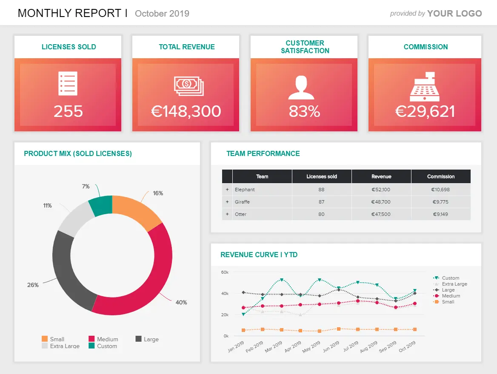
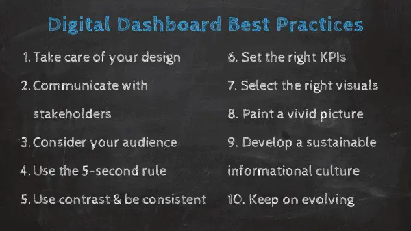
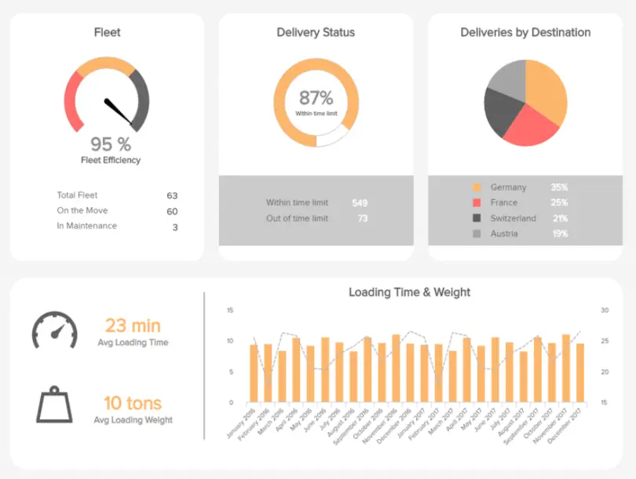
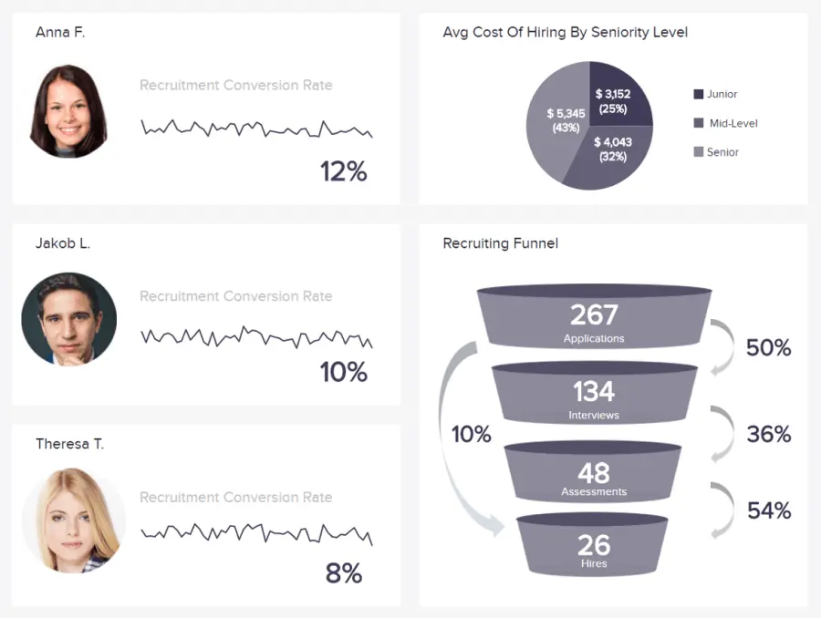
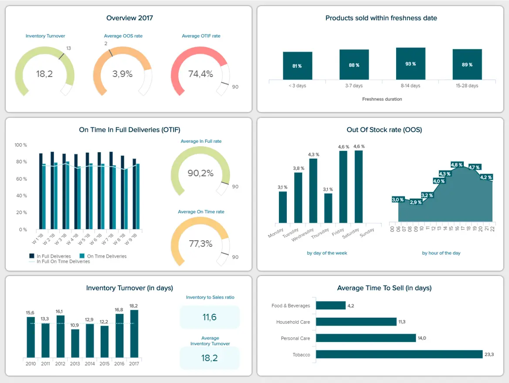

我们生活在信息时代。 撇开利基或行业不谈，通过从企业数据中榨取每一滴价值，您将变得更加高效、创新和富有成效。

数据提供了大量无价的见解，将极大地促进您的业务增长和发展。 而且，如果你不能利用大数据来发挥自己的优势，你可能会发现自己落后于竞争对手，最终变得过时。

 

但是，有了这么多的信息和这么少的时间，你甚至从哪里开始？ 数字仪表板不仅可以帮助您深入了解对您的业务最重要的见解，而且还提供交互式可视化表示，有助于更快、更明智的决策以及发现无价的新见解。

数据驱动的[业务仪表板](https://www.datafocus.ai/infos/dashboard-examples-and-templates)是您通往高级商业智能 （BI） 的门户，这种智能将在竞争日益激烈的商业世界中加速您的成功。

此外，[仪表板构建器](https://www.datafocus.ai/infos/dashboard-builder)是一种宝贵的商业工具 - 如果您正确使用它。 为了帮助您走上仪表板软件启蒙之路，我们将定义数字仪表板，了解以数据为中心的平台的业务提升优势，探索现代仪表板工具，并提供一系列现实生活中的示例。 让我们开始吧！

您的机会：[想要构建自己的专业数字仪表板吗？](https://www.datafocus.ai/console/) 试用我们的现代仪表板软件 14 天，完全免费！

## 什么是数字仪表板？

数字仪表板是一种分析工具，允许业务用户实时监控和分析其最重要的数据源。 通过交互式数据可视化，数字仪表板可以改进决策过程和持续增长。

然后，用户可以通过以易于理解的演示格式显示历史趋势、可操作的见解和实时信息来监督许多关键领域。

如果您想以有意义的方式展示您的见解，[在线数据可视化](https://www.datafocus.ai/infos/data-visualization-tools)确实是一个强大的工具——数据驱动的仪表板提供了一种访问重要信息并在整个组织中轻松交付的方法。

## 使用数字仪表板的 6 大优势

现在我们已经了解了明确的数字仪表板定义，我们将继续探索在您的业务中使用这些[在线数据分析工具](https://www.datafocus.ai/infos/data-analysis-tools)的六个基本好处。

- 决策：数字仪表板的可访问可视化特性使用户能够轻松分析和深入了解重要的指标和见解，从而在组织的所有关键方面更快地[做出数据驱动的决策](https://www.datafocus.ai/infos/data-driven-decision-making-in-businesses)。
- 可访问性：扩展我们之前的观点，这些类型的仪表板提供直观的数据可视化这一事实意味着不需要全面的培训。 相反，现代仪表板旨在易于访问和导航。 它们的图形性质允许与宝贵信息轻松交互。
- 移动性：数字仪表板是可定制的，并在一个中心位置显示每一串相关信息，并且还可以通过[移动设备和应用程序](https://play.google.com/store/apps/details?id=com.datapine.viewer&hl=en)访问最佳平台，这意味着无论您身在何处，都可以访问基本信息。
- 商业智能：通过获得访问过去、实时和预测分析的能力，以及针对增长、演变和专业发展的明确指标，您将提高团队[的商业智能技能](https://www.datafocus.ai/infos/bi-skills-for-business-intelligence-career)，并最终领先于竞争对手。
- 基准测试：撇开行业或行业不谈，实现甚至超越目标的最佳方法是努力明确定义与您最重要的目标一致的基准。 数字风格的仪表板具有动态可视化的关键绩效指标，不仅可以提供宝贵的实时信息，还可以帮助您深入了解需要做什么才能达到[重要的里程碑](https://blog.asana.com/2017/11/cracking-the-code-6-steps-to-achieving-your-company-goals)。
- 沟通：组织孤岛扼杀了生产力并阻碍了创新。 基于 BI 的仪表板灵活而详细，使共享和讨论数据驱动的发现变得快速、简单和有效。 反过来，这些工具鼓励跨部门沟通，同时打破沟通障碍——这两者都是现代成功的关键。

## 如何制作数字仪表板：最佳实践

现在，您已经了解了优势的工作知识以及可供参考的数据仪表板定义，我们将继续进行下一步。

为了帮助您了解数据驱动型仪表板的关键要素（可产生实际结果的仪表板），以下是最佳实践的概览。

### 1\. 照顾好你的设计

首先，让我们专注于设计。 为了从仪表板中获得最大价值，应始终确保设计清晰、简洁，并且仅显示与组织相关的信息 - 仅此而已。 从视觉上看，您应该始终确保您的仪表板有助于告诉您一个故事并直接回答与您的业务绩效相关的所有问题，这意味着您永远不应该塞进太多小部件，因为它们只会用于解决问题。 此外，您应该以逻辑格式放置所有信息，以帮助您描绘信息的全景图。 请考虑将表格放在页面底部，因为它们提供的价值通常低于图表、图形或其他指标。 为了帮助您，您可以查看我们关于最受欢迎的[仪表板创意](https://www.datafocus.ai/infos/great-dashboard-design-examples-for-inspiration)的指南。

### 2\. 与利益相关者沟通

其次，您应该与企业内的其他关键利益相关者坐下来，决定企业的核心宗旨和目标，既具有时间敏感性，又持续不断。

此过程对于从一开始就为您的开发工作提供明确的方向至关重要 - 确保健康的投资回报 （ROI） 以及可持续的商业增长。

从本质上讲，您将能够确保您的仪表板旨在提供实用价值，从而提供可操作的结果。

### 3\. 考虑您的受众

扩展我们的最后一点，当您开发现代仪表板时，重要的是要考虑最终用户以及它将如何使他们受益。

为了有效地做到这一点，考虑您的核心目的和目标至关重要，因为它将为您提供一个可靠的指示，说明您为什么要将这些工具用于您的业务。

您是否希望向外部投资者证明您最近的销售和营销活动的价值？ 您是否希望您的客户服务人员了解他们的流程或绩效如何影响业务？ 为您的人力资源经理提供简化招聘流程所需的洞察力是游戏的目标吗？

通过探索您的核心目标以及您的用户（或收件人）如何与您的电子仪表板数据进行交互，您将创建直截了当的信息中心，并提供丰富的业务促进价值。

### 4\. 利用 5 秒规则

在设计界被称为“五[秒规则”，](https://fivesecondtest.com)您的创作应该始终在大约五秒钟内提供相关信息 - 你猜对了。 如果不是这种情况，您应该回到绘图板并进行必要的调整，以使您的仪表板更易于消化。 确保这种情况的一种方法是采用“倒金字塔”方法，其中您最紧急或“有新闻价值”的信息显示在顶部，然后是最重要的指标和详细信息，任何其他相关或杂项信息显示在底部，如下图所示。 现在，虽然这种类型的框架通常是新闻业的代名词，但它正在成为数据驱动的仪表板设计中越来越[有价值的蓝图](https://vanseodesign.com/web-design/inverted-pyramid-design)。

\*\*来源：[维基共享资源](https://commons.wikimedia.org/wiki/File:Inverted_pyramid.svg)\*\*

### 5\. 使用对比并保持一致

除了考虑“五秒法则”之外，您还应该针对不同的标题和可视化效果使用对比色或字体，以便在正确的时间将用户的视线吸引到正确的位置，并更容易一目了然地提取相关见解。

但是，在设计仪表板和选择颜色或字体方案时，请务必保持选择的全面一致性，以避免任何潜在的混淆或代价高昂的数据误解。

有关其他可视化和基于功能的提示，请阅读我们关于基本[仪表板设计](https://www.datafocus.ai/infos/dashboard-design-principles-and-best-practices)原则和最佳实践的完整指南。

### 6\. 设置正确的关键绩效指标

当我们定义数字仪表板时，始终重要的是要记住，[最佳 BI 工具](https://www.datafocus.ai/infos/best-bi-tools-software-review-list)的主要目标是提供有关特定业务领域的可操作信息。也就是说，在创建或开发数据驱动的仪表板时，无论您是否需要处理[人力资源 KPI](https://www.datafocus.ai/infos/kpi-examples-and-templates-human-resources)、采购或营销，在使用正确的基准时，都必须专注于最相关的信息。通过长期而努力地研究您的核心公司目标，您将能够选择动态 KPI，这些 KPI 将提供交互式可视化，使您能够深入了解特定的组织战略、流程和职能。通过明智地选择指标，您不仅能够识别优势和发现劣势，而且您将能够用您的数据讲述故事，使企业内的其他利益相关者更容易访问它。

### 7\. 选择正确的图表和可视化效果

通过正确的演示和表示，数字仪表板平台将成为您有史以来最好的投资之一。除了利用具有关键绩效指标的仪表板外，您还应该始终通过考虑哪些图表类型对您要讲述的故事或要显示的见解最有效来进一步完善您的工作。为了帮助指导您的开发工作，以下是业务环境中数字仪表板最强大的图表类型的简要概述：

- 条形图
- 折线图
- 迷你图
- 散点图
- 气泡图
- 数字图表
- 地图
- 面积图

您可以通过浏览我们的权威指南来熟悉这些强大的交互式可视化，以便为您的企业选择正确的[数据可视化类型](https://www.datafocus.ai/infos/how-to-choose-the-right-data-visualization-types)。

### 8.描绘一幅生动的画面

可视化到位后，您应该设置切合实际的基准来衡量您在每个关键领域的成功。

在短时间内，您将开始看到信息图片的形成。如果您的绩效指标讲述了一个合乎逻辑的故事，并一目了然地描绘出生动的画面，那么您的可视化安排和设计就是最佳的。如果你发现某些信息片段很难分析，或者觉得缺少一个重要的拼图，你应该回到绘图板并调整你的设计。

为了让您走上正确的道路，这是我们的数据[驱动故事讲述指南](https://www.datafocus.ai/infos/dashboard-storytelling-with-kpis-presentation-examples/?msclkid=43a54a59c62911ec8e43d8756b6d982e)，为您的阅读带来乐趣。

### 9\. 发展可持续的信息文化

一旦您的数字仪表板以最高信息效率运行，请务必确保您新发现的 BI 工具和实践过滤到组织中的每个部门和个人。

在报告和模板平衡且易于理解的情况下，您应该根据所需的可访问性级别分配适当的用户权限，使企业内的每个人都能够使用这些工具，从而发挥他们（和您）的优势。

举办研讨会以培训每个人如何与新工具进行交互，同时通过移动设备为远程工作情况提供访问权限也很重要。

通过提供正确的培训并定期进行公司更新，您将最大限度地提高新流程的价值，在此过程中变得更加可扩展和适应性强。这就引出了下一点。

### 10\. 不断变化;不断发展

我们生活在一个不断发展的技术驱动时代，技术、工具和组织方法处于不断变化的状态。也就是说，为了确保您的一个或多个电子仪表板继续提供最大价值，必须定期审查它们并进行必要的调整或更新。

虽然您的报告可能提供当今数字仪表板软件的所有好处，但在不久的将来，它们可能会变得不那么强大。

花点时间考虑您的目标或价值观可能如何变化，并检查您现有的 KPI、图表和设计元素。如果您觉得有必要改变或改进 - 采取行动。这样做将确保您保持领先地位。

通过遵循这些最佳实践，您将创建一个 BI 仪表板，该[仪表板](https://www.datafocus.ai/infos/bi-dashboard-best-practices)不仅高效，而且还为业务、角色或部门中的每个人提供最佳价值。

牢记这些最佳实践，您将创建一个开放、协作和想法驱动的[内部文化](https://www.yourerc.com/blog/post/workplace-culture-what-it-is-why-it-matters-how-to-define-it)，这将使您在利基市场中脱颖而出，同时使您的公司比您想象的更有效率。

您的机会：[想要构建自己的专业数字仪表板吗？](https://www.datafocus.ai/console/)试用我们的现代仪表板软件 14 天，完全免费！

## 顶级数字仪表板软件功能

到目前为止，我们已经清晰地概述了一个明确的定义，并研究了如何创建成功的数据驱动分析工具。现在，是时候看看顶级数字仪表板功能了 - 或特性。

### 1\. 数据连接器

现代分析管理工具的最佳功能之一是[数据连接器](https://www.datafocus.ai/infos/data-connectors)。这些动态连接器提供了连接大量流行平台（例如SQL Azure，Amazon Aurora，DropBox，Google Adwords和Oracle）并将信息整合到一个中心位置的能力。

这样，您就可以跨平台轻松访问每个相关指标和见解，通过交互式可视化使您的信息栩栩如生，节省时间，提高分析效率，并消除流程中的碎片化。

### 2\. 互动功能

在数据驱动的平台功能方面，使用强大、适应性强、尖端的[仪表板软件](https://www.datafocus.ai/infos/best-dashboard-software-features)将确保您所做的一切都经过优化，以实现持续和可持续的成功。

为了使现场数据分析成为可能，当今的设计工具配备了许多交互式功能，旨在使向下钻取特定指标、过滤信息、放大图表或可视化以及尽可能快速、简单和可访问地自定义仪表板。

### 3.许多图表类型和可视化选项

使用带有关键绩效指标的正确数字仪表板，您可以全面了解所有核心领域最宝贵的组织指标，从财务和[人力资源报告](https://www.datafocus.ai/infos/monthly-and-annual-hr-report-templates)到 IT 支持、客户服务、内部绩效、营销策略等。此类工具的数字仪表板功能非常强大，因为您可以从一个易于导航的集中位置访问信息的各个方面。

现代[BI 仪表板软件](https://www.datafocus.ai/infos/bi-dashboard-tools)提供对一系列动态图形、图表或可视化工具的访问，使您能够提取您从未知道存在的实用见解，同时允许您使用历史、预测和实时数据的混合制定强大的策略。

### 4\. 跨设备可访问性

数字仪表板开发工具针对几乎所有可以想象的设备进行了优化，包括智能手机和平板电脑。

这种有凝聚力的跨设备可访问性水平将使企业中的每个人都能够从 24/7 全天候访问宝贵的数据驱动见解中受益。反过来，您将促进更大的内部创新和更好的沟通，并最终从加速增长中受益。

### 5\. 增强的用户控制管理和安全性

现代分析工具功能的另一个关键功能是高级用户控制管理和安全性。

借助数字业务仪表板，可以轻松设置用户角色，为适当的人员提供适当的访问权限级别，同时确保数据安全。您可以基于以下四个区域设置用户控件：

- 管理
- 编辑 器
- 电源查看器
- 观众

这四层访问意味着组织中的每个人都可以从数据的力量中受益，以适合角色、必要性或资历级别的方式与仪表板进行交互。

如果您想看到交互式数据平台的实际应用，请务必查看我们的教程，了解您的企业如何从专业可视化中受益。

 

### 6\. 自动化功能

在我们这个技术驱动的时代，数字仪表板功能非常强大，以至于可以根据一系列功能和特性创建自动报告。

自动化某些报告和信息管理流程的能力使数字仪表板软件成为任何组织的宝贵资产，因为这些功能可以提高产出，同时让您的内部人才专注于更复杂或更具创造性的任务。

借助人工智能技术，这些强大的工具还可以根据许多参数提供自动警报，例如当新趋势出现或您达到某个基准时。

如果您想了解有关该主题的更多信息，请查看我们关于[自动报告的](https://www.datafocus.ai/infos/automated-reporting-system-and-tools)交互式指南。

### 7\. 嵌入功能

任何值得一提的数字仪表板都配备了嵌入功能。这个概念很简单，但非常有用：您可以将平台或报告添加到现有框架（例如，您的 Intranet、内部应用程序或网站），从而节省开发成本，同时获得大量宝贵的交互式功能。

[嵌入式仪表板](https://www.datafocus.ai/infos/embedded-dashboards)的另一个优点是，您可以通过在必要时限制访问来提高信息安全性，这在通过外部门户共享报表时尤其重要。

### 8\. 多种设计选择

具有真正的 BI 增强功能的数字业务仪表板提供了多种设计选项，这些选项不仅实用，而且易于以最少的技术知识实施。

除了提供许多自定义选项，允许您更改页面布局和更改您使用的可视化效果外，还可以“白标”。

白标允许您使用公司品牌、徽标、配色方案和一般视觉识别来自定义报告，这是向客户或外部利益相关者展示您的发现时的有效意识工具。

## 利用数字仪表板示例

我们已经探索了数字仪表板的定义及其在业务环境中的价值，现在我们将分享六个现实生活中的示例，这些示例深入到管理，IT，服务和支持，销售，社交媒体和零售等关键领域。

### 1\. 投资者关系仪表板

对于那些处于管理职位的人来说，牢牢掌握公司的运营计划至关重要——但策划、计算和传达有关企业整体情况的关键见解同样重要。这就是这个仪表板的用武之地：

\*\*点击放大\*\*

投资者关系仪表板是我们[管理仪表板](https://www.datafocus.ai/infos/dashboard-examples-and-templates-management)示例系列的一部分，它提供了以公司投资者为中心的无价见解、他们希望看到的信息以及有助于确保这些关系的健康和一致性的见解类型。

这个数字仪表板工具深入到重要指标，包括资产回报率、股本回报率、市盈率以及最重要的股价，在一个中心位置提供所有以投资为中心的关键信息。

主要关键绩效指标：

- 资产回报率
- 股本回报率
- 市盈率

### 2\. IT 成本仪表板

随着数字技术的发展和内部系统变得越来越高度互联，跟踪和管理[IT KPI（](https://www.datafocus.ai/infos/kpi-examples-and-templates-it)尤其是成本）的能力对于组织的持续成功至关重要。

\*\*点击放大\*\*

通过更深入地了解包括 IT 投资回报 （ROI）、IT 成本的详细细分以及这些成本如何抵消收入在内的要素，这款数字驱动的仪表板软件为持续部门的成功和发展提供了所有工具。

每个IT经理或决策者都必须在日常运营中考虑成本，而这个特定仪表板提供的指标将有助于减少支出，同时提高效率。证明了数字仪表板在专业环境中的强大功能。

主要关键绩效指标：

- 信息技术投资回报率
- IT 成本明细
- IT 成本与收入

### 3\. 客户满意度仪表板

毫无疑问，客户几乎是任何组织跳动的心脏，让您的客户满意将带来持续的商业成功。 为了帮助实施此类计划，客户满意度仪表板侧重于跟踪、分析和做出积极更改以提高整体客户参与度和满意度所需的所有[客户服务 KPI](https://www.datafocus.ai/infos/kpi-examples-and-templates-customer-service)和指标。

\*\*点击放大\*\*

在这里，您将能够提高您提供的客户体验水平，改善您的消费者接触点（网站、登录页面等），更快地处理问题，并随着时间的推移提高客户保留率——这对增长、演变和发展至关重要。

主要关键绩效指标：

- 客户满意度
- 净推荐值
- 客户努力得分
- 客户保留

“你不能在创建问题的同一水平上解决问题。 你必须超越它到一个新的水平。

### 4\. 销售数字仪表板

具有大量深度的数据仪表板模板具有全面的销售指标组合，每个指标都旨在帮助现代销售团队监控收入，同时降低流失率并制定可持续提高利润的策略。

\*\*点击放大\*\*

除了帮助销售代表监控一段时间内的绩效外，这个尖端的销售模板还提供了对成本细分的丰富见解，以及显示增量销售收入等的交互式[销售图表](https://www.datafocus.ai/infos/sales-graphs-and-charts-for-managers)。

视觉平衡，涵盖所有战略基础，这是您所需的[销售仪表板](https://www.datafocus.ai/infos/dashboard-examples-and-templates-sales)，用于响应迅速、一目了然的信息和长期战略规划。

这是我们迄今为止功能最强大、以结果为导向的数字仪表板示例之一，也是确保您的销售额随着时间的推移持续增长的工具。

主要关键绩效指标：

- 每个销售代表的收入
- 客户流失率
- 追加销售和交叉销售率
- 每个销售代表的利润率
- 按活动划分的增量销售额

### 5\. LinkedIn公司页面仪表板

作为我们的第五个数字仪表板示例，这个最动态的新增功能侧重于通过LinkedIn（世界排名第一的专业社交网络）优化您的成功。

\*\*点击放大\*\*

这种核心[LinkedIn指标](https://www.datafocus.ai/infos/kpi-examples-and-templates-linkedin)的流畅可视化表示形式专为管理公司官方LinkedIn页面的持续增长和演变而设计，将帮助您了解如何鼓励参与并扩大您在平台上的影响力。

商业环境中的数字仪表板没有比这更有价值的了，因为如果您有能力优化您的LinkedIn公司页面，您将开始生成一份全面的[社交媒体报告](https://www.datafocus.ai/infos/social-media-reports-examples-and-templates)，使您能够获得丰富的新潜在客户，建立新的业务纽带，并在您的领域变得更加权威。

这场由指标、可视化和 KPI 组成的完美风暴将确保您在正确的时间拥有正确的内容，从而加速您的商业成功。

主要关键绩效指标：

- 关注者的人口统计
- 关注者数量
- 印象和覆盖面
- 参与率
- 公司更新统计

您的机会：[想要构建自己的专业数字仪表板吗？](https://www.datafocus.ai/console/) 试用我们的现代仪表板软件 14 天，完全免费！

### 6\. 销售和订单仪表板

最后但并非最不重要的一点是，在我们明确的商业数字仪表板清单中，我们的[零售仪表板](https://www.datafocus.ai/infos/dashboard-examples-and-templates-retail)专注于销售和订单，是任何零售商或电子商务品牌的必备工具，无论利基市场如何。

\*\*点击放大\*\*

在我们这个高度互联的时代，在线购物呈指数级增长 - 因此，在线零售数据庞大而丰富。

虽然访问基于电子商务的数据确实相对简单，但不知道如何引导它，您不太可能充分利用您的指标或见解。

通过深入了解销售和订单，这个强大的工具提供了关键运营元素的动态可视化表示，包括订单总额、订单状态、按地区下达的订单、完美的订单率，甚至产品退货的原因。

这种有凝聚力的视觉信息和 KPI 提供了一定程度的深度，使任何雄心勃勃的在线零售商都能在可持续的基础上节省资金、提高效率并提高其底线。 现代电子商务企业家的宝贵工具。

主要关键绩效指标：

- 订单总数
- 按地区划分的总销售额
- 订单状态
- 完美的订单率
- 退货原因

### 7\. 采购 KPI 仪表板

\*\*点击放大\*\*

您企业的采购流程对您的整体增长和生产力至关重要。 供应链中的一个薄弱连接或障碍，您将遭受经济损失和声誉损害。

作为我们的主要仪表板示例之一，我们的数据驱动[型采购仪表板](https://www.datafocus.ai/infos/dashboard-examples-and-templates-procurement)配备了跟踪供应商关系、管理合规率和精确简化采购订单周期时间所需的 KPI 和可视化。

这种完美的信息风暴将确保您的采购策略始终保持安全和凝聚力，同时提高组织效率。

主要关键绩效指标：

- 合规率
- 供应商数量
- 采购订单周期时间

### 8\. 运输仪表板

\*\*点击放大\*\*

今天的数字原生消费者已经真正地坐在驾驶座上。 为了企业蓬勃发展，尽快为您的客户提供他们想要的东西至关重要。

我们的动态[运输仪表板](https://www.datafocus.ai/infos/dashboard-examples-and-templates-logistics)将为您提供所需的洞察力，以缩短交货时间，同时将运营成本降至最低。

这种视觉信息的平衡组合能够帮助各行各业的企业正面满足客户的履行需求，同时始终保持财务效率。 该工具将帮助您的企业可持续地增长和繁荣。

主要关键绩效指标：

- 交货时间
- 运输费用

### 9\. 患者仪表板

\*\*点击放大 ̈\*\*

我们的下一个数字仪表板示例是医疗品种。 在患者护理方面，获取信息可能意味着生与死的区别。

为了确保各类医院和医疗机构都具备跟踪多个关键领域患者护理绩效所需的信息，我们的患者数据平台拥有平衡的可视化和关键[医疗保健指标](https://www.datafocus.ai/infos/kpi-examples-and-templates-healthcare)，例如患者随访率。

在这里，您拥有做出重要患者护理决策所需的所有核心信息支柱，同时保持对不断变化的响应，以及全面提高您提供的服务质量。 这是每个医疗服务提供者在其数字工具包中都需要的数字业务工具。

主要关键绩效指标：

- 床位占用率
- 医疗设备利用率
- 患者每次入住药物费用
- 病房周转率
- 患者随访率
- 医患比例
- 取消/错过的约会

### 10\. 首席营销官仪表板

\*\*点击放大\*\*

CMO的工作多种多样，压力相同。 因此，如果您是首席营销官，从一个交互式位置访问大量高级见解至关重要。

我们的动态[CMO 仪表板](https://www.datafocus.ai/infos/dashboard-examples-and-templates-marketing)包含指标、图表和 KPI，这些指标、图表和 KPI 将使实时决策更明智、更准确，并最终更有价值。

凭借有关销售增长、每条潜在客户成本、网站流量与潜在客户比率等的深入信息，这款尖端工具将使您的营销投资回报率 （ROMI） 年复一年地飙升。

主要关键绩效指标：

- 销售目标和增长
- 网站流量与潜在客户比率
- 每条线索的成本
- 潜在客户与 MQL 比率
- MQL 与 SQL 比率

### 11\. 能源管理仪表板

\*\*点击放大\*\*

撇开利基或行业不谈，降低能源成本将使您的业务在财务上更加进步和更环保。

我们的能源仪表板是一款数字仪表板软件，旨在降低不必要的[能源](https://www.datafocus.ai/infos/dashboard-examples-and-templates-energy)成本，使您能够比较各行各业的使用情况，同时根据来源跟踪您的成本。

随着时间的推移跟踪这些指标将帮助您识别潜在的低效率，并制定有价值的计划来降低能耗，同时做出更明智的运营选择。 这是每个现代企业必不可少的工具。

主要关键绩效指标：

- 停电和平均持续时间
- 按行业划分的消费量

### 12\. 招聘仪表板

\*\*点击放大\*\*

最后但并非最不重要的一点是，在我们的数字仪表板业务示例清单中，我们为您提供了一个[人力资源仪表板](https://www.datafocus.ai/infos/dashboard-examples-and-templates-human-resources)，其中显示了招聘指标，可帮助您为您的业务获得完美的人才。

通过改善您的招聘选择，您将提高员工保留率，同时提高生产力。 让您的招聘流程恰到好处也可以让您避免浪费时间和金钱。

这个动态工具的 KPI 包括每次招聘成本、招聘转化率和填补时间在视觉上和谐地工作，作为一个信息中心，可以在降低成本的同时提高招聘成功率。

主要关键绩效指标：

- 每次雇用成本
- 招聘转化率
- 填满时间

### 13\. 营销绩效仪表板

作为营销人员，衡量您的活动是否成功，同时证明您的各种促销活动的合理性是一项持续的任务。 也就是说，始终如一地使用正确的指标对于获得健康的营销投资回报 （ROMI） 至关重要。

\*\*点击放大\*\*

我们的下一个示例是使用现代[营销仪表板软件](https://www.datafocus.ai/infos/marketing-dashboard-software-tools)创建的，它配备了旨在衡量参与度以及与各种营销活动相关的成本的 KPI。

有了这些基本指标，就可以使用这个数字仪表板示例来清楚地了解哪些活动和接触点产生了最佳和最差的回报。 因此，您可以不断完善您的计划，以满足消费者的需求，同时通过营销加速公司的发展。

主要关键绩效指标：

- 点击率 （点击率）
- 每次点击费用
- 每次转化费用

### 14\. 快速消费品 KPI 仪表板

我们接下来是快速消费品中心，简称快速消费品。 负责供应链中所有快速变化的部分并非易事，尤其是在您扩大规模时。 但是，通过使用正确的指标，您可以牢牢控制您的流程。

\*\*点击放大\*\*

在这里，您可以监控您的缺货率和平均销售时间指标，并清楚地了解您的商品在保鲜期内销售或按时全额交付的成功。

由于能够在一个中心位置与这个强大的数据大熔炉进行交互，您可以找到任何明显的供应链问题的根源，并在它们失控之前修复它们。 设定基准和跟踪趋势还将改善您的实时决策，同时帮助您根据流程、库存管理计划和供应商关系做出更具战略性的决策。

主要关键绩效指标：

- 缺货率 （OOF）
- 按时和全额交付 （OTIF）
- 平均销售时间
- 保鲜期内售出产品的百分比

### 15\. 生产仪表板

在保持生产线或流程流畅和高效时，效率低下是您最大的敌人。 在应对任何障碍或问题的同时提高端到端效率需要战略思维。 这就是我们的[制造仪表板](https://www.datafocus.ai/infos/dashboard-examples-and-templates-manufacturing)发挥作用的地方。

\*\*点击放大\*\*

对于任何以生产为核心的有抱负的数字仪表板业务来说，这是一个必不可少的平台，在这里您可以轻松衡量特定时间范围内的产量、停机时间和各种成本。 通过每天与该信息控制中心合作，您可以磨练影响您产出的任何流程或机器，同时减少任何不必要的成本。

因此，您将节省成倍的时间和金钱，同时全面优化生产部门的效率。

主要关键绩效指标：

- 产量
- 生产停机时间
- 生产成本

### 第16章 产品创新仪表板

作为我们最有见地的例子之一，我们的生产创新工具揭示了您的产品在客户或消费者眼中的实际表现。

\*\*点击放大\*\*

高度可视化并配备了重要见解的平衡组合，这个[市场研究分析工具](https://www.datafocus.ai/infos/market-research-analytics)将为您提供人们为某些产品付费的意愿以及使用和购买意愿的真实衡量标准。 您还可以通过简单的一目了然看到哪五种产品的销售或表现最佳。

有了这些信息，您就可以正面满足受众和目标市场的需求，同时改进现有产品以提供更大的消费者价值或开发可能提供健康投资回报率或将您的公司定位为行业领导者的全新产品（或两者兼而有之）。

主要关键绩效指标：

- 预期用途
- 购买意向
- 支付意愿

### 17\. Zendesk 谈话仪表板

Zendesk 是世界上最广泛的客户支持平台之一，为各行各业的企业提供工具和信息，以跨渠道为消费者提供无缝体验。 但是，如果您可以从平台上榨取更多的信息价值并在竞争中获得优势呢？

\*\*点击放大\*\*

使用此模板，您可以更深入地深入了解关键的[Zendesk KPI](https://www.datafocus.ai/infos/kpi-examples-and-templates-zendesk)以获得客户支持，并快速访问呼叫应答时间、腿部通话时间、质量率以及任何被视为不成功的呼入电话。

掌握这些重要指标将使您能够提高解决率并处理更多影响质量的客户电话。 此外，如果您与任何新出现的问题联系起来，您可以分析信息模式以找到问题的核心（例如，技术故障、糟糕的呼叫处理流程或需要更多培训的座席），并进行有针对性的改进，最终导致更高的满意度。

主要关键绩效指标：

- 回答时间
- 腿部通话时间
- 呼入呼叫失败
- 质量率

### 18\. 脸书页面仪表板

Facebook仍然是地球上最受欢迎和参与度最高的社交媒体网络之一，为各个行业的品牌和公司提供了宝贵的促销机会。 如果您以正确的方式处理该平台，它将为您的商业增长创造奇迹。

\*\*点击放大\*\*

我们以 Facebook 为中心的工具拥有您所需的一切，可帮助您在特定地区或特定受众特征中最大限度地提高付费和自然内容的成功率、参与度和覆盖面。

在这里，您可以查看首页浏览来源，深入了解页面操作，将您的粉丝或关注者细分为年龄或性别细分，并跟踪您在不同国家/地区的增长。 这种完美的视觉风暴将使您能够更有效地管理您的付费社交预算，制作激发特定地区参与度的内容，并在受众最有可能参与的时间发布帖子 - 这是社交成功的秘诀。

主要关键绩效指标：

- 风扇数量
- 关注者人口统计
- 按来源划分的页面浏览量
- 页面上的操作

您的机会：[想要构建自己的专业数字仪表板吗？](https://www.datafocus.ai/console/) 试用我们的现代仪表板软件 14 天，完全免费！

## 数字仪表板要点

我们考虑了如何在实际环境中定义“数字仪表板”，探讨了主要优势和最佳实践，并展示了真实世界示例的强大组合。 在我们的旅程中，很明显，使用这些动态商业智能工具可以为您带来一切好处。

在快节奏的商业环境中，交互式、直观和信息化的仪表板不仅可以提高您的内部智能，还可以为组织内的每个人提供一定程度的洞察力，从而促进更好的绩效和效率、更有凝聚力的内部沟通以及更高效的运营流程。

现代品种的仪表板对于商业成功至关重要，并且是以返回可操作结果的方式展示您的智能的最佳工具 - 这种仪表板将帮助您在利基市场掀起真正的波澜，同时在不断变化的商业环境中保持适应性。

今天拥抱仪表板的强大功能，明天您将获得无尽的商业回报 - 现在是时候出击了。

要更深入地了解组织的数据驱动型工具，以及如何使用它们推动组织领先一步，请阅读我们的业务[绩效仪表板](https://www.datafocus.ai/infos/performance-dashboard-examples)入门基本指南。

如果您想创建自己的仪表板并将您的组织提升到一个新的水平，请尝试我们的动态仪表板软件进行[14 天试用](https://www.datafocus.ai/console/)，完全免费！
