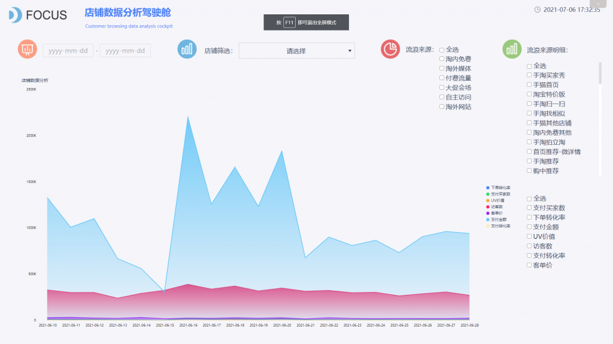

[数据分析](https://www.datafocus.ai/)现在是电子商务成功的关键。通过广告平台定位合适的受众对于提高在线销售是非常必要的，因为客户只希望查看他们需要的相关产品或项目。人工智能 （AI） 在机器学习 （ML） 的帮助下，帮助根据客户偏好和过去的浏览数据确定目标受众，从而帮助潜在买家并得分入站销售。

同样，在平台上向客户推荐合适的产品也有助于带来更多的销售。亚马逊和阿里巴巴等电子商务服务公司利用数据分析来推动预测性建议，有助于推荐用户喜欢的各种产品。

对于Facebook和谷歌等平台上的广告产品，作为电子商务公司投放广告的媒介，人们严重依赖数据分析向潜在买家展示相关广告。例如，当用户在 Google 上搜索特定产品时，它会显示来自不同公司的相同产品的相关广告。

人工智能在确定特定产品的潜在买家时的准确性大大有助于向他们建议他们立即需要的产品，从而立即实现预期的销售。如果没有这一点，买家绊倒他们肯定想要和购买的产品的机会相对较低，除非他们积极寻找产品。

**电子商务中的数据分析**

数据分析利用各种数据源（如销售历史数据、经济变化、客户行为和搜索）来支持预测性预测。这通过向潜在买家推广相关产品，使电子商务公司获得权力。机器学习 （ML） 和人工智能 （AI）使购物者在决定寻找产品或是否特别需要某些产品之前，就有可能根据自己喜欢的内容提供预测。

ML 和 AI 通过分析客户的行为趋势并在过去的购买之间建立关系来完成此目标。客户情绪分析在确定未来的销售前景和目标受众方面发挥着重要作用，实现了直接营销策略和促销活动。

数据分析在调查趋势和发现客户行为和品牌情绪模式方面发挥着重要作用。

分析师可以使用数据分析来分析购买模式，并制定策略，以增加销售额并有效库存。企业可以进一步利用数据分析来预测销售和需求，这有助于企业做出更好的决策来宣传或囤积特定产品。

数据分析如何促进电子商务的销售？

数据分析在很多方面促进了电子商务领域的销售。其中一些是：

**推荐系统：**

数据分析为完全基于用户过去数据的推荐系统提供动力，同时大量使用 ML 和 AI 来帮助电子商务服务提供更相关和更准确的建议。这工作就像一个魅力，似乎几乎推荐的产品，用户总是希望购买或至少表现出兴趣。这转化为通过在合适的买家面前生产正确的产品来增加销售额。

推荐系统根据客户进行个性化，并在用户信息的帮助下进行建模，例如用户正在购买的产品和用户正在点击的页面。亚马逊的推荐系统和亚马逊个性化帮助改善了销售：两者都是亚马逊军械库不可分割的一部分，目前亚马逊控制着美国电子商务总收入的40%。值得注意的是，根据巴里利安斯，产品推荐占电子商务网站收入的31%。

**客户反馈分析：**

数据分析允许电子商务公司通过收集每个产品或服务的相关反馈，然后根据集体分析采取行动来弥补其缺点。情绪分析和品牌形象分析等方法帮助公司了解客户或目标受众的要求，显著提高销售额。

电子商务巨头和初创公司使用 NLP 或自然语言处理、文本分析、文本分析和计算语言学来为此类分析提供动力。

**库存管理：**

数据分析使老牌电子商务公司和初创公司能够更有效地管理其库存。这也间接地帮助他们不要将资本浪费在销售不好、不需要重新进货的不受欢迎的产品上。由于电子商务公司每天与数以吨计的客户和数千种产品合作，先进的数据分析对于对未来需求进行准确的库存管理和预测预测是非常必要的。房板公司使用预测分析获得约2900%的投资回报。

**客户体验和客户服务：**

数据分析通过自动化许多功能，并通过反馈和分析使常规事务变得无忧无虑，帮助缓解和改善客户体验。这些实现范围从自动化体验到更轻松的导航。

根据报告，大约 80% 的客户认为客户体验也很重要，并帮助他们返回到特定网站。此外，通过社交媒体确定偏好还可以改善客户服务，许多千禧一代和 Z 一代通过 Instagram 等社交媒体平台发现了产品，因此提出了建议。

ML 在客户服务中特别有用，因为它能够带来更好的 IVR 和聊天机器人服务，从而帮助随着时间的推移更有效地解决客户问题。情绪分析等工具非常善于了解客户体验并帮助公司保留这些经验。

**数据分析是否有助于电子商务公司更好地做广告？**

是的，数据分析也有助于广告分析。此外，广告平台在人工智能和 ML 上运行，使用数据分析执行各种功能，如通过行为和其他因素（如人口统计学）定位受众。值得注意的是，数据分析允许电子商务公司开展相关的广告活动。

**机器学习如何用于在线销售？**

从虚拟助理到个性化推荐引擎，机器学习以各种方式促进在线销售。例如，ML 通过定制建议帮助将更多的浏览器或潜在客户转换为直接买家，增加了转换的机会。此外，它还有助于根据历史数据收集新客户。

**结论**

[数据分析](https://www.datafocus.ai/)为电子商务巨头提供了接触客户并为他们提供个性化体验的权力。这无疑为客户提供增强的购物体验，并增加了许多电子商务公司的在线销售。数据分析已经证明，在收集客户和增加利润方面非常有用。
