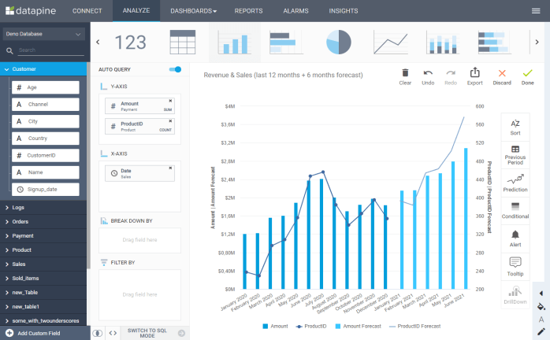
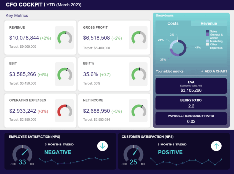

在线数据可视化是一个术语，是指通过交互式图形、图表、仪表板和报告来描述数据集的图形化表示，以便在有效的在线环境中以吸引人的可视化方式传达可操作的业务洞察力。借助专业的在线数据可视化工具，各行各业的公司都可以以通用的方式快速高效地可视化其最相关的信息，促进协作和业务增长。

研究表明，人脑处理视觉数据的速度是文本或数字的 60,000 倍。考虑到这一事实，就不可能忽视交互式可视化可以为您的业务带来的好处。为了更好地理解这一点，我们在此向您展示了您的企业可以从投资现代在线数据可视化软件中获得的好处：

- **简单的数据管理：**众所周知，我们在过去十年中看到的大规模数据爆发必须得到妥善管理。在当今的环境中，大大小小的企业都面临着将日益增长的数据作为日常运营的一部分进行管理的挑战。如果没有正确的知识和分析，所有的数据潜力都没有得到开发，这对他们来说是一个巨大的损失。在过去，为了最大限度地利用数据，企业需要数据科学专业知识，并通过智能方式将获得的见解传达给利益相关者。今天，由于配备强大的数据可视化功能的自助式 BI 工具的兴起，每个人都可以访问数据的力量，而无需技术技能或手动工作。通过结合来自广泛数据源的所有数据，它可以让您有更多时间来完成这项工作中最重要的部分：分析。通过将强大图形和图表编译到[业务仪表板](https://www.datafocus.ai/infos/dashboard-examples-and-templates)，在线数据可视化工具将帮助您传达您想要讲述的数据故事。
- **信息丰富且有吸引力：**数据讲故事已成为通信工具包的重要组成部分，不仅用作决策过程的基础，而且还用作任何业务演示的基本组成部分。对于许多专业人士来说，提供视觉上引人注目的数据驱动的在线演示的能力是一项关键技能，以鼓励他们的同事采取新举措或谈论新业务机会，因为在信息数据可视化的支持下，每一条消息都更具吸引力和可信度。
- **利用云：**专业的在线数据可视化工具让企业从一开始就可以控制他们的数据，让他们有可能不把数据视为大量的数字，而是将其视为一种可操作的见解的来源，而不仅仅是从台式电脑，也可以通过笔记本电脑、平板电脑或智能手机即时访问。此类工具拥有安全且可访问的基于云的服务器，允许用户直接在线编译报告和访问数据可视化。高速服务器通常覆盖在企业级安全层中，以确保对所有敏感数据的保护——您可以在几秒钟内为选定的接收器分配安全访问权限。
- **清晰易懂的数据：**在收集和分析之后，数据管理面临的最大挑战是如何让没有技术技能的人可以理解和清晰。不幸的是，由于表格和图表过于复杂而无法传达连贯信息的最佳分析是无用的。在制定有可能促进业务发展的数据驱动决策时，向利益相关者、投资者或管理层传达您的洞察力和敏锐度至关重要。得益于实施良好的[在线 BI 工具，在线数据可视化是将这些决策变为现实的好机会](https://www.datafocus.ai/infos/online-bi-tools)，它可以将复杂的数据压缩成更易于理解的格式，赋予数字和数字真实的维度，并将它们置于现实生活中的业务运营环境中。要可视化您的业务数据分析，请选择SaaS的灵活性与在线数据可视化工具的多功能性相结合。
- **自助服务和灵活的报告：**对数据分析的日益重视已导致许多企业搜索[自助服务 BI](https://www.datafocus.ai/infos/self-service-bi-tools)，这将帮助他们编写深入的报告，并产生有意义的业务洞察力。为了在短时间内创建这些报告，他们需要一种易于处理且灵活的工具，使多人可以随时随地处理报告。在这个时代，协作不再是一个花哨的概念，而是一个真实的需求，使用我们的在线数据可视化工具，可以在您的公司中培养这种环境。

从任何连接互联网的设备上在线提取、操作和分析数据的可能性，并在没有深厚的 IT 或技术知识的情况下创建强大的可视化，使在线数据可视化成为现代、敏捷业务管理的支柱。如果没有它，公司就有在现代数据世界中变得盲目的风险，在这个世界里，每条信息都是无价的。此外，这些工具可以自动化许多当今企业仍然手动执行的流程，欢迎您进入 21 世纪。

### 为什么现代企业转向在线数据可视化工具？

从数据库中提取数千个数字并编译一个可管理的报告，或者创建一个令人惊叹的可视化仪表板，听起来是一项相当复杂的任务，但最先进的数据可视化工具已经被创建出来了，以使业务用户能够自己执行这些操作。

以下是在线数据可视化过程的一些提示：

- **增强组织内的每个人的能力：**正如我们之前提到的，可访问性是任何在线数据可视化工具的主要优势之一。使所有员工无需任何 SQL 培训或先前的技术代码专业知识即可构建查询，从而减轻 IT 部门的负担，甚至无需建立查询，这是现代数据可视化的主要因素。集成的、易于使用的[在线 SQL 查询构建](https://www.datafocus.ai/infos/sql-query-builder)工具使不同职位的所有业务用户都可以访问数据集。但是，如果您具备这方面的基本知识，大多数工具也允许您手动输入 SQL 代码，执行查询并立即可视化结果。
- **自动化您的所有报告：**到目前为止，Excel 或 PowerPoint 曾经是数据报告的主要工具。然而，他们对数据可视化及其接收施加了许多限制。数据必须手动更新到每个新报表中，并且数据集必须在开始构建PPT之前关闭并完成，因此经常发生数据在展现时已经过时的情况。此外，无限的ppt演示使向利益相关者或客户报告变成了一个漫长的过程，对任何人来说都没有效率。这一问题您将不再面临。[在线报告工具](https://www.datafocus.ai/infos/online-reporting)会自动更新，通过为您提供一个带有实时数据的单屏可视报告，您可以通过过滤实时数据来支持多个讨论，从而节省您手动创建报告的时间，使您的演示过程比以往更快、更具交互性。
- **与他人协作：**在线数据可视化的工作方式具有令人难以置信的协作性，因为几个团队成员可以访问该工具并在不同的仪表板上一起工作。这为您提供了 PowerPoint 所无法达到的移动性和灵活性，而且省去了负责演示和报告的人员在存储设备或笔记本电脑中携带数据的必要性。现在，借助共享和报告选项以及移动应用程序，每个利益相关者和员工都可以在线与数据进行交互——根据您希望授予任何人的访问权限来编辑或查看它们。如果需要，可以随时撤销和修改此类权限授予。一个数据可视化在线工具还提供通用网页浏览，让您和您的队友可以在任何地方，和任何笔记本电脑或电脑上登录到基于云的软件。所有这些功能自然地允许团队内部更好的沟通并促进决策过程。
- **探索交互功能：**可视化工具可以提供额外的功能，例如借助交互功能，更快的操作，从而使用户能够快速处理信息。人脑处理视觉信息要比处理书面信息容易得多，因此，对数据的理解将更容易消化，因为简单的可视化将能够以一种直接的方式呈现最复杂的数据集。添加几次点击并具有交互功能，用户可以快速访问提出的任何问题，并需要提示或战略性的回答。
- **实时更新您的数据：**在当今数字时代，收集消费者数据的数量为企业主、c 级主管或部门经理提供了许多机会，以适应和定制他们的运营策略和部门间沟通——效率将因此呈指数增长。这些工具允许其用户在几分钟内将原始数据转换为易于阅读的、信息丰富的[KPI 仪表板](https://www.datafocus.ai/infos/best-kpi-dashboard-examples)和图表，从而使所有利益相关者和决策者能够根据实际情况做出重要的战略决策。允许您的同事与您合作，或与投资者和利益相关者分享您的报告，并促进每个人的信息流通——简单有效。

这些提示可以使您减少通常需要的时间，以生成可操作的业务见解，并找到足够的信息来改进决策过程。当你拥有可视化效果时，就不会有迟交的报告，也不会有杂乱无章的数据。

### 为什么选择我们的在线数据可视化工具？

- **快速数据连接和同步：**您可以选择要连接到该工具的数据源（数据库、平面文件、市场分析、社交媒体、帮助台等）。我们的软件允许您在一个仪表板上并列来自不同数据集的数据。此外，仪表板会自动更新，并始终向您显示最新的实时数据。此外，我们的演示仪表板可让您即时访问，以了解我们的软件可以为您做什么。这很简单，只需单击一下即可连接数据，再单击一次即可选择仪表板模板，然后就可以看到数据魔术发生了。
- **简化数据仓库：** DataFocus不仅为您的公司提供出色的[仪表板构建器](https://www.datafocus.ai/infos/dashboard-builder)，还提供数据仓库服务。您可以将数据存储在云端。即使您的办公服务器无法访问，存储在我们基于云的数据服务器中的数据也依然是最新的并且始终可用。但是，如果您对单独监督数据感到更自在，我们也可以提供本地版本，您可以将所有敏感数据保存在公司内。
- **定制仪表板：**我们的数据可视化工具可以将大量数据压缩成一个简单清晰的数据仪表板。数据可以在自定义图表中排列 - 您可以在多种类型之间进行选择，如折线、条形、柱形、饼图、地图、仪表、散点图或表格，然后进一步自定义图表中每个元素的颜色、背景和线条。不仅如此，我们已经提供了现成的仪表板模板，您可以使用和调整自己的数据源——如果您不喜欢设计，则不必创建自己的仪表板——我们也谈到了这种可能性。
- **直观的界面：**我们直观的搜索界面使我们的[仪表板创建](https://www.datafocus.ai/infos/dashboard-creator)成为一个非常易于访问且易于操作的工具：您无需具备丰富的 IT 知识即可生成令人惊叹的报告，从而为您的业务带来价值。得益于DataFocus的用户友好界面，您企业中的每个人都将能够通过交互式可视化从数据分析的力量中受益，从而在您的组织中发展数据驱动的文化。
- **多种共享选项：**您可以轻松生成报告，并通过电子邮件以 XLS、PDF 或 PNG 格式将其发送给选定的接收者。您可以安排一个单独的日期，在该日期发送一次报告，或者设置分发报告的固定时间间隔。您还可以通过向选定的查看者发送 URL 来共享仪表板，并帮助他们更好地理解数据。

免费试用 DataFocus 30天，了解是什么让我们在其他数据可视化工具中脱颖而出。了解我们的综合软件包如何使您的业务受益，并为您的监控、分析和报告实践增加价值——今天就注册吧！
