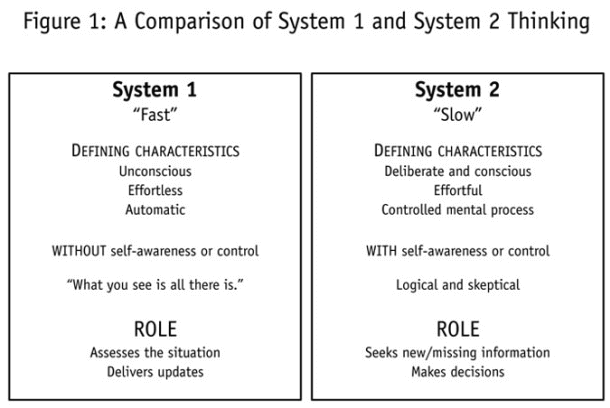
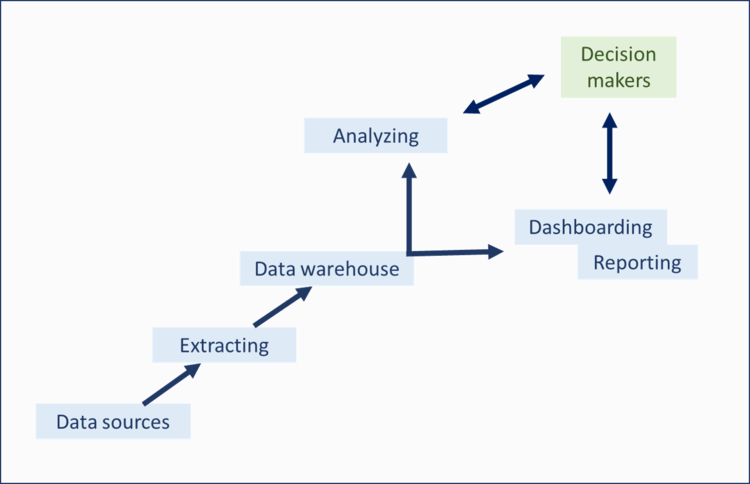
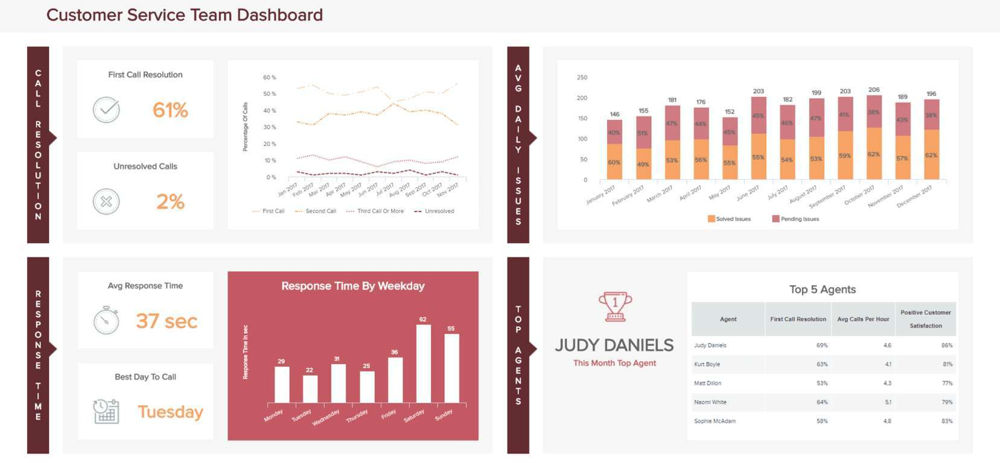

_“没有大数据，在高速公路中间，你就瞎了，聋了。” – Geoffrey Moore，管理顾问和作家_

在一个以数据为主导的世界中，企业比以往任何时候都需要了解如何从触手可及的大量数字洞察中提取每一滴价值。

据 Better Buys 称，85% 的企业领导者认为，利用大数据发挥优势将显着改善他们经营公司的方式——他们并没有错。

通过了解哪些数据集与您的组织中的特定目标、战略和计划相关的能力，您将能够识别有助于您在组织内的许多关键领域做出重大改进的趋势或模式。这个概念被称为[商业智能](https://www.datafocus.ai/infos/bi-skills-for-business-intelligence-career/)。

商业智能，简称“BI”，每年在各行各业中变得越来越普遍。但是商业智能概念带来了很多混乱，最终导致了不必要的行业术语。这些行话导致[商业智能流行语](https://www.datafocus.ai/infos/business-intelligence-buzzwords-2019/)，从而淡化重要信息的含义。

随着我们对商业智能的介绍，我们将消除围绕 BI 的神话，探索核心商业智能概念，涵盖 BI 基础知识，并深入研究现实生活中的[商业智能示例](https://www.datafocus.ai/infos/analytics-and-business-intelligence-examples/)和用例。

## 商业智能概念简介

商业智能概念是指以数据仓库、分析和可视化的形式使用数字计算技术，目的是识别和分析基于业务的基本数据，以产生新的、可操作的企业洞察。

BI 技术提供与组织内所有部门相关的内部结构化数据的当前（实时）、历史和预测视图，从而指数级地增强运营洞察力并改进决策过程。

**简而言之：**商业智能是发现数据中有价值的趋势或模式，以做出与您的业务目标、目的和战略相关的更有效、更准确的决策的过程。

由于模式识别是 BI 的决定性部分，商业[智能中的人工智能](https://www.datafocus.ai/infos/artificial-intelligence-in-business-intelligence/)在此过程中起着举足轻重的作用。如果处理得当，模式识别是区分 BI 专家和 BI 业余爱好者的关键标志之一。通过帮助用户自主发现完整的洞察，人工智能技术极大地帮助了模式识别，使过程更直观、更精简，最终更准确。

一系列商业智能概念是通过直观、交互式的工具和仪表板来实施的，这是一个集中的空间，提供轻松深入数据的能力。稍后会详细介绍。

接下来，让我们考虑商业智能概念如何与人脑的内部运作相关联。

## 我们大脑中的两种决策方式

国际象棋神童 Joshua Waitzkin 在《学习的艺术：追求卓越的旅程》中写到了这一区别。维茨金在他的书中指出，最好的国际象棋棋手是那些能够在短时间内获取最多信息的棋手。他们使用大脑的“快速思考”系统来做到这一点。

让我们解释一下。正如诺贝尔奖获得者心理学家丹尼尔·卡尼曼(Daniel Kahneman)在他的《思考，快与慢》一书中所述，你的大脑有两种不同的学习和决策系统：

_\*\*来源：__Readinggraphics.com_

 

### 1.缓慢但准确

您有一个缓慢的思维系统，您可以将其视为注意力的聚光灯。当您真正专注并逐步思考问题时，您会使用此系统。这个缓慢的思维系统非常准确。但是，它每次只能处理这么多的信息，并且需要大量的能量。

我们中的许多人在做大多数决定时都没有使用这种缓慢的思维系统。相反，我们使用我们的快速系统，也就是我们的直觉。

### 2\. 快速但容易出错

您的快速思维系统可以一次接收大量数据。它还可以非常快速地做出决策，而且准确度很高。然而，你的快速思维系统有一个很大的缺点。它容易出现逻辑谬误和感知偏差。

如果你的慢思考系统就像一个聚光灯，那么你的快思考系统就像一张图片中没有聚焦的区域。你不需要消耗太多的能量来使用它，但你看事物的能力不如你用你的慢思考系统那么清楚。

_\*\*来源：Readinggraphics.com_

随着您获得专业知识越多，您缓慢思考系统的能力或您的意识焦点似乎并没有太大变化。

与大多数人一次只能在短期记忆中保存这么多数字的方式类似，您的缓慢思维系统似乎有一些生物学上的限制。

### 专家有更好的模式识别

此时，您可能会想，“这一切都很好，但它与专业知识和商业智能有什么关系？” 这里的关键是，一个领域的专家能够使用他们快速思维系统一次识别和使用比业余爱好者更多的信息。

正如维茨金在“学习的艺术”中所写的那样，国际象棋大师可以在几秒钟内查看棋盘，并在几分钟内获得比业余爱好者更多的有用信息。由于这种更强大的信息处理能力，专家们能够在重要的地方使用他们的慢思维：批判性思维和检查他们的偏见。

您可以将商业智能视为一种极其强大的[数据发现工具](https://www.datafocus.ai/infos/what-are-data-discovery-tools/)，它是您快速思考思维的延伸。

这是有道理的，因为商业智能允许您处理比其他方式更多的信息。虽然您仍然需要做功课并使用批判性思维检查所有内容，但如果您正确使用商业智能，您将比市场上的其他公司拥有难以置信的竞争优势。

## 为什么商业智能概念和BI解决方案在今天如此重要?

随着数据的产生，商业智能的重要性也在增长——这对于正常的人类大脑来说变得越来越难以理解。

**如前所述：**_我们生活在一个充斥着数字数据的世界中，如果不利用它为您带来优势，您将很快落伍，这将使您的企业在几年内过时。_

但是，尽管数字数据在决策制定和提高业务效率方面具有强大的作用，但只有知道如何正确处理它，它才有优势。这就是当今 BI 概念的用武之地。

为了突出商业智能概念在现代的重要性，以下是接受 BI 的主要好处：

### 1\. 它们可以防止您被数据淹没

事实是，如果没有商业智能，您就有可能被数据淹没。看看这些数字：根据CloudTweaks， 2015 年每天产生 2.5 万亿字节的数据。你知道这是多少吗？这是一个 2.5 后跟18 个0。我们已经进入了 泽字节（Zettabyte） 时代，这也是我们2019 年的[技术流行语](https://www.datafocus.ai/infos/technology-buzzwords/)之一，而就规模而言，在 2012 年，整个互联网仅包含 ½ 个ZB的数据。

指数增长怎么样?

_\*\*来源：_[_Adeptia_](https://adeptia.com/blog/surprising-things-you-dont-know-about-big-data)

**\*\*点击放大\*\***

取决于您如何看待它，如此庞大的数据量要么是令人头疼的问题，要么是世界上最大的机会。一方面，可能出现的有用信息比以往任何时候都多。但是，另一方面，阻碍您找到有用信号的噪音比以往任何时候都多。

### 2\. 他们提供了丰富的见解

通过为您的业务使用[自助式 BI 工具](https://www.datafocus.ai/infos/self-service-bi-tools)和概念，您将能够获得丰富的洞察，帮助改善部门间和外部沟通、问题解决流程、[在线数据分析](https://www.datafocus.ai/infos/data-analysis-tools)、财务效率、目标设定、营销和盈利能力。

### 3\. 对标更准确

通过使用基于 BI 的关键绩效指标 (KPI)，您将获得设置可执行目标的能力。反过来，这将帮助您更有效地制定策略并更有效地朝着必要的基准工作，从而加速您的整体成功。通过为您的业务选择和设置正确的[KPI 模板](https://www.datafocus.ai/infos/kpi-examples-and-templates/)，您将能够更深入、更准确地评估您的目标和进度。

### 4.您可以预测您的业务未来

商业智能的另一个关键概念是预测未来趋势的能力。[在线 BI 工具](https://www.datafocus.ai/infos/online-bi-tools)和解决方案提供的可消化模式和信息提供了一种可行的方法来预测未来结果，并制定计划以防止灾难发生或在竞争对手之前利用潜在趋势。

### 5\. 它们支持强大的数据可视化

如果您能够在[在线数据可视化](https://www.datafocus.ai/infos/data-visualization-tools)的帮助下可视化您的数据，使其易于被人眼理解，您将能够用您的洞察力讲述一个故事，并将您的发现更有效地传达给他人。这样做将促进您的组织取得成功，使其比以往任何时候都更加强大。BI 解决方案将帮助您做到这一点。

商业智能是基础至关重要的。我们需要它们来消除噪音，在我们生活的数据海洋中找到好东西。

既然您已经知道了它的重要性，以及它在数字时代的主要好处，那么让我们分解一下当代BI解决方案的关键组件。

## 商业智能的概念是什么？

如果您向 BI 专业人士询问商业智能概念的核心，他们可能会将其分解为特定的部分或层。但是，出于本文的目的，我们将解释商业智能中的 4 个基本组件：

- 数据本身（原始数据）
- 数据仓库
- 数据访问、分析和演示
- 数据仪表板和报告

### 1) 原始数据

集成 BI 解决方案的第一个组成部分是数据本身。这些数据可以是当年的销售记录、最新广告计划中实施的关键字、工资和福利表或损益表。

公司的数据通常存储在大量数据库中，具体取决于收集每个特定数据集的方式（通过 CRM、ERP、平面文件、API 等）。由于这种碎片化，今天的 BI 解决方案是使用各种[数据连接器](https://www.datafocus.ai/infos/data-connectors/)开发的，这些连接器允许用户将他们的所有数据库整合到一个集中的数据仓库中，从而使他们能够联合处理每个洞察并增强跨数据库分析。

### 2）数据仓库

如前所述，[数据存储仓库](https://www.datafocus.ai/infos/data-storage)是将所有不同数据库连接在一起并允许您在它们之间创建关系的平台。[随着基于云的 BI 工具](https://www.datafocus.ai/infos/cloud-bi)的引入，这一领域最近取得了巨大进展。

数据仓库的传统方法通常是不同 Excel 工作表、必须技术人员访问的旧主机风格据库、纸质记录和专有程序数据库的混合体。

在意识到利用所有这些分散的数据源是多么困难之后，人们开始通过使用仓库和系统来集成数据库。现代系统也优于旧系统，因为它们经常实时更新，而不是必须手动更新——这个过程通常需要 IT 部门。

### 3) 数据访问、分析和展示

一旦您的所有数据都连接起来并可以“相互交谈”，接下来的关键商业智能概念之一就是利用这些数据。这包括访问数据、分析重要趋势并以可立即理解的方式呈现数据。

这些步骤通常可以混合在一起，特别是如果您使用[交互式仪表板](https://www.datafocus.ai/infos/interactive-dashboard-features/)，可以根据您的业务需求放大和缩小数据。自 Excel 时代以来，数据展示也取得了长足的进步。现在有漂亮、直观的 [仪表板示例](https://www.datafocus.ai/infos/dashboard-examples-and-templates/)，可以一目了然地为您提供所需的信息。

### 4) 数据仪表板和报告

基于我们之前的观点，第四个交互式仪表板，可能也是最关键的部分，它有持续跟踪、监控和报告数据的能力。

通过访问灵活、可定制、数据驱动的 [在线仪表板](https://www.datafocus.ai/infos/online-dashboard)，您可以设置目标、识别模式、发现趋势并发现促进增长和改进的洞察。通过主动性、功能性和无缝数据可视化，您还可以以包容且易于理解的方式与组织内的其他人分享您的发现。

此外，当今基于 BI 的[仪表板报告](https://www.datafocus.ai/infos/dashboard-reporting)是便捷的的，您可以在世界任何地方、在多种设备上全天候登录、分析数据和共享信息。

很明显，这 4 个商业智能概念是数据驱动成功的秘诀。现在让我们看看如何在现实环境中应用它们。

## 如何在现实世界中应用 BI 概念？

正如您之前所读到的，商业智能基础知识实质上提升了您查看与您的业务和市场相关的有用趋势和模式的能力。商业智能概念允许您利用“80-20 原则”，即任何领域 80% 的结果来自 20% 的行动。

为了充分利用它，有一个重要的维度需要披露：数据可视化。将您处理的大量数据可视化对于理解这些数据至关重要。因此，您应该将一些[仪表板设计原则](https://www.datafocus.ai/infos/dashboard-design-principles-and-best-practices/)应用于我们在本指南中介绍的整体 BI 基础知识。

从选择正确的[数据可视化类型](https://www.datafocus.ai/infos/how-to-choose-the-right-data-visualization-types/)到知道如何进行高效地[讲述仪表板故事](https://www.datafocus.ai/infos/dashboard-storytelling-with-kpis-presentation-examples/)，有很多东西需要探索。考虑到这一点，这里有几个 BI 用例。

### 1\. 缩短销售周期

使用[销售分析](https://www.datafocus.ai/infos/business-intelligence-sales)，您可以查看哪些销售经理表现最好。然后，您可以更深入地挖掘为什么他们的表现优于其他同事，并了解如何在更大范围内复制他们的成功。

有了像下面这样的[销售仪表盘](https://www.datafocus.ai/infos/dashboard-examples-and-templates/sales)，我们可以清楚地分析漏斗每个步骤的销售周期长度，并比较每个经理的绩效：

 

### 2\. 识别客户的行为

你可以研究哪些客户获取渠道目前能够带来最大的收益。您还可以分析哪些客户获取渠道为您提供了最好的客户——那些按时付款并为您推荐新业务的客户。

 

例如，像上面这样的[零售商店仪表板](https://www.datafocus.ai/infos/dashboard-examples-and-templates/retail#retail-store-dashboard)将极大地帮助经理了解他的客户行为。将销售额按差异划分，显示女性用品是主要收入来源；按位置分解它们，显示了每个城市的表现。所有这些都将有助于根据目标设计特定的营销活动，或者他们在执行 A/B 测试活动时需要比较两个销售点，以便更有效地获取新客户。

### 3.策划成功的营销活动

结合使用[营销分析](https://www.datafocus.ai/infos/business-intelligence-marketing)和预测分析，您可以确定最有效的营销活动及其共同因素。在下面的[网络分析仪表板上](https://www.datafocus.ai/infos/dashboard-examples-and-templates/marketing#web-analytics-dashboard)，您可以了解您的在线状态如何，您应该关注的不同渠道收购，以及根据您的目标，您的不同营销活动的执行情况。

 

然后，您可以使用此信息来计划您的下一个营销计划，并使其尽可能成功。

### 4\. 改善您的客户体验流程

在信息时代，客户服务和客户体验 (CX) 是持续增长和成功的最重要因素之一。让他们始终保持正确是至关重要的。

 

[像我们的客户服务仪表板](https://www.datafocus.ai/infos/dashboard-examples-and-templates/customer-service)这样的 BI 解决方案提供了一系列关键见解，旨在定期满足或超越客户的期望。结合重点[客户服务 KPI](https://www.datafocus.ai/infos/kpi-examples-and-templates/customer-service)（包括平均响应时间和顶级座席），此仪表板可提供洞察，以促进您面向客户的工作以及您的内部培训和发展计划。这使它成为始终能促进一致性、卓越性和以客户为中心的创新的明确手段。

### 5\. 控制您的整个采购操作

除行业或部门外，采购几乎是每个企业日常运营的后勤核心，而且它不仅仅局限于有形库存或货物。在当今的环境下，采购还包括第三方供应商、自由职业者和代理机构的服务。

有各种[采购 KPI](https://www.datafocus.ai/infos/kpi-examples-and-templates/procurement)，但保持它们流畅、有凝聚力、高效和一致是您成功的关键——如果链中的一个多米诺骨牌倒下，其他大多数也会倒下。为了使您的采购工作尽可能顺利进行，将 BI 概念应用于您的战略至关重要。

 

我们的[采购仪表板](https://www.datafocus.ai/infos/dashboard-examples-and-templates/procurement)为您的整个运营提供可浏览的全面概览，提供有助于加强弱点、管理关系并节省时间和金钱的洞察——这再次证明了 BI 解决方案的强大功能。

### 6\. 提高您的 IT 项目管理

作为数字化转型的直接结果，IT 部门的作用比以往任何时候都更加广泛，压力也更大。

为提供优良的内部支持；管理补丁、资产和服务器；解决潜在问题；并确保项目以最佳能力（并按时）交付，采用 BI 方法至关重要。

 

上面介绍的[IT 仪表板](https://www.datafocus.ai/infos/dashboard-examples-and-templates/it)提供了所有 BI 基础知识，再加上量身定制的[IT KPI](https://www.datafocus.ai/infos/kpi-examples-and-templates/it)组合，以帮助管理和改进最忙碌的 IT 部门。通过使用基于 IT 的仪表板，您可以更有效地解决常规问题、交付项目并管理基础设施，这将对您的整个组织产生难以置信的积极影响。

本文对商业智能基础知识的介绍，证明在当今数据驱动的世界中，能够筛选噪音以挖掘出真正重要信号的公司和个人将远远超越竞争对手。BI 概念为寻求前沿竞争优势的精明个人和企业提供了一种高级模式识别形式。

总之，BI 可以帮助您了解您的市场、您的客户、您的竞争对手和您的业务，以便您做出最有效的决策。

因此，不要错过这趟列车，并通过[DataFocus的 30 天免费试用](https://www.datafocus.ai/console/)加入 BI 潮流！
