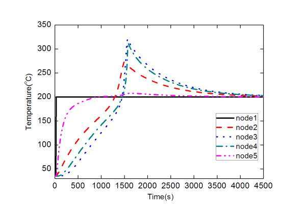

谈到数据分析，往往都会提到数学能力、统计学知识或者编程能力等等，每一个都是学习起来颇具难度的技能，因此常常使人觉得气馁。事实上，一些数据分析的方法并非对数学能力等等有着如此高的要求，更重要的是具备数据分析的思路。接下来，DataFocus数据分析团队将来给您分享一下。

1\. 分类 分类分析的目标是将一组人（或对象）划分为若干类别，或预测他们属于每个类别的概率。 举个例子吧：“京东的哪位用户会在618订购？”这是一个典型的两类问题：买还是不买。 分类分析（基于历史信息）产生模型，该模型预测新人（或事物）将属于哪个类别，或属于类别的概率。

 2. 回归 回归任务的目标是根据某个属性变量给每个人（或对象）一个数字（以衡量他的好坏）。 继续举个例子：每个用户在618订购京东多少钱？ 注意，回归和分类之间的区别在于分类输出的结果是几个固定选项之一，并且回归的结果是连续数，并且可能的值是无限的。 3. 聚类 聚类任务的目标是给一组人（或对象），并在不指定目标的情况下查看哪些人（或事物）更近。例子：是否可以为一组用户分成几种类型的购买记录？ 注意聚类与上述分类和回归之间的本质区别：分类和回归将有一个给定的目标（无论是否下订单，贷款违约，房价等），并且聚类没有给定的目标。 4. 相似匹配 类似匹配任务的目标是基于已知数据确定哪些人（或事物）与特定（一批）人（或事物）更相似。 例子：了解一群去年在双十一中投入超过1万元的用户，哪些用户与他们相似？

 5. 频繁集发现 频繁发现剧集的目的是找到经常共同发生的人（或事物）。这是着名的“啤酒和尿布”的一个例子。 6. 统计(属性、行为、状态)描述 统计描述任务的目标是最好的理解：人们在什么状态下做什么状态（或事物）。 例子：5月份7天内京东各用户的无条件退货数量 统计描述通常是用户欺诈检测。想象一下，用户每月返回100次以上。会是什么情况？ 7. 联系预测 联系预测的目标是预测应该存在关系的人（或事物）。 栗子：你可能知道xxx？你可能想看xxx？ 8. 数据压缩 数据压缩的目的是减小数据集的大小并增加信息密度。 栗子：京东想要分析用户对进口巧克力的偏好，筛选掉所有国内的产品。 大数据虽然数据越多越好，数据带来更多信息，但噪音也会增加。

 9. 因果分析 顾名思义，因果分析的目标是找出事物之间的关系。 比如：广告的效果是否有所改善，因为广告内容是好还是传递给更准确的用户？ 数据分析非常强大，但当然有必要使用科学的分析方法在特定情况下产生有价值的结果。
