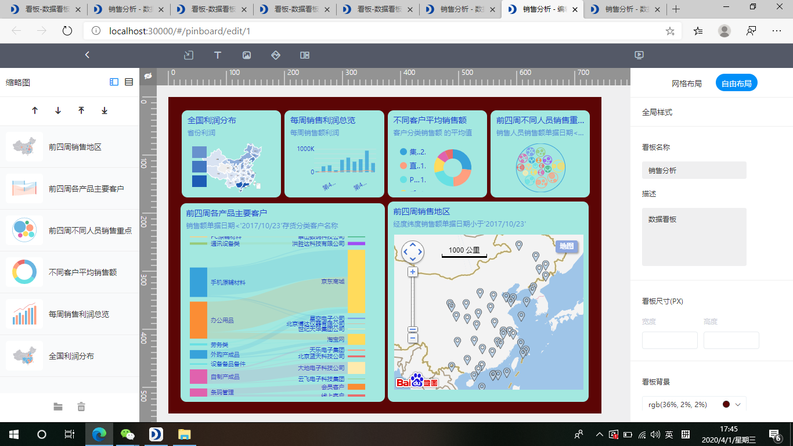

在如今的互联网时代，假如一个公司不可以合理的开展数据统计分析，或是不明白解析数据信息，那麼被同行业市场竞争掉是早晚的事儿。数据统计分析的結果没办法落地式，数据统计分析的使用价值远远地小于预估，这种难题全是数据统计分析的必要性。

数据分析是信息科技的一场改革。公司企业针对数据统计分析的利用率慢慢提升，企业的关键侧重点取决于顾客，因此依据自然环境的特性将数据统计分析分成不一样的种类，各自有规定性解析、分析预测及其说明性解析。那麼接下去就解读一下为何数据统计分析这般的关键。

**计算机科学视角**

数据统计分析应用不一样的专用工具及其方法解析来源于于不一样地区的数据信息。互联网大数据具备多元性、速度更快、数据信息巨大的特性。数据信息来源于于互联网、各种各样网页页面、声频视频及其别的来源于。

数据分析包含应用设备、大数据挖掘等的解析技术性来获取、提前准备和混和数据信息，从而开展数据信息的解析。如今，大中型的公司和企业都以不一样的方法来应用这种技术性。

互联网大数据一般 是规模性即时产生的数据信息，他们都是是非非结构型的，统计分析工具捕捉、储存起來开展解析。在其中数据统计分析的专用工具有：ApacheHadoop、Hive、Storm、[**datafocus**](https://www.datafocus.ai)这些。

**业务流程视角**

因为如今的公司对互联网大数据需求量的提升，那麼针对该类的专用工具的需要量也扩大。数据统计分析能够协助公司有新的看法和管理决策，来运作业务流程。统计分析工具有利于挖掘有效的信息内容，作出合理的管理决策，进而提升企业的权益，另外也可以节约企业领导者的時间和活力。

**即时行得通视角**

由于数据统计分析的优点诸多，因此数据统计分析获得了飞快的发展趋势。这就造成了许多的制造行业都应用互联网大数据。

统计分析工具获得的結果有益于更掌握顾客的要求，进而产品研发出更合适的商品。那样既能够协助企业获得更大的权益，还可以协助顾客更考虑于她们的要求。

**学生就业视角**

伴随着对云计算技术的市场需求慢慢提高，因此针对此层面的复合型人才的要求也愈来愈大。计算机科学和解析具备挺大的发展潜力。数据统计分析有益于业务流程顾客价值而且得到判断力。解析的应用能够提高投资分析师的制造行业专业知识，另外这种解析权威专家使公司更强的运用了数据信息。

磨刀不误砍柴工工欲善其事。在我国国内的数据统计分析商品datafocus是业内较为认同的数据统计分析商品，实际操作简单易入门。从数据库连接，到数据收集、数据处理方法，再到数据统计分析和发掘，连通了数据信息生命期的重要环节，保持数据信息申报、解决及其解析一体化，为客户出示一站式网络服务。可以提升网站安全性，服务项目数据统计分析。

数据统计分析很关键，自然选对了工具才算是更关键的事儿。
