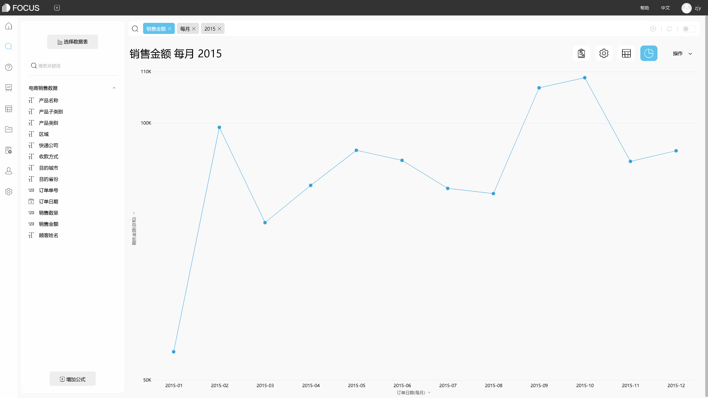

当今时代大数据发展的至今，企业的数字化转型应该清楚地认识到业务发展的趋势和面临的障碍，并更好地规划其寻求的业务成果的路径。考虑到这一点，以下是我们关注的三个主要数据趋势以及数字时代的业务和成功之间可能出现的三个困境。

1.真·机器学习

我们坚信，机器学习和人工智能将很快占领世界，至少是人类的大部分工作。然而，现实正在逐步向我们前进，我们发现机器学习作为人类助手而不是替代品可能是最有效的。人类工作和机器学习的结合是最好的结果。

2.从数据收集者到数据生成者

过去，公司专注于挖掘他们拥有的数据，发现和收集其他组织拥有的数据。但现在，公司需要一些战略转变，有意识地创建销售新产品和服务以满足业务目标所需的数据。例如，医疗检查公司收集有关患者生活方式和保险公司保险条件的信息，并在此基础上提供个性化的客户服务和指导。这些公司将更进一步，有针对性地收集和提供数据，以满足其客户的需求。

3.优化客户体验的新方法

大数据领域的最后几场战斗之一是增强用户体验。在目前的趋势中，使用自然语言处理来分析现有数据是个好主意。例如，社交媒体上的情感分析可以更容易地捕捉用户的喜好和改进产品。

DataFocus作为新生代的数据分析工具，有着最新的分析方式——基于自然语言分析的搜索式分析，以及严谨细致的行列粒度数据权限管控和安全的私有化部署方式，助力与您的企业构建数据分析系统。

 
