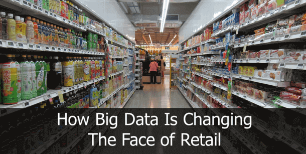
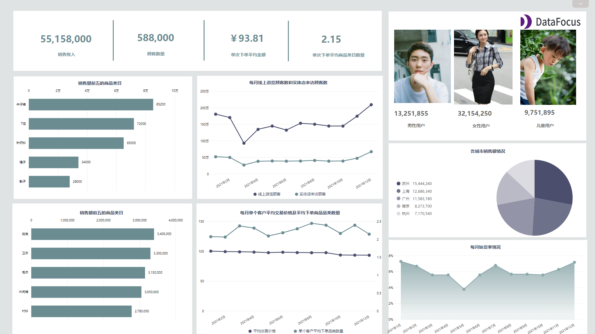

“信息是 21 世纪的石油，而分析是内燃机。” - Peter Sondergaard，Gartner

在当今这个超连接的数字世界，大数据无处不在。 不管你信不信，我们都有一个数字足迹，几乎我们在网上所做的一切都可以被分析、量化并用于帮助跟踪消费者趋势、行为和洞察，从而帮助品牌在个人层面上吸引更多用户。

也就是说，如果您是一名零售商并读到以下内容；如果您目前不在，您需要开始利用大数据来发挥自己的优势，例如通过[零售分析软件](https://www.datafocus.ai/infos/retail-analytics)来掌握和理解它。 为了与你的目标受众建立有价值的、个性化的内容或根据他们的个人需求定制的交易，你需要大数据。

大数据提供了有关您的品牌目标人群的深入信息，它正在以巨大的方式改变零售世界的面貌。

为了帮助您了解大数据对零售业的影响_，_我们将探讨大数据对零售业如此重要的原因。我们还将深入研究一些有价值的大数据零售案例，以生动地描绘这些指标在消费者世界中的价值。

让我们开始吧。

## 为什么大数据在零售业很重要？

正如前面提到的，我们生活在这样一个时代，普通消费者不仅非常精通技术，而且渴望与他们想要投资的品牌建立亲密关系，无论是在财务上还是情感上。

如今，一刀切的心态已经行不通了。

大数据正在帮助零售商更深入地了解他们的前景，通过一系列指标，包括社交媒体偏好、浏览行为、设备偏好、地理人口统计等，以及更容易获得的数据，品牌正在以比过去更有意义的方式扩展业务。

大数据的价值不仅限于纯数字零售商。 思科发现，仅店内分析就为零售业带来了价值 610 亿美元的价值。这意味着更古老、更传统的实体店获得了新的生机。

通过利用对顾客在店内如何参与产品或展示的高度精确的洞察，商业街商家能够定制他们的商品、交易和营销活动，以满足购物者的需求。它还帮助实体零售商更准确地衡量他们的投资回报率，有助于增长、发展和商业进步。能够帮助你做到这一点的最佳工具是[零售仪表板](https://www.datafocus.ai/infos/dashboard-examples-and-templates-retail)，它可以让你轻松可视化所有的分析。

很明显，大数据是任何现代零售商武器库的重要组成部分，如果不利用这些信息、洞察力和指标来发挥自己的优势，您可能会面临严重落后于竞争对手的风险。

## 利用大数据为您带来优势

大数据分析不仅可以帮助零售行业更好地了解客户，让客户在购买过程的每个阶段都能获得更个性化、更吸引人、更主动的体验，而且在其他领域也有显著的好处:

- **需求：**通过了解基于数据的消费者习惯洞察，零售商可以了解他们的哪些产品和服务最受欢迎，哪些应该停止提供。这些见解不仅可以节省资金和投资，还可以帮助品牌为消费者提供他们想要的东西。
- **预测：**大数据中的趋势预测算法可以帮助品牌做出关键市场预测和预测消费趋势。借助专业的[数据警报](https://www.datafocus.ai/infos/business-intelligence-data-alerts)，零售商可以实时监控需求波动，并可以开发出能够为他们提供最佳投资回报的产品。
- **定价：**通过获得有关实时客户交易的洞察，零售商可以更好地了解哪类价格对特定产品产生最佳效果。大数据技术还可用于“降价优化”——了解何时应该降低特定商品的价格。零售巨头沃尔玛已经获得了 实时销售的回报，作为其成功的结果，该品牌现在正在构建世界上最大的私有云，以便更深入地挖掘其客户的行为**。**
- **跨渠道：**在当今世界，全渠道体验非常重要。谷歌研究表明，98% 的美国人在同一天内切换设备。随着移动技术和社交媒体变得越来越复杂，消费者渴望一种跨越多种媒介和设备提供价值的零售体验。零售大数据让品牌有能力从各种设备和媒体中提取洞察，来创建活动、倡议和优惠，创造一个在数字和物理意义上无缝衔接的购买之旅。与不采用全渠道策略的公司相比，采用全渠道策略的零售商的客户保留率同比提高 91%，这是一个不容忽视的领域。

总之，通过利用大数据分析的优势，您将能够了解客户群的想要、需要和愿望，了解需求，预测无价的市场趋势，做出更明智的定价决策，并创造有价值的跨渠道购物体验。反过来，这些努力将成倍地提高您的品牌知名度、客户忠诚度和转化率。

现在您了解了如何使用大数据来获得最重要的竞争优势，让我们看看零售行业中的一些大数据示例。

## 从大数据和分析中获益的品牌

在零售领域，许多创新品牌和企业已经通过利用大零售数据发挥优势，取得了巨大的成果。这些大数据零售用例将告诉你如何做到这一点。

### 星巴克

这个巨大的咖啡品牌几乎不需要介绍——这家总部位于西雅图的品牌在其数十年的历史中不仅幸存下来而且蓬勃发展是有原因的。简而言之，这个原因就是创新。

星巴克拥有不可思议的能力，可以在同一个街区开设多家分店，并从每家分店中获得可观的利润。通过充分利用大数据分析，星巴克可以通过查看地理位置、客流量、区域人口统计和顾客行为等指标来预测每家新店的增长潜力。

此外，星巴克从每周 90 00多万笔交易中收集信息，并使用这些数据为其客户提供个性化体验，从而引发创新，包括其量身定制的数字奖励计划，该计划在顾客购买习惯和购买历史方面收集的数据越多，就越直观。

仅去年一年，星巴克的营收就达到了 223.9 亿美元，可以说星巴克是真正的零售赢家。

### 天气频道

尽管是一个天气频道，但它是现代娱乐界最具前瞻性的广播公司之一。

该广播公司通过其数据平台 Location FX 和 Weather FX ，研究天气对其观众情绪的影响。通过这样，天气频道利用预测分析的力量，通过发现有价值的位置趋势，引导其广告合作伙伴的活动朝着正确的方向发展。

以该频道与潘婷(Pantene)和沃尔格林(Walgreens)的合作关系为例。通过使用天气频道收集的指标，潘婷(Pantene)和沃尔格林(Walgreens)获得了预测空气湿度何时达到最高值的能力，发起了一项有针对性的活动，鼓励女性抢购她们的产品，以防止“尴尬”（或者她们说）的季节性毛躁。

结果？在活动启动前后的两个月内，Pantene 在 Walgreens 的销售额增长了10% 。

### Costco

在 Costco 利用数字指标和洞察力推出的众多消费者创新中，涉及一批受污染水果的事件可能是该品牌在零售示例中最引人注目的大数据。

与许多现代批发商一样，Costco 会跟踪您购买的商品和时间。一家位于加利福尼亚的水果包装企业向 Costco 发出警告，称其核果中可能存在李斯特菌污染。几周内，该公司没有向所有在 Costco 购物的人发出全面警告，而是能够通知购买了这些特定水果的特定客户，先是通过电话通知他们，然后是信件。

这个特殊的例子证明了大数据分析在零售领域的无与伦比的力量。

## 忽略这一点，后果自负

与上面详述的大数据零售用例相反，由于忽视数字数据和新兴技术，也出现了一些臭名昭著的商业失败案例。

最近的一个例子是历史悠久的玩具品牌 Toys'R'Us。 不久前，这家儿童零售商宣布，由于开始破产程序，仅在美国就将关闭约180家门店。

在导致其商业失败的一系列问题中，未能进行以数据为主导的全面数字化转型是导致了该品牌衰败的原因之一。玩具反斗城未能充分利用大量可用的数字数据发挥其优势，未能提供创新的全渠道体验，从而使其与亚马逊等在线零售巨头区分开来。

如果该公司能更深入地研究大数据，它本有机会保留现有的客户基础，并创造一种量身定制的购物体验，帮助它在数字时代蓬勃发展。

## 现代仪表板如何帮助您理解大数据？

正如我们在本文中所看到的那样，利用大数据分析将带来更大的商业成功。[此后，我们通过以易于理解的方式将重要的零售 KPI](https://www.datafocus.ai/infos/kpi-examples-and-templates-retail)可视化，向您展示使用这些分析的实际方法：专业的实时仪表板。

### 销售和订单仪表板

随着互联网的出现和普及，消费方式发生了变化，如今96% 的美国人在网上购物，而 2000 年这一比例为 22%。这种急剧增长还带来了大量分析数据，让您可以更好地跟踪和了解消费者行为。作为在线零售商，数据收集更加容易且丰富——所以你最好以一种有组织的方式跟踪正确的指标，以避免淹没在信息中，并最大限度地利用它。

使用上述销售和订单仪表板，可以评估您在订单和销售方面的表现；跟踪您拥有的总订单和每位客户的平均订单，您可以管理库存以避免产品短缺或相反的溢出。

同样，此仪表板向您显示完美的订单率，让您深入了解您的业务在无事故交付方面的效率 - 从订单的履行到运输和交付。这正是您要跟踪的指标类型，因为它直接影响客户保留率，并最终影响他们向朋友和亲戚推荐您的服务的可能性。

最后，您还可以看到需要跟踪和了解的退货：客户为什么要退回他们的商品？这将极大地帮助您在未来改进您的产品和服务。

### 零售店仪表板

数据截图：DataFocus（数据已脱敏）

尽管这种情况越来越少，但并非每个零售商都在线上。在许多情况下，现实生活中的线下体验感比线上更强烈。它同样重要，并且需要更多的跟踪，因为数据不像在线那样容易收集和处理。涉及许多不同的实体，从仓库管理到销售商店本身及其库存。

通过跟踪零售店中发生的事情，您可以识别一些客户的模式，并根据结果调整您的策略。了解您的畅销商品将让您深入了解当下的潮流，以及客户喜欢什么。您可以订购类似的商品，但也可以通过识别前 10 件商品并监控 OOS（缺货）率来防止缺货。缺货是您显然想要避免的情况，因为它会将对您不满意的客户推向竞争对手，并损害您的形象。

同样，评估您的总销售额，并将其按类别和每个位置进行细分，您就会知道谁和哪里是您的主要收入点。这样，您可以创建对受众产生更大影响和更高投资回报率的定制化活动。

关键是，大数据是零售业的未来，如果您想在当今乃至未来的世界中取得成功，充分利用消费者洞察是财富至关重要。如果你不这样做，你就会落后于其他人，让你的品牌和产品比你想象的更快地过时。另一方面，利用大数据来发挥自己的优势，回报可能是无穷无尽的——这是一件美好的事情。 为了进一步增强您的大数据知识，您可以查看我们关于[物流](https://www.datafocus.ai/infos/how-big-data-logistics-transform-supply-chain)中的大数据如何改变供应链的文章。

如果您想了解零售分析软件如何帮助您的组织，请立即注册30天[免费试用](https://www.datafocus.ai/console/)，或与我们联系 ——我们期待您的回音！
