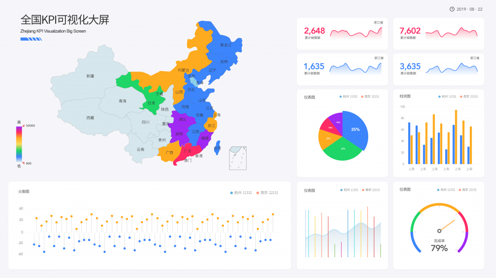
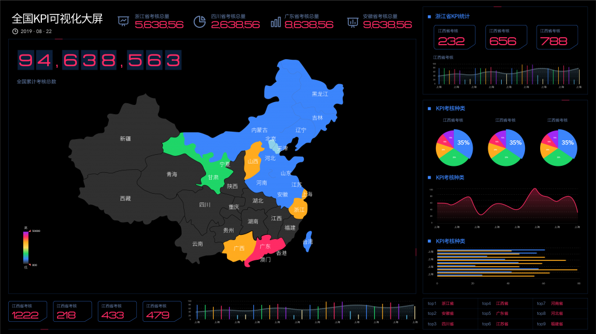

大数据时代，公司大数据管理看起来至关重要。公司大数据管理分成公司本身的数据管理，如公司的顾客、商品、市场销售、库存量等数据信息和公司的外界数据管理，如产品与服务的点评、信息工作、行业动态的搜集等。因此 挑选一个功能强大的公司大数据管理平台软件对公司的发展趋势十分关键。

移动互联、社交网络和其他来源的数据信息爆发式提高，造成了大量的数据信息，公司会细心搜集这种数据信息，并将其储存起來，便于多次重复使用。数据信息早已做为公司关键财产被广泛运用于赢利剖析与预测分析、客户关系管理管理方法、合规管控、经营风险管控等业务流程之中。

## 协助公司掌握客户

根据数据分析技术，公司能够将顾客、客户和商品开展有机串连，对客户的商品喜好，顾客的关联喜好开展人性化精准定位，生产制造出客户驱动型的商品，开发出顾客主导性的服务项目。

从大数据技术层面看来，用数据信息来引导公司的发展，将已不只是一句标语。根据应用互联网大数据，不但能够从数据信息中挖掘出融入公司发展自然环境的社会发展和商业服务形状，用数据信息对客户和顾客看待商品的心态，开展发掘和洞悉，精确发觉并讲解顾客及客户的众多新要求和个人行为特点，这终将颠复传统式公司在用户调研全过程中，太过依靠以偏概全的市场需求分析方式。

## 协助公司开展资源精准定位

根据大数据技术，能够完成公司对所需資源的精确定位，在公司在经营全过程中，所必须的每一种資源的发掘方法、详细情况和储藏量遍布等，公司都能够开展收集剖析，产生根据公司的資源遍布可主视图，就好似“在线地图”一般，将原来仅仅虚似存有的各种各样优点点，开展“点到点”的数字化、图象化呈现，让公司的管理人员能够更形象化路面对自身的公司，尽快运用各种各样现有和潜在性資源。

## 协助公司搞好运营策划

过去企业品牌如必须做市场需求分析，大多数靠本身資源、公关和过去的实例来开展剖析和分辨，得到的结果通常也较为模糊不清;非常少能获得各自行业内的足够重视。根据互联网大数据的相关分析，依据不一样知名品牌销售市场数据信息中间的交叉式、重叠，公司的经营方位可能越来越形象化并且非常容易鉴别，在品牌营销、区位优势挑选、战略发展规划层面将保证更有机会路面对。

根据数据分析能够分辨顾客话题讨论各种来源的比率，明确顾客上网的习惯性;信息内容的关键话题讨论，及其有关网络媒体曝光量，公司能够目的性得挑选并制订活动营销服务平台、营销推广方位等，提高企业经营实际效果。

## 帮助公司更好的进行项目服务

根据互联网大数据计算对社交媒体信息内容数据信息、顾客互动交流数据信息等，能够协助公司开展知名品牌信息的水平化设计方案和碎片化扩散。经济师RichardH.Thaler以前明确提出一种见解，“个人见解的细微转变都能够演化为任何人的群体行为方式的重特大转型。”

在这里一重特大转型的情况之中，对细微的信息流广告，公司都务必高度重视，而顾客服务为解决这类状况，也必须像气体一样遍布在一些细微末节当中。公司能够依靠社交网络中公布的海量信息，根据互联网大数据信息内容交叉验证技术性、分析数据內容中间的关联系数等，从而朝向社会性客户进行精细化管理服务项目，提供更多便利、创造更大的价值。
