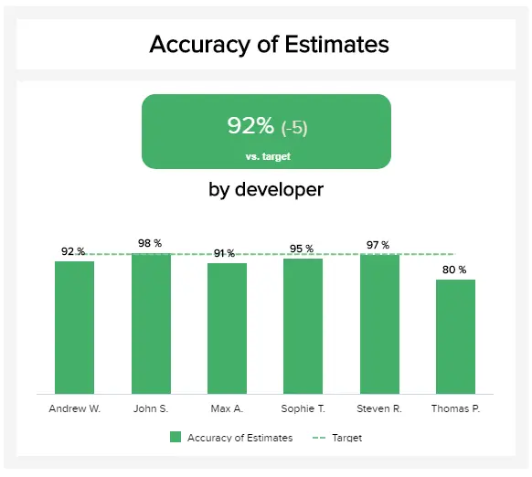
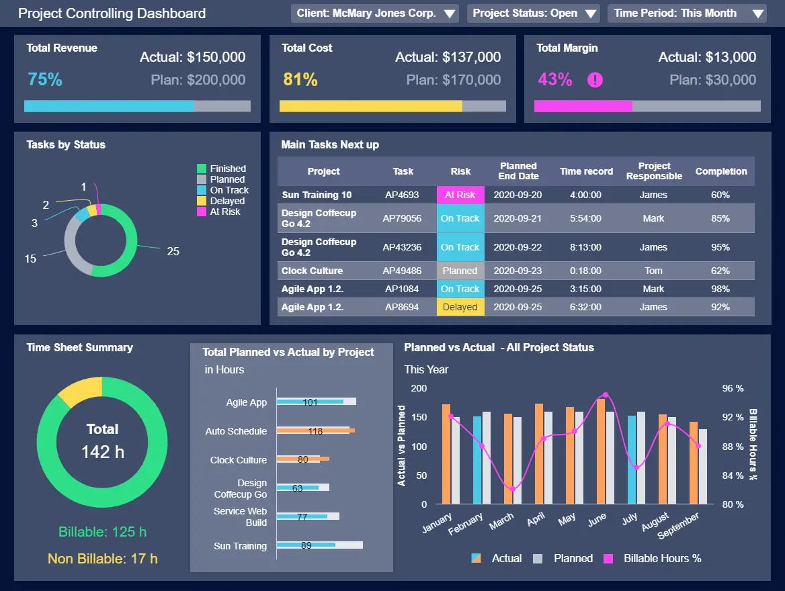
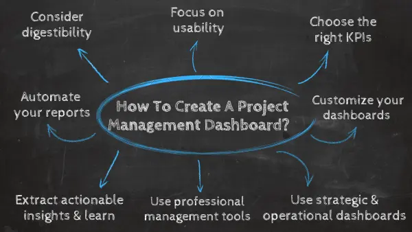

目录

[1） 什么是项目管理仪表板？](https://www.datafocus.ai/infos/how-to-create-a-project-management-dashboard-examples-templates#definition)

[2） 项目管理仪表板示例](https://www.datafocus.ai/infos/how-to-create-a-project-management-dashboard-examples-templates#examples)

[3） 如何创建项目管理仪表板？](https://www.datafocus.ai/infos/how-to-create-a-project-management-dashboard-examples-templates#how-to)

[4） 项目管理仪表板的好处](https://www.datafocus.ai/infos/how-to-create-a-project-management-dashboard-examples-templates#benefits)

项目是企业成功的基石之一。撇开部门或行业不谈，专注于特定业务领域的战略计划有助于推动组织年复一年地前进、成长、进步和发展。此外，实施有效的[管理报告](https://www.datafocus.ai/infos/management-reporting-best-practices-and-examples/)将创建一种数据驱动的方法来制定业务决策并获得可持续的业务成功。

但是，根据项目管理研究所进行的全球调查，尽管成功交付协作战略具有促进业务的潜力（和至关重要性），但只有58%的组织充分了解项目管理的价值。有了这些知识，您可以在竞争中获得显着优势，并成倍地提升您的项目。

 

通过采用[在线数据可视化](https://www.datafocus.ai/infos/data-visualization-tools)方法来处理公司的战略活动，无论大小，您将使您的业务更具凝聚力、协作性、智能性和盈利能力——项目管理[仪表板](https://www.datafocus.ai/infos/dashboard-examples-and-templates-management)将帮助您做到这一点。借助现代解决方案，您可以监控、优化和增强项目绩效，同时提高整个团队的生产力，节省无数工作时间，并最终节省成本。

考虑到这些概念，我们将解释项目管理仪表板的基本动态，探索最佳示例和模板，并深入研究项目仪表板的好处以及如何创建一个。但首先，我们将回答一个基本问题：什么是项目仪表板？

阅读本文后，您将获得利用现代项目管理仪表板软件的专业知识和完整的路线图，以帮助您开始这个令人兴奋的工作领域。

让我们开始吧。

您的机会：[想要构建出色的项目管理仪表板吗？](https://www.datafocus.ai/console/)试用我们的专业仪表板软件 14 天，完全免费！

## 什么是项目管理仪表板？

项目管理仪表板是一个数据驱动的平台，它通过在一个中心位置显示定制的 KPI 组合来显示特定于特定项目或策略的指标、统计信息和见解，以提高项目的绩效。

这样的仪表板非常适合希望监控其项目和活动的成功、发现过去或现在的趋势并最终有助于使组织更加智能的各个部门。项目仪表板软件由于其灵活的访问和可用性，对于部门间协作也很有效，但我们将在本文后面解释这个概念。

现在，我们将查看各种功能的顶级示例，并为您提供每个功能的详细信息。

## 最佳项目管理仪表板示例

通过探索这 5 个基本项目仪表板示例，将 PM 仪表板的所有质量和功能放入现实世界的上下文中。它们提供了在 IT、营销中执行的项目的概述，但也可用于其他项目，因此您可以将它们用作模板。让我们更详细地了解这一点。

### 1\. IT 项目管理仪表板

此项目仪表板模板是我们 5 个项目仪表板示例中的第一个，它侧重于从头到尾成功交付非常具体的基于 IT 的战略计划所涉及的步骤和任务。

\*\*点击放大\*\*

无论您的行业或部门如何，如果首席信息官 （CIO） 希望提供更多价值并对业务产生更重大的影响，他们都必须与公司的核心战略重点保持一致。为了实现这一目标，IT 驱动的仪表板是无价的工具。

这个基于 IT 的项目管理工具中的每个[IT KPI](https://www.datafocus.ai/infos/kpi-examples-and-templates-it)和可视化元素都有助于提高效率、沟通和凝聚力，深入到任务管理和交付、截止日期和特定工作负载。

通过全面了解这些见解，可以使贵公司的 IT 项目比以往任何时候都更省时、更具成本效益和结果驱动。让我们更详细地探索此[IT 仪表板](https://www.datafocus.ai/infos/dashboard-examples-and-templates-it)的核心 KPI：

a） 总票数与不平开票数：

此特定 KPI 通过仔细监视进度和工作负载，有助于提高 IT 项目的整体性能、效率和交付。它将构成项目整体成功的基础。

通过监控此 KPI，您可以轻松发现未解决的任务，并避免将它们堆积起来，从而导致整个项目出现问题。您可以立即确定团队的工作量并调整截止日期或与您的员工交谈，看看他们是否需要更多帮助。这样，您可以防止预计发布数据中出现问题并相应地调整您的票证。

b） 按预算交付的项目：

这个宝贵的 KPI 提供了详细、准确的评估，以评估您保持在预算限制范围内的能力。如果您学会了如何保持在预算范围内，您的项目将更加有效和高效。

成本是任何项目的关键部分。当然，意外费用一直在发生，并可能导致计划变更和额外优化。在这种情况下，创建一个余量来考虑这些意外事件是有意义的。

c） 平均处理时间：

平均处理时间 KPI 提供了宝贵的见解，了解您在时间范围、交付日期和截止日期方面处理项目的情况。成功项目管理的重要组成部分。

该指标对于每个项目经理来说都是无价的，因为您可以优化每个团队成员的未来任务和工作量。在上面的这个例子中，我们可以看到一些团队成员难以完成他们的工作，因此您可以进一步调查并提供额外的帮助。

d） 重新开放的门票：

重新打开的工单将向您展示如何有效地处理特定任务，正确保存，并且以后不会重新打开。定期监控这一点至关重要，这样您就可以了解您的团队是否有效地处理工单或他们需要额外的帮助。

在上面的这个具体示例中，我们可以看到 12 周内的总体进度、重新打开的工单的百分比以及与上个月的比较。数字越低，您的工单管理效果越好。

e） 精度估计：

成功的项目在其监控过程中应实施的另一个关键要素是准确性估计。团队成员估计完成任务需要多少时间。如果需要更长的时间，则需要进行其他调整。

在上面的例子中，我们可以看到一些开发人员没有以最好的方式进行估计 - Thomas 的计算被遗漏了 1/5，而其他人则超过 90%，这通常是一个很好的结果。这些估算可以在各种项目中实施，包括代理商需要为其客户估算时间的营销。

说到营销，我们现在将仔细研究代理商如何借助现代仪表板解决方案升级其项目绩效。

### 2\. 代理商的营销绩效仪表板

如果没有有效的、以目标为导向的营销策略，您的业务将永远无法增长或发展。此[市场营销仪表板](https://www.datafocus.ai/infos/dashboard-examples-and-templates-marketing)模板专门关注组织的促销计划。代理商使用它来监控和管理其客户的多个活动和项目的绩效，以便创建在这个快节奏的行业中使用的综合[营销报告](https://www.datafocus.ai/infos/daily-weekly-monthly-marketing-report-examples/)。

\*\*点击放大\*\*

营销绩效仪表板是一个非常宝贵的项目仪表板模板，因为它直接触及了机构促销活动的成本效益、目标会议能力、参与度和点击率的核心。

此营销仪表板提供了每个相关营销渠道中所有广告系列效果数据的理想概览。此外，它还展示了您需要的所有见解，以决定以最明智、最具战略性的方式将营销预算放在何处，以便您可以快速有效地向客户展示您的结果。让我们一瞥使这个整体仪表板滴答作响的 KPI。

主要关键绩效指标：

- 点击率 （CTR）：点击率是一项重要的营销指标，可明确指示您的促销内容、资产和通信与目标受众的共鸣程度。
- 每次点击费用 （CPC）：这是一个重要的营销指标，因为它可以全面概述您的各种促销广告支出在每个渠道上的花费以及每项活动对项目成功的有效性。
- 每次获取成本 （CPA）：通过了解您的各种促销活动在获取新客户或转化方面的成本，您可以进行战略调整，从而节省资金，同时促进您的成功。您的注册会计师将帮助您做到这一点。

您的机会：[想要构建出色的项目管理仪表板吗？](https://www.datafocus.ai/console/)试用我们的专业仪表板软件 14 天，完全免费！

### 3\. 项目控制仪表板

项目控制是项目管理的核心组成部分，因为它提供了重要的支持，以确保实现所有项目目标。它通过将目标的实际状态与预期状态进行比较来做到这一点，以便密切跟踪值并找出是否缺少某些内容。监视领域包括预算、成本、日程安排和绩效进度。让我们通过我们的项目控制仪表板更深入地了解它，该仪表板提供了与项目规划和绩效相关的所有详细信息的更大图景。

\*\*点击放大\*\*

仪表板首先指示客户端、项目状态和时间段。所有这些信息都可以根据要可视化的项目或时间段进行筛选。根据此信息，我们获得了与成本和收入相关的 3 个关键指标，每个指标都显示实际值和计划值。这使您可以快速可视化某些内容是否未按预期执行，并立即找到解决方案。接下来，我们看到一个[仪表图](https://www.datafocus.ai/infos/gauge-chart-examples/)，它按状态提供了任务的概述，旁边是更详细地分解任务的表格。他们每个人都被分类为风险级别和不同的颜色，以及完成百分比和负责人的姓名。手头有这种详细信息，以一种视觉上吸引人的方式，可以帮助每个人一目了然地快速了解任务的状态，并使项目尽可能高效。

最后，仪表板提供了与项目中计划和完成的工作时间相关的三个指标。我们得到的总工作时间分为计费和非计费，每项任务的工作小时数以及过去 8 个月的小时数的详细细分。

主要关键绩效指标：

- 总收入和成本：当项目处于评估的初始阶段时，将计算预期收入和成本。在项目开发过程中仔细测量这些数字非常重要，并注意这些值是否高于或低于预期，因为这可能会给项目的完成带来很大的问题。
- 按状态划分的任务：项目控制中的一个重要角色是负责团队。按状态和负责任务的人员或团队仔细查看任务，可以让您解决任何延迟并找到改进它们的解决方案。拥有此类信息还可以让团队成员了解他们之前的其他任务是如何完成的。
- 时间表摘要：在项目以及任何其他业务活动中，时间意味着金钱。因此，时间表摘要是要跟踪的重要指标，因为它允许项目经理了解在每个任务上花费的时间资源。工时除以计费和非计费工时，换句话说，即工作和待工时。

### 4\. 品牌分析项目仪表板

[市场研究和数据分析](https://www.datafocus.ai/infos/market-research-analytics)齐头并进。在展示调查结果时，市场研究机构通常依靠静态演示，并在传统的幻灯片和表格中提供每个项目的结果，这些幻灯片和表格无法立即回答所有问题。我们的下一个项目管理仪表板模板侧重于深入的品牌分析项目，该项目提供交互功能，使代理商和客户的项目演示更加轻松和有效。

\*\*点击放大\*\*

大量的问题、分析过程和呈现结果通常会给市场研究机构带来一个漫长而乏味的过程，以最有效的方式管理此类项目。项目管理仪表板工具可以轻松创建调查结果、采取的步骤的清晰概览，并使用简单而有效的[仪表板设计器](https://www.datafocus.ai/infos/dashboard-designer)可视化整个项目。让我们仔细看看使这个代理项目如此无价的 KPI。

主要关键绩效指标：

- 独立品牌知名度：一项直接调查，需要您采访过的人的积极思考，并通过开放性问题来衡量品牌回忆。受访者给出了他们脑海中出现的所有品牌的名称列表，没有任何偏见或帮助。
- 辅助品牌知名度：在一个开放性问题之后，评估消费者如何识别您的品牌是有意义的，但这个指标不需要受访者的积极思考。如果您发现识别一个品牌的比例高于另一个品牌，则消费者可能会关注投放的广告活动。
- 品牌形象：消费者的印象将他们的感知转化为他们与特定品牌相关的形容词和想法。从这个角度来看，将您的品牌形象与竞争对手进行比较是有意义的，看看他们是否根据您的营销活动来感知您的品牌。

### 5\. 东南亚广告系列项目的谷歌广告仪表板

如果您决定使用 Google Ads（以前称为 AdWords）进行营销项目，则需要清楚地了解统计信息、指标、预算和广告系列的整体效果。项目状态[Google Ads 仪表板](https://www.datafocus.ai/infos/dashboard-examples-and-templates-google-adwords)（例如下面的仪表板）将证明对您的 SEA 项目有益，并使您能够专注于它带来的最重要的数据和结果。让我们通过一个例子来了解这一点：

\*\*点击放大\*\*

如果您是广告活动经理，无论是内部还是代理方面，您都需要仔细查看每个营销活动的效果，以便交付成功的广告项目。此仪表板的核心是单个广告系列和汇总的转化，但您还可以查看设备细分和支出预算。

主要关键绩效指标：

- 转化率：此指标将显示所需目标操作（例如白皮书下载、电子邮件订阅或产品购买）的效果水平，您应该考虑到并非所有操作都能带来高百分比的转化。例如，电子邮件订阅转换的行为与产品购买不同。
- 每次转化费用：要查看预算在广告系列一级的效果，每次转化费用会告诉您哪些广告系列效果最佳。比较不同的广告系列以了解如何以最有效的方式使用预算是有意义的。
- 预算实现：此指标是营销项目中的一般控制数字。项目管理仪表板肯定会实施此 KPI，以查看预算目标的准确实施方式。

这些项目管理KPI仪表板适用于各个部门，您可以根据项目要求简单地调整它们，并在现代[管理报告工具](https://www.datafocus.ai/infos/management-reporting-tools)的帮助下提供最佳结果。

为了将您的项目控制仪表板提升到一个新的水平，我们现在将重点介绍创建此类仪表板的技巧，并使您能够改进您的项目，无论您的公司或部门规模如何。

您的机会：[想要构建出色的项目管理仪表板吗？](https://www.datafocus.ai/console/)试用我们的专业仪表板软件 14 天，完全免费！

## 如何创建项目管理仪表板？

很明显，项目管理仪表板是一种强大的[在线数据分析工具](https://www.datafocus.ai/infos/data-analysis-tools)。但是，这种直观的数据驱动软件只有在具有适合工作的正确属性、质量和功能时才有效。为了帮助您取得成功，以下是您在创建此类仪表板时应关注的 8 个主要技巧：

### 1\. 考虑消化率

当您在交付项目的过程中，压力可能会很大，这意味着要达到目标并完成工作，即时访问正确的信息至关重要。任何强大的项目管理工具都将在视觉上易于理解，设计精良，并以让您在几秒钟内从中提取价值的方式提供见解。

### 2\. 确保关注可用性

除了消化率（或有时称为“可扫描性”）之外，项目管理仪表板还必须完全用户友好。组织内的每个人都应该能够相对轻松地浏览您的[在线仪表板](https://www.datafocus.ai/infos/online-dashboard)，而且不应该需要技术人员定期干预和执行数据驱动的任务。简而言之，任何值得一提的项目仪表板都将允许所有部门处理对其在特定项目中的角色最重要的数据，而不会大惊小怪。

### 3\. 选择正确的一组关键绩效指标

无论您正在从事哪种类型的项目，您都需要设置适当的关键绩效指标。每个数据源都有需要跟踪的特定指标。通过利用动态仪表板进行项目管理，可以轻松地将指标整合到单个访问点中。虽然有许多示例可供选择，但只有许多 KPI 对您的特定项目有意义。从特定的项目状态、团队绩效和指定的分配到营销机构活动管理，选择一些 KPI 非常重要，这些 KPI 将传达数据故事，并使您能够在需要时深入了解详细信息。

### 4\. 受益于战略和运营仪表板

我们已经在示例列表中向您展示了一个项目控制仪表板。项目管理的这一领域也可以分为两种类型的仪表板，可以是操作性的，也可以是战略性的。一方面，运营仪表板旨在记录正在进行的项目在成本、截止日期和资源等方面的当前状态。另一方面，战略项目仪表板旨在监控整个项目，确保其经济高效并识别风险。考虑这两种方法是管理过程中的基础，因为这将确保项目最终取得成功。

### 5\. 自定义仪表板上的每个元素

您的项目管理仪表板必须完全可定制。通过自定义[BI 仪表板](https://www.datafocus.ai/infos/bi-dashboard-best-practices)，您将能够设置与您的项目最相关的 KPI，同时集成对您的活动最有用的平台和服务，并选择对您和您的同事最有帮助的设计或布局。这里重要的概念是不要使用不相关的信息、太多的颜色或甚至不适合您的故事的指标使仪表板负担过重。如前所述，选择正确的 KPI 以及自定义设计和每个元素的位置将被证明是展示您的项目及其性能的有效方式。

### 6\. 自动化您的报告流程以节省时间

创建项目管理可视化或仪表板时的最后一个要素是能够安排和自动化报告流程。无论您需要每日、每周还是每月概览，简单的自动化都将为您节省无数小时，因为您无需手动更新数据或一次管理多个电子表格。专业的[BI仪表板软件](https://www.datafocus.ai/infos/bi-dashboard-tools)将使您能够只关注数据，并自动执行定期创建和交付报告的繁琐任务。这在项目管理中非常重要，因为需要始终调整许多不同的角度。

### 7\. 提取可操作的见解并从流程中学习

这似乎是一个显而易见的观点，但重复它永远不会有什么坏处。拥有功能齐全的项目管理仪表板后，您需要从仅监控指标并提取可操作的见解更进一步，使您能够优化多个流程并找到改进机会。项目完成后，您可以分析数据，看看可以做得不同或更好的地方，并为下一个项目准备策略。

### 8.使用专业的项目管理仪表板软件

专业软件将使您能够将我们提到的所有点整合到一个统一的访问点中，如果您没有时间自己设计，您可以在其中自定义、自动化和选择项目状态仪表板模板。如果您需要创建更多特定于用户的内容，该软件可以为您提供提供[嵌入式仪表板](https://www.datafocus.ai/infos/embedded-dashboards)的可能性，以便您可以轻松地将它们实施到您自己的应用程序、网站或 Intranet 中。但不仅如此，基于项目的软件的另一个关键属性是可移植性。强大的[数据仪表板](https://www.datafocus.ai/infos/data-dashboards-definition-examples-templates-)将为用户提供对各种媒体的访问，从桌面到移动应用程序，无论您身在何处，都可以 24/7 全天候提供对基本项目数据的完全优化、用户友好的访问。您只需要简单地连接到互联网，只需单击几下即可访问项目管理软件仪表板。

要从您可以在项目中实施的各种解决方案中受益更多，您可以探索我们关于[最佳企业应用程序](https://www.datafocus.ai/infos/enterprise-software-applications-tools)的主题。

这些只是您在利用项目管理跟踪工具可以根据您的参数提供的所有可能性时应考虑的一些提示，以便充分利用创建此类仪表板的优势。

当我们专注于为项目管理创建成功的仪表板的定义、示例和技巧时，现在我们将重点介绍原因。通过解释创建 PM 仪表板的好处，您将了解为什么这些数据驱动的仪表板对于现代管理工作至关重要。

您的机会：[想要构建出色的项目管理仪表板吗？](https://www.datafocus.ai/console/)试用我们的专业仪表板软件 14 天，完全免费！

## 项目管理仪表板的 6 大好处

项目管理仪表板为任何现代组织带来许多好处，无论行业或利基市场如何。在这里，我们解释最突出的：

### 1\. 沟通与凝聚力

成功的项目管理的关键是沟通。如果参与特定战略或计划的每个人都了解自己的角色，能够获得充分发挥任务所需的洞察力，并了解他们面前的数据，那么您的项目可能会超出预期并实现目标。使用可以创建广泛[分析报告](https://www.datafocus.ai/infos/analytical-report-example-and-template/)的项目仪表板软件将赋予您的战略活动所有这些关键属性。

### 2\. 集中数据

在当今的数字业务环境中，由于需要考虑的平台或接触点数量众多，再加上任何时候可用的大量数据，项目可能会变得复杂。

项目仪表板呈现和可视化与特定项目 100% 相关的数据，并且由于每个见解都位于一个中心位置，因此无需登录其他应用程序或平台即可快速访问项目中不可或缺的所有见解或指标。这就是项目仪表板的本质——节省时间和金钱。

### 3\. 促进协作

项目通常涉及多个部门和团队执行联合任务。在许多情况下，团队无法在其他领域完成新任务之前开始新任务。让每个人都了解项目的时间和进度并不容易。但是，通过在您的业务中实施强大的项目管理仪表板和[BI 报告解决方案](https://www.datafocus.ai/infos/bi-reporting)，所有这些戏剧都可以轻松抛在后面。将所有相关信息集中在一个地方，可以让每个人都了解项目不同阶段的状态，并实现部门间协作，从而形成更高效的环境。

### 4\. 有针对性的信息

通过使用与手头任务相关的特定[KPI 模板](https://www.datafocus.ai/infos/kpi-examples-and-templates)，[实时仪表板](https://www.datafocus.ai/infos/live-dashboards)可以从头到尾跟踪、衡量和改进您的绩效。

此外，通过获得比较可消化的视觉数据的能力，您可以发现趋势、利用优势、识别劣势并显着提高项目的成功率。

### 5\. 实时数据的利用

虽然[在线报告工具](https://www.datafocus.ai/infos/online-reporting)为您提供了许多不同的角度，您可以从中监控您的项目，但要强调的重要一点是可以使用实时数据。无论您是需要立即回答您的业务问题，还是只是想获得最新信息而无需手动更新，这些仪表板都使您能够不断提取实时信息。例如，如果您想跟踪在项目的特定部分花费了多少时间，实时数据将确保您在正确的时间获得正确的信息。

### 6\. 整个项目的整体概述

无论您是在社交媒体上工作还是（已经解释过的）IT项目，您都需要全面了解需要跟踪的任务，预算，里程碑，战略或[运营KPI](https://www.datafocus.ai/infos/operational-metrics-and-kpi-examples)。过去，您可以创建传统报告并使用历史数据，以便为未来生成见解，但今天您可以构建现代有效的[社交媒体报告](https://www.datafocus.ai/infos/social-media-reports-examples-and-templates)或仪表板，例如，将所有接触点放在清晰、简洁的可视化概览中。这将为您提供一个高质量的骨干，以全面地看待不同的角度，并确保可持续的项目开发和概述。

您的机会：[想要构建出色的项目管理仪表板吗？](https://www.datafocus.ai/console/)试用我们的专业仪表板软件 14 天，完全免费！

### 关键要点项目管理仪表板

事实上，沟通、情报、从管理的基础选择合适的[数据分析方法](https://www.datafocus.ai/infos/data-analysis-methods-and-techniques)，以及从头到尾交付一个成功的项目，是你在项目管理中需要考虑的最重要的概念。

我们已经介绍了项目管理仪表板的定义，为您提供了一些行业示例，以及如何创建它们的提示和技巧。我们希望您现在对这些报告工具的强大功能有了清晰的了解，并准备好开始从中受益。

如果您希望所有项目都超越您的目标并将您的业务推向令人眼花缭乱的新高度，那么项目管理仪表板无疑是前进的方向。拥抱项目管理技术的力量，您和您的企业将发生伟大的事情。

如果您想开始构建自己的仪表板并控制您的项目，您可以试用我们的软件进行[14 天试用](https://www.datafocus.ai/console/)，完全免费！
