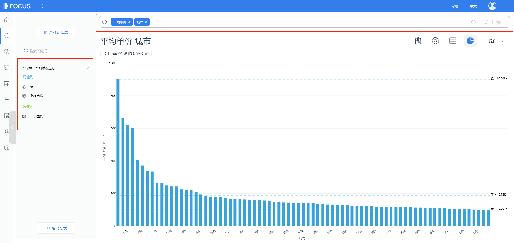
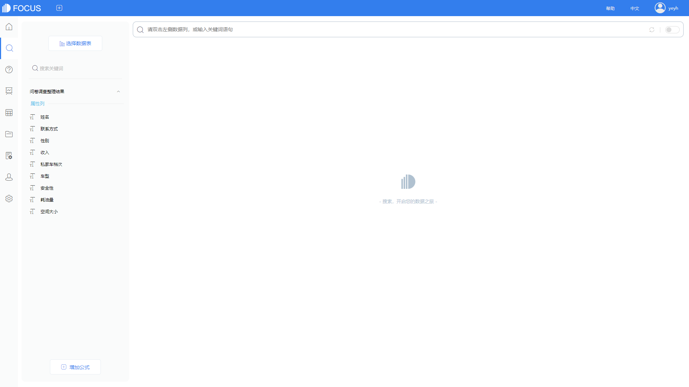
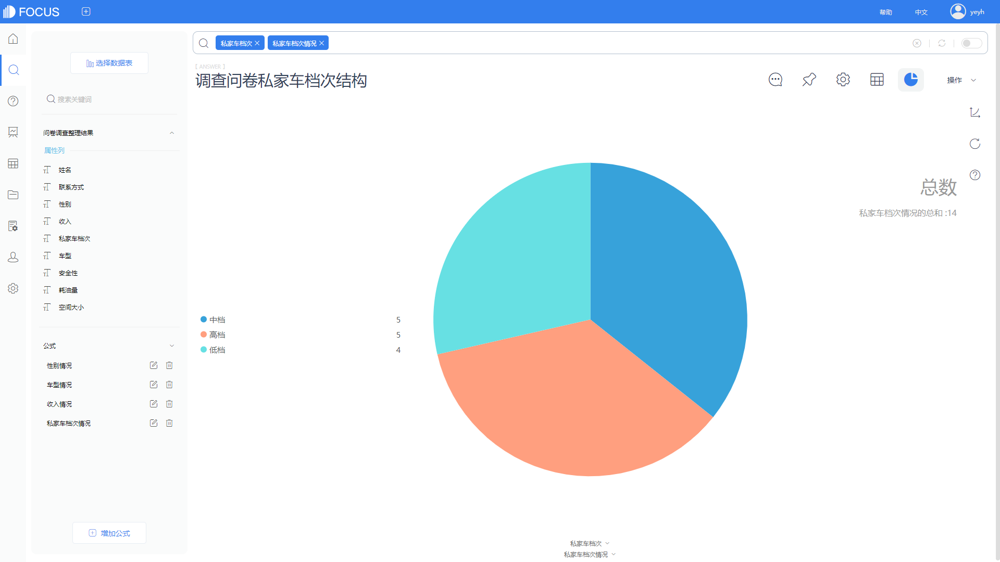
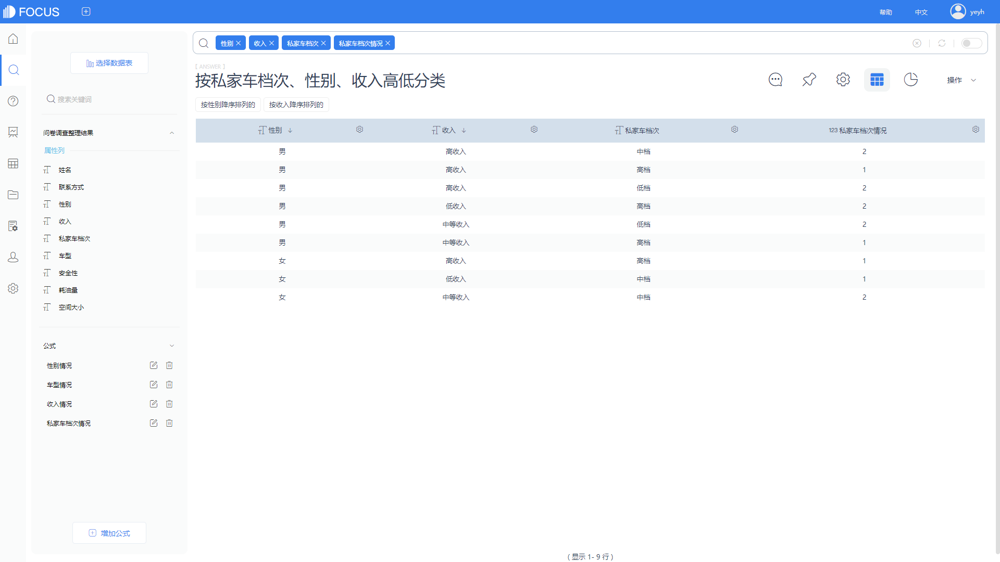
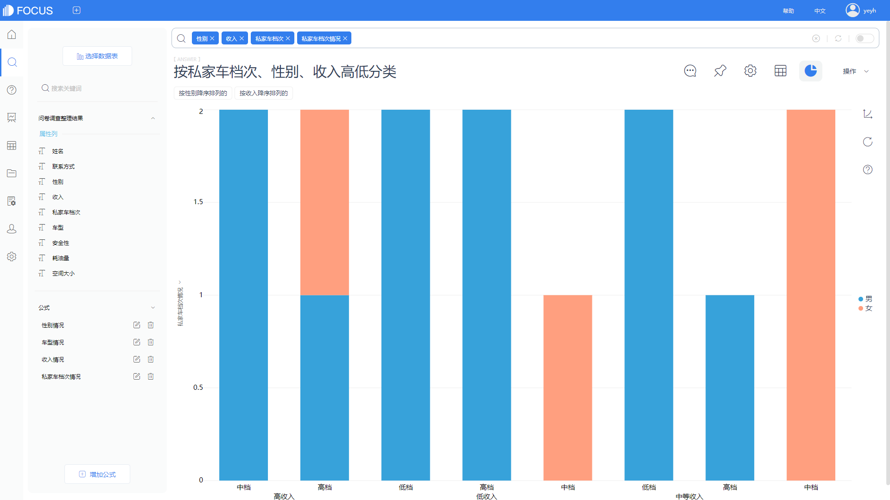

原始数据在进入系统时，必须要进行一定的处理，包括数据清洗、筛选有效字段等等。中间表是DataFocus系统设计出来区别于原始数据的一类表格，主要作用是可以筛选原始数据表格中的有效字段，为后续的数据分析做准备工作。

本文介绍的内容是如何利用DataFocus系统创建一个用户所需的中间表。简单介绍，在DataFocus系统主要有两种方法：

1、关联两个及两个以上的中间表，在搜索界面双击选择需要的字段，并保存为中间表；

2、在数据管理界面，选择操作，创建中间表。

两种方法创建的中间表内容一致，但是显示在系统上中间表的类型略有差异，接下来就详细介绍中间表的创建步骤。

### 方法1：搜索创建

第一步：选定需要进行筛选字段的工作表，如有两张及两张以上工作表，需要对这多张工作表进行关联，这里以两张工作表为例。创建关联关系并成功构建模型；

第二步：模型构建成功后，回到搜索界面，选择工作表，可以在页面内添加指定的公式，对原始数据进行一定的数据处理，得到后续分析所需字段；

第三步：选择有效字段，可以选择不同表中的字段以及公式，还可以在搜索栏添加关键词或者筛选某列的特定行为。点击页面右侧的操作按钮，选择“保存为中间表”；

第四步：对需要保存的中间表进行命名。回到数据管理页面，等到新建的中间表状态变成SUCCESS，则代表中间表创建成功。从图中可以看出，此时中间表的来源为“worksheet”，状态为“question”。

### 方法2：数据管理创建

第一步：在数据管理页面，点击右侧操作，并选择创建中间表按钮；

第二步：在选择数据处，选择正确的数据源即工作表，然后同理添加一个公式，但是此处的公式不能有聚合方式；

第三步：选择有效字段，这种方法只能选择不同表中的字段以及公式，无法添加关键词和筛选列中值，当然此处可以直接修改原始工作表的列名和中间表的表名；

第四步：修改完成后，点击右侧操作——保存，将该中间表保存，自行跳回数据管理页面，等到中间表状态变成SUCCESS，则代表中间表创建成功。从图中可以看出，此时中间表的来源为“worksheet”，状态为“prejoin”。

总结下来就是，搜索创建中间表，需要对多张表进行关联，且不能直接修改列名，但可以利用系统的关键词、筛选列中值；数据管理创建中间表，可以不关联多张表格，且能直接修改列名和表名，但不能进行关键词搜索、筛选列中值。

两种创建方法各有优劣，也各有特点，可以根据实际情况，选择适当的方法进行中间表的创建。仔细看看这篇文章，学会后就可以灵活运用这两种方法，更加简洁明了~~~
