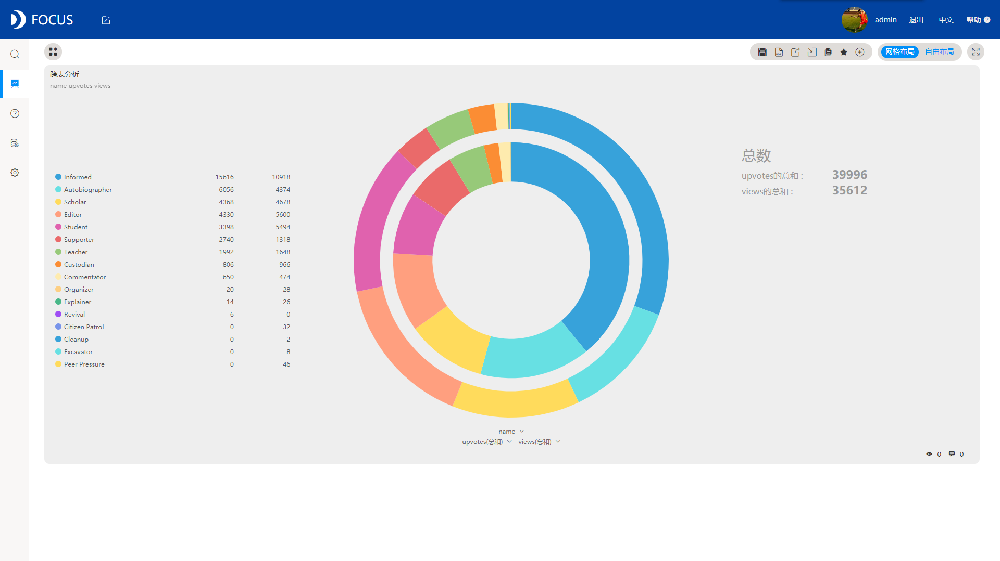
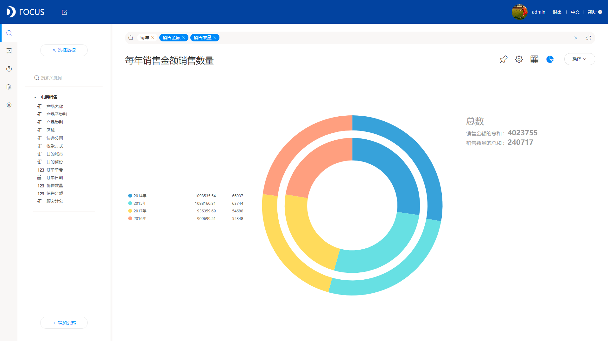

中间表作为DataFocus系统特设的一款专门用于数据清洗的表格，是非常实用的。我在试用这款产品的过程中也会时不时用到这个功能，比如我可能要对这一列的列名进行修改或者筛选列中值，就可以利用这个功能，非常方便！

但最近我也是遇到了一个问题，但我想删除某张中间表的时候，却突然遇到了一些问题，就是无法直接删除这张中间表，需要先把这张中间表关联的内容全部删除，才能删除这张中间表。接下来我就这个删除中间表的操作步骤简单介绍一下。

第一步：选中你想要删除的中间表打开，点击右上角的依赖关系，会显示所有依赖此表建立的中间表或者历史问答。也就是说，如果你想要删除这张中间表，你必须删除其中的所有依赖该表建立的中间表；

第二步：因此，选择与该表有依赖关系的另一张表打开，比如打开“近期活跃用户数”，同样点击依赖关系，会发现有一个历史问答依赖“近期活跃用户数”建立；

第三步：点击“历史问答”界面，在其中找到与“近期活跃用户数”存在依赖关系的“各用户群人数对比”历史问答，这里建议大家可以选择在搜索框中输入想要查找的历史问答名称，方便系统自动为您筛选符合条件的历史问答； 

第四步：选中该历史问答，然后点击删除，若能直接删除成功，则在删除完历史问答后回到系统管理界面删除中间表“近期活跃用户数”；若发现系统删除失败，则代表该历史问答被放置在某看板中，需先将看板中的历史问答删除，再删除历史问答，最后删除中间表。

其实讲述下来的步骤还是很简单的，但是这个过程实在感觉有些繁琐，都不能直接删除，还要进行那么多的步骤。希望DataFocus系统可以稍微改进一下，方便大家直接可以一键删除中间表和中间表关联的历史问答。
