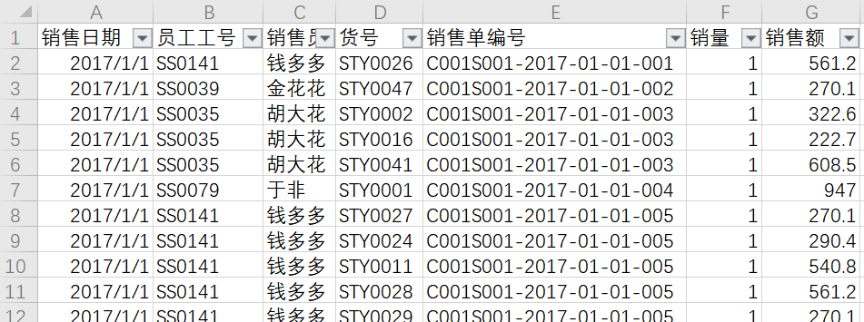

看过上篇文章的应该对我所说的数据搜索有了一定的了解，这款叫做DataFocus的BI可视化工具在数据搜索这方面做出的突破还是相当优异的。那么就像画饼充饥，在了解了数据搜索的意义后，究竟该如何利用DataFocus来进行数据搜索呢？这篇文章就将简单解释数据搜索的步骤，为什么只是简单解释呢，因为数据搜索涉及很多的关键词，这里仅仅只是举了一个例子，具体的关键词还要再DataFocus的官网上，通过产品手册的介绍所了解。

在这里，我举例用的数据是“登记用户属性”表格，其中有年龄、注册时间和用户ID三个字段，我想要将用户的年龄进行分组，然后统计各组的用户人数情况，如果没有关键词搜索，就要使用if…then…else公式进行划分组别，然后对各组用户数进行统计。但使用关键词搜索后，直接在搜索框中输入“按年龄分X组统计的”、“年龄的数量”，其中X代表想要划分的年龄的组数，点击回车，就能展示出你所需要的图形。

是不是感觉利用数据搜索比使用公式方便多了，而且更加灵活，还可以随意调整组数的变化。当然了，这里只是使用了数据搜索其中的一个关键词，还有很多与时间有关的、计算同比环比的关键词可供用户使用，关键词的词库还是相当丰富的。
