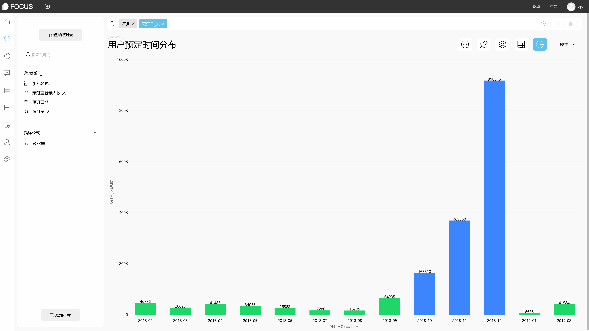
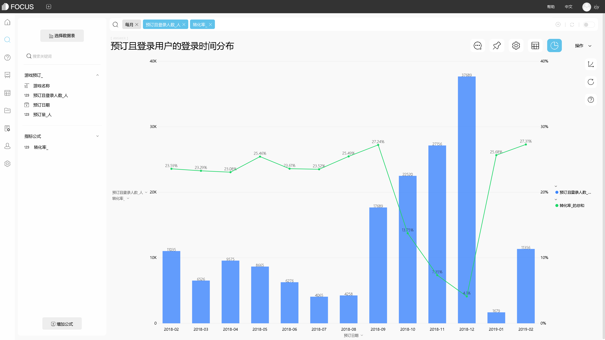

前面的朋友们都总结得很到位。在通用流程上，你确实可以套用那些模板，比如说用户分析、商品分析、渠道分析的各项指标。但是现实世界千变万化，每家超市都有其特殊性，甚至说同个超市不同地区的门店都可能有着较大的差异性。

因此，与其生搬硬套，不如先梳理下你们超市的业务流程和业务逻辑。比如说，是如何采购的：包括采购计划如何制作，会从哪些渠道采购，采购了以后如何仓储等等。有了流程之后，再分析这些流程中的核心指标，有必要的话，可以划分二级指标、三级指标。没有灵感的时候，可以看看别人的模板怎么做的，想想如何应用到自己这里。

我个人认为，这样“从实际出发去应用理论”可能会更好地发挥数据价值。

在分析工具的选择上，国内软件我推荐DataFocus；它搜索式分析的方式非常有助于激发灵感和深度挖掘，而且没啥学习成本、会用百度就能上手，因此对于业务人员来说是非常棒的助手。而且，制作出的图形颜值也超高的！看下面：

漂亮的搜索界面

炫酷图表完全不在话下：

