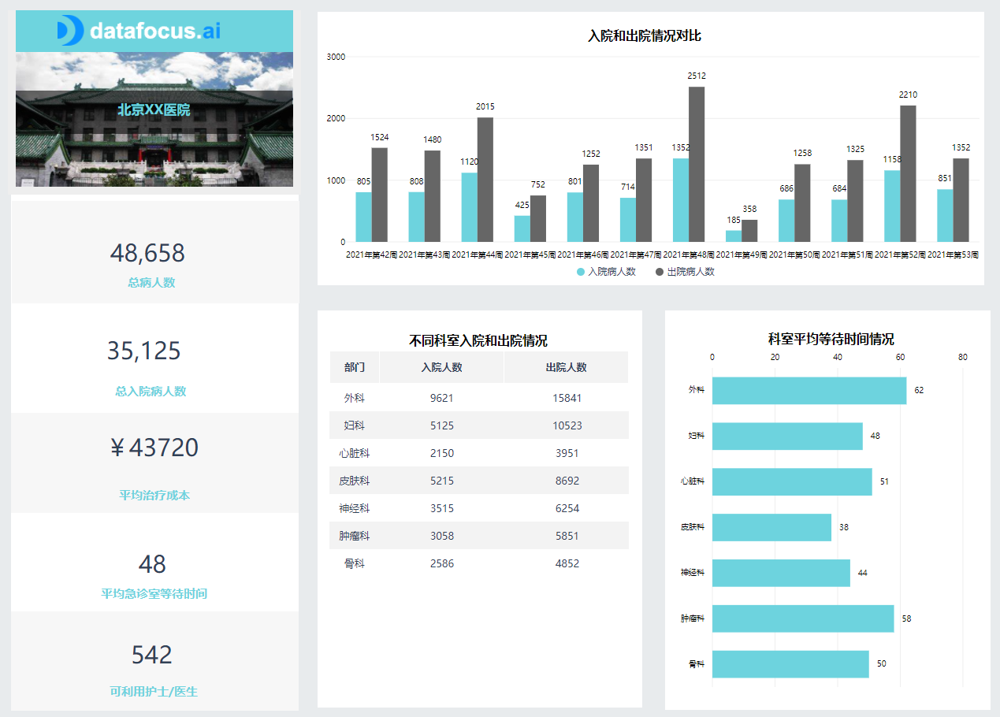
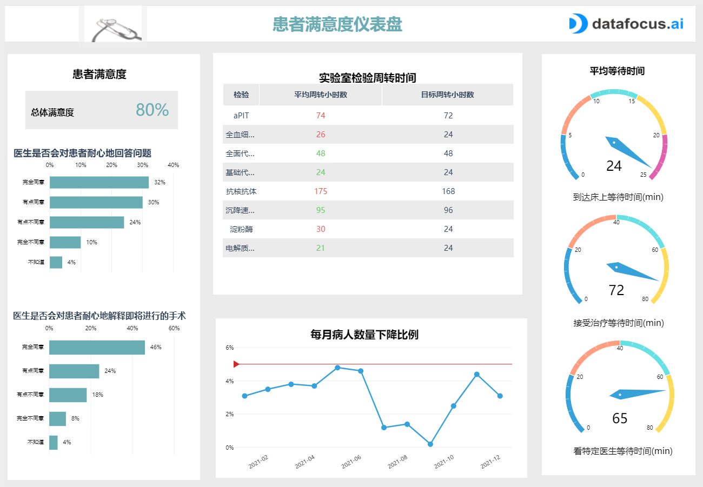
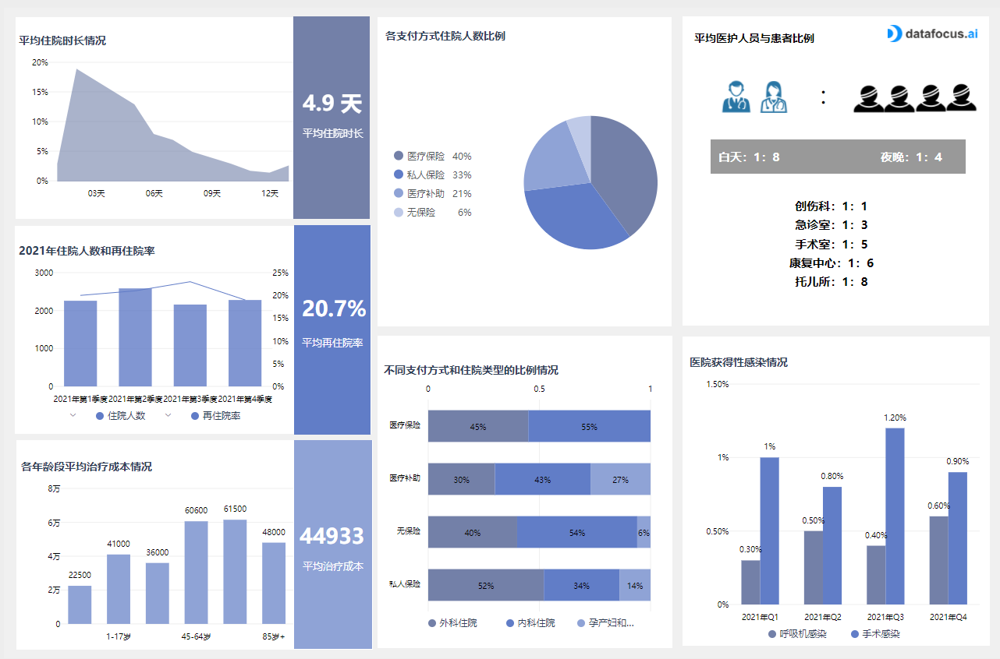

**医疗KPI如何搭建？揭秘医疗绩效管理奥秘!**

随着医疗卫生信息化迅速发展，医学研究正步入大数据时代。如今，医疗保健专业人员收集了海量数据，但这些数据通常分散在各个部门之间，并编译在单独的系统和文档中，因此所有这些潜力都未被开发。

而医疗保健仪表板是一种现代分析工具，用于以动态和交互式方式监控医疗保健 KPI。一个常见的例子是医院KPI仪表板，它使医疗保健专业人员能够实时访问重要的患者统计数据，以提高医院的整体绩效和患者满意度。

为了帮助您顺利运营医院，必须分析设施每个部门的医疗保健指标，并监控出勤率以及产生的费用。通过不断提高医院绩效、患者满意度，并在现代医疗保健分析和专业仪表板的帮助下生成见解，您可以在竞争中领先一步，但最重要的是，提供出色的患者护理服务。

医院 KPI 仪表板

集中式医疗保健仪表板可以成为有效管理您的企业的重要工具，因为它将帮助您确定工作在哪里是瓶颈的，或者您可以随着时间的推移发现某种趋势，并以这种方式调整资源分配，产生可持续发展。

该医院 KPI 仪表板将为您提供运行如此复杂的设施时所需的全局控制。根据大屏中的主要指标，您可以跟踪医院在一段时间内欢迎的患者，他们的治疗费用或他们在急诊室等待多长时间才能看医生。此仪表板还为您细分了每个部门从手术到心脏病学的入院和出院患者的趋势，以及他们花了多长时间才看到相应类别的专家。

上面提供的医疗保健仪表板示例旨在为最高管理层提供分析数据的整体视图，并提供有关设施如何运作的见解，以增强其决策过程。例如，他们可以看到他们收治的患者总数以及出院人数。他们所负责的每位患者的平均治疗费用是多少，这是一项对财务状况和医院可持续性至关重要的指标。如果这些成本相比医院的一般财务状况来说高出很多，那么需要降低这些成本，同时注意保持所提供服务的质量。

平均ER（急诊室）等待时间，是患者体验和患者满意度的重要指标。我们可以在此医疗保健仪表板上看到按部门细分的平均等待时间，这可以帮助找出哪些单位面临问题：患者等待专家的时间太长可能是因为对工作人员缺乏培训，当然也可能是因为人手不足，需要更多的护士和医生，还有可能是因为缺乏需要的设备。

患者满意度仪表板

患者满意度仪表板是您的医疗机构的总体展示。它将具体体现为您在欢迎和治疗患者方面付出的努力，以及您为他们提供的安全程度。不满意的患者既不会在出现问题时就算了，也不会向朋友和家人推荐您的设施。在互联网时代，"坏嗡嗡声"的病毒式传播可能是有害的，难以遏制。

使用这种类型的医疗保健仪表板会非常有价值，尤其是在与患者沟通时。医疗保健是一个非常特殊的行业，因为它暴露在很多人类主观性中，它涉及高风险——人们的健康和生命。沟通和理解通常被认为是医患关系中的一个重要方面，这就是为什么这样的仪表板可以使您的服务受益匪浅。患者喜欢高质量的护理，这需要他们的反馈。

在此医疗保健仪表板模板中，您还可以看到调查中向患者在住院后提出的问题的示例。工作人员是否有足够的时间倾听患者可能遇到的问题，他们是否花时间回答这些问题并解释即将进行的手术？花时间评估患者的意见和感受不仅可以提供有关您的设施如何被患者感知的宝贵见解，而且还会给他们一种被倾听和被考虑的感觉，这是满意度得分的一个重要方面。

在患者反馈的基础上进行跟踪，这也将帮助您提高患者满意度得分。平均等待时间很容易测量，正如我们在上面的第一个医院仪表板中看到的那样，它们可以表明您的医疗机构管理中的其他缺陷。这些等待时间可以测量在看特定医生之前，到达床上或接受治疗之前所需的时间。通过评估这些KPI，您将了解一天中不同时间和不同部门的平均等待时间：这种洞察力将使您能够设置您想要达到的目标时间，以避免患者无限排队从而达成更有效的护理。

实验室周转时间是一个重要的患者满意度KPI，用于衡量医院实验室处理结果所需的时间。此指标需要分别细分为所进行的每个测试，并评估每个测试需要多长时间 - 某些测试更难执行并且需要更多的时间。接下来，为执行的每个实验室结果设置一个时间目标并达到它。

医院绩效仪表板

最后一个医疗保健仪表板示例是医院绩效仪表板。它的目标旨在实现预先设定的预期结果，将信息触手可及，并具有医院生活不同方面的相关可视化。使用此类仪表板将帮助您在临床、运营和财务上进行改进。您将在此处使用的指标必须引发行动，即如果它显示表现不佳，我该采取什么响应？

为了帮助您在复杂的医院数据环境中利用信息，高效的医院仪表板是关键。这就是为什么DataFocus[的在线BI软件](https://www.datapine.com/online-bi-tools)是您项目中的绝佳合作伙伴，可以简化您的数据可视化，从而更好地衡量性能。这种表现涵盖了我们上面看到的所有方面：患者满意度，治疗的财务管理和患者的出勤率。

大屏要评估的第一个 KPI 是患者的平均住院时间。此指标将直接影响员工的成本和工作量。根据停留的类型，它也会有很大差异，因为例如阑尾手术可能需要比几针更长的时间。因此，建议根据这一数字对数值进行进一步评价，以发现任何新出现的问题。

此医疗保健仪表板模板的另一个关键指标是再入院率，这可能会产生严重后果并直接影响医院的声誉。该指标的计算方法是将再入院人数除以入院总人数。再入院率代表您的医疗设施中提供的护理质量，并且应该尽可能低：没有人喜欢在出院后回到医院。避免再入院也将帮助您控制成本并减少不必要的费用。与您的患者安全相关的另一个KPI是HAI（医院获得性感染）。这是一个重要的指标，如果不加以监控，不仅会增加员工的工作量，增加成本，还会损害您的声誉，因为您的设施提供的护理质量取决于此。正确跟踪此 KPI 将帮助您确定事件发生在护理流程的哪个部分，并相应地调整您的标准。

医疗仪表板进一步为您提供与患者和员工管理相关的信息：护士与患者比率指示每位患者有多少护士可用。此指标将指示您的设施是否人满为患或人手不足。您还可以在科室维度查看数据情况：创伤，急诊室，手术室，康复室或托儿所，看看哪些是需要重新调整，相应地评估并调整白班或夜班。

借助此类医疗保健仪表板，可以在交互式报告的帮助下轻松监控每个数据，并进行详细分析，以便您的工作效率提高，患者的满意度每月都超出您的期望。DataFocus可以在此过程中为您提供帮助，并为您提供14天的免费试用！立即注册，领取您的福利！
