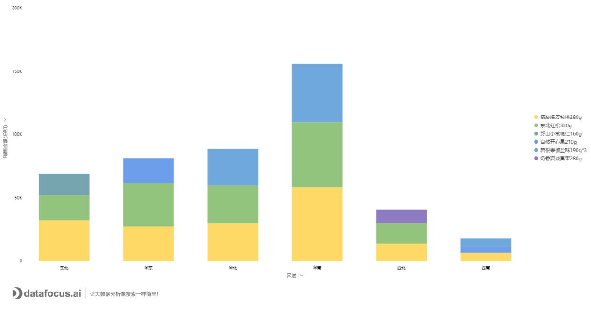

维度一般指事物现象的某种特征。从某种角度出发的度量统计，角度即为维度。

指标一般指可以量化的数据，是进行统计后的结果。

指标用于衡量事物发展程度，维度用于对指标多方面的进行对比，找趋势等等。

在数据分析中，例如，各产品的销售额，销售额即为指标，‘产品’即为维度；各区域利润排名前三的产品，‘区域’和‘产品’即为维度，利润即为指标。

当然维度不一定都是‘文本’类呈现的，维度分为定性维度和定量维度。‘文本’类维度即为定性维度，例如城市、性别等。还有一种情况，当我们需要对数值型数据进行分组统计，例如销售额分区间的订单量统计，这时‘销售额分段’即为维度，这类叫做定量维度。

指标亦分为基础指标和复合指标。基础指标例如注册用户数、销售额、订单量等。复合指标是在基础指标基础上，通过相关计算得到的结果，例如支付转化率=（生成订单次数）/（支付成功次数）
