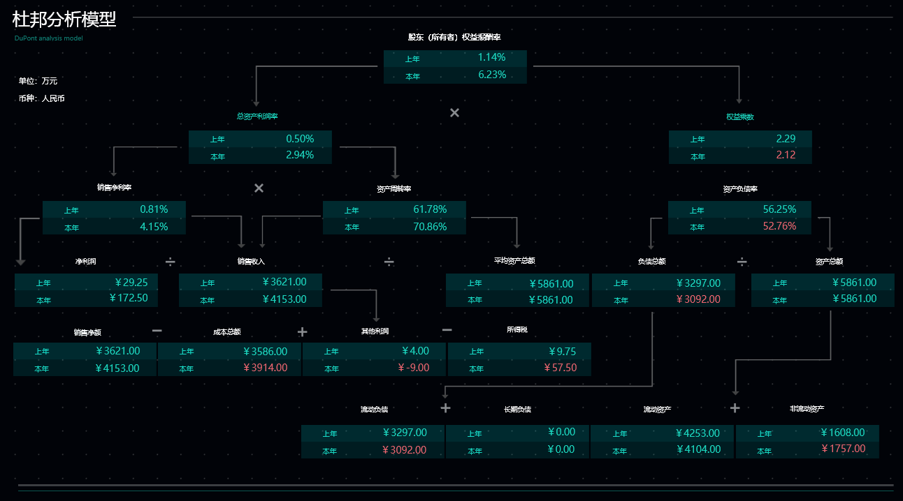
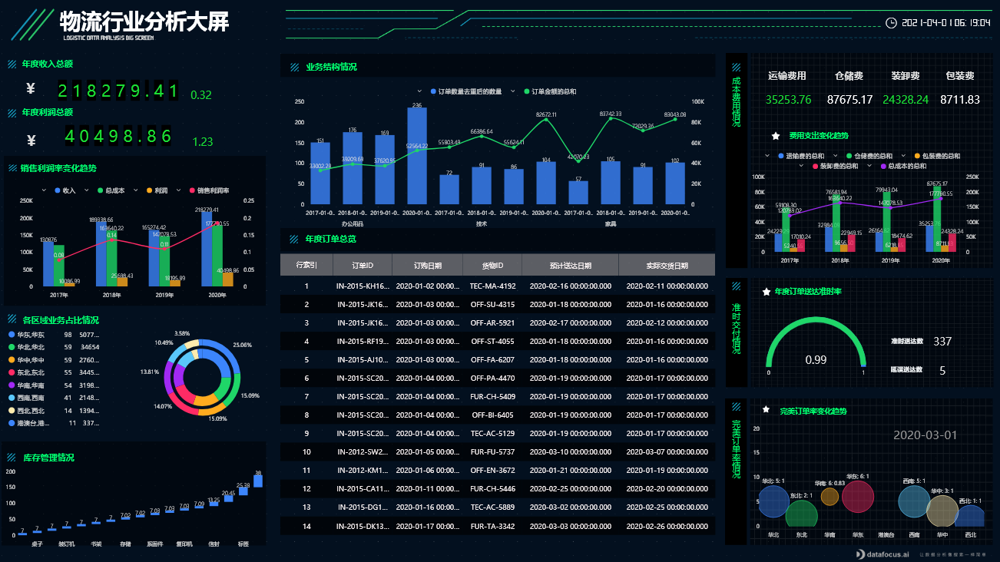
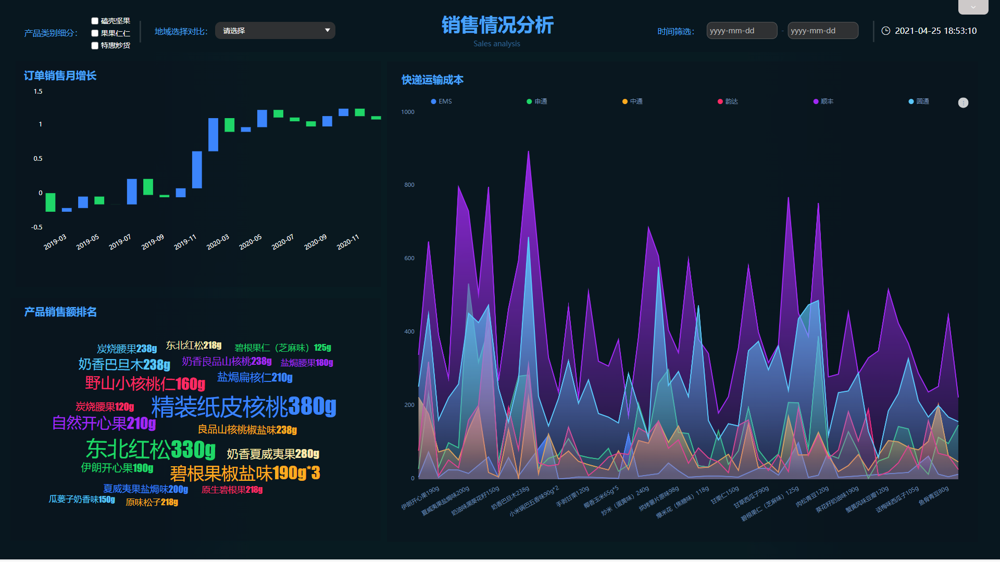

上一篇，我们简单了解了在DataFocus系统中对多个Excel数据表的处理，今天，我们将进一步了解，如何用DataFocus实现对Excel表中数据的清洗处理。

## 导入Excel数据表

在数据处理之前，我们需要先将本地Excel数据表导入到DataFocus系统中，大致流程如下：

1. 数据表管理模块的“导入表”栏下选择导入本地文件（或资源管理功能模块中点击“创建资源”按钮）。
2. 选定“EXCEL”文件类型，并在选择本地文件后点击“上传“。
3. 上传成功后的 Excel表配置信息界面，可以选择导入的列、重新命名表名及列名、修改列类型等等，配置完成确认无误后点击“确定”完成上传。

## 二、数据的清洗处理

### 2.1清洗 数据

#### 2.1.1 重复数据

##### 2.1.1.1 重复数据的处理

处理重复数据在数据处理中较为常见。在DataFocus系统中，可以通过中间表的制作来删除重复行。

进入DataFocus系统的搜索模块，选择数据表后，双击或在搜索框中输入列名。通过在搜索框中输入关键词或直接在图表中将数值列的聚合方式改为“平均值”，最后在操作栏下选择“保存为中间表”，将删除重复数据后的数据保存到DataFocus系统中 ，以用于今后的分析使用。

图表2. 1 数值列统计“平均值”

##### 2.1.1.2 重复数据的查看

如果想知道有哪些行数据是重复的，可以在搜索框中使用公式count或关键词“数量”统计行数，再使用“大于1”或“>1”对源表中信息进行筛选。

图表2. 2 关键词统计行数

图表2. 3 公式统计行数

图表2. 4 公式筛选数据

#### 2.1.2 缺失数据

##### 2.1.2.1 查找缺失数据

导入到DataFocus系统中的数据表，可以在搜索模块，使用关键词或公式进行缺失数据的精确查找，以便于对缺失值进行处理。

在DataFocus系统的搜索模块，选择数据源表后，双击或在搜索框中输入列名，并使用公式 isnull或者关键词“为空”进行数据筛选，以快速查找有缺失数据的记录。

图表2. 5 公式查找缺失数据

图表2. 6 关键词查找缺失数据

##### 2.1.2.2 处理缺失数据

A、当需要对缺失值进行数据补全时，可通过系统支持的公式来实现，并将补全后的信息保存为新的列，以用于数据分析。

在搜索模块，选择数据表后，点击数据表下方的“增加公式”进入公式编辑界面。点击“公式辅助”后可以看到系统支持的公式以及公式的使用说明和样例。若某列信息中只有一个空值，可以直接使用公式ifnull进行数据的添加；若列中有多个空值，则需要“if...then...else”、“isnull”以及“and”等公式进行数据的定位和添加。

编辑好公式内容和公式名后，点击“确定”以保存为新的公式列。公式列用于搜索式分析时，同样是双击或直接在搜索框中输入列名。

如果需要将补全后的数据保存并用于今后的数据分析，则在搜索框中输入所需列信息后，在“操作”栏下点击“保存为中间表”，将当前展现的数据以数据表的形式保存到系统中。

图表2. 7 补全缺失值

1. 当需要将有缺失值的记录删除时，可以先使用公式或关键词对有缺失值的记录进行排除，再将排除后的数据以中间表的形式保存到系统中，以用于后续的数据分析。

排除空值的方式有三种，直接在搜索框中使用关键词”不为空“或 公式not(isnull) 进行数据的排除；也可以在“添加公式”界面使用公式not(isnull)制作新的公式列；或者直接在图表中进行数据的筛选设置。

排除有缺失值的记录，并选择所需列信息后，在操作栏下将当前展现的数据保存为中间表。

图表2. 8 排除有缺失值的记录

1. 当对缺失值的记录进行排除但不删除时，排除方法同上。最简单的方法是直接在搜索框中使用关键词“不为空”或 公式not(isnull) 进行数据的筛选。

用DataFocus系统处理Excel表中“重复数据”或“缺失数据”的方式还有很多，这里就不一一介绍了，大家可以通过实践慢慢了解到的。对数据的处理，除了清洗，还有数据转换、数据抽取、数据分组、数据计算等等，这些内容，我们将在接下来的文章中进行介绍。
