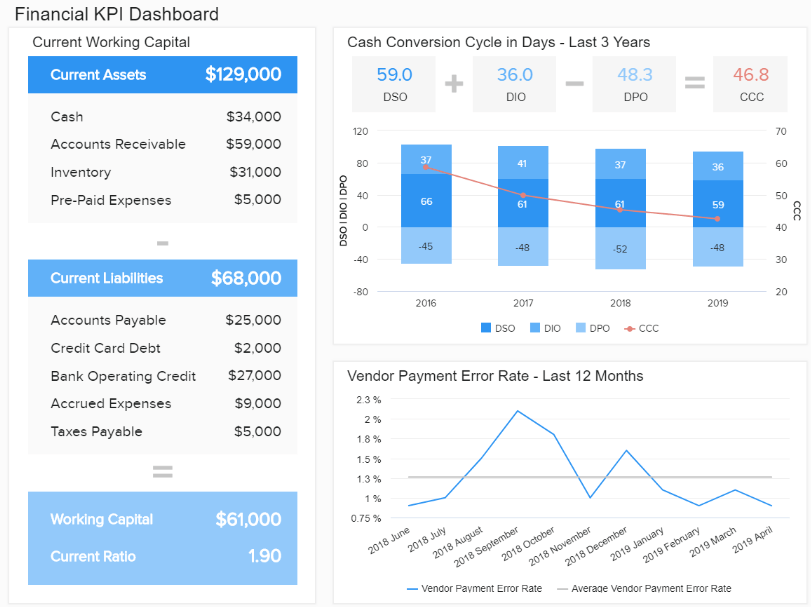
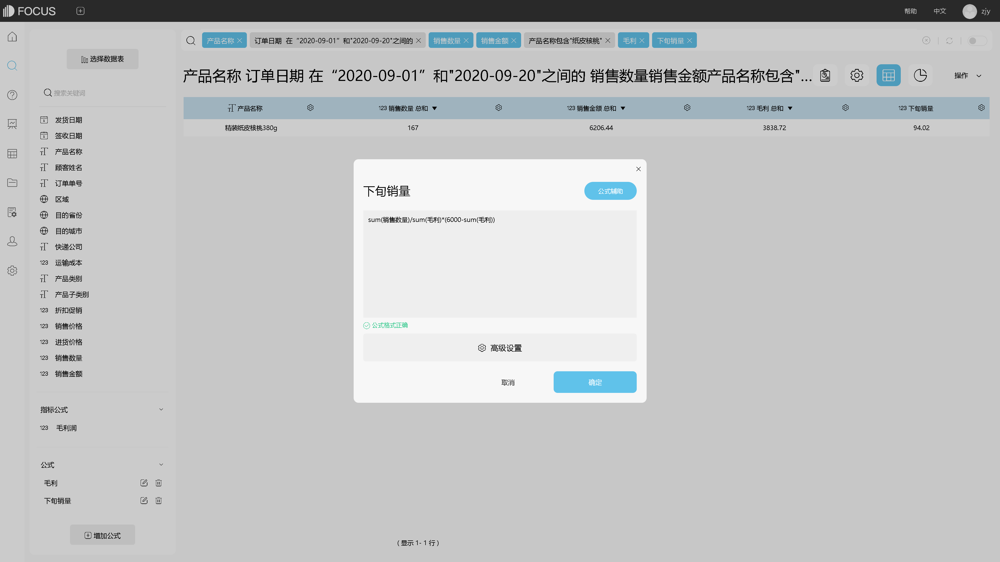

**如何用DataFocus对Excel表中数据进行分析（二）?**

DataFocus系统中的公式，包括聚合公式、分析公式、日期公式、混合函数、数字函数、逻辑操作符、文本操作函数等等多种类别。那么，除了之前介绍的可以对Excel表中数据按条件计算、对日期数据计算，还可以如何查看与计算Excel表中数据呢？接下来，我们继续探究DataFocus系统公式的使用。

## 公式的创建与使用

DataFocus系统中公式的使用以及数据分析，是在搜索界面完成的。

将Excel数据表导入系统，并在搜索界面中选择该源表后，即可开始使用公式进行数据分析。具体操作如下：

1. 数据表管理模块的“导入表”栏下选择导入本地文件（或资源管理功能模块中点击“创建资源”按钮）。
2. 选定“EXCEL”文件，并配置上传成功的 Excel表信息，点击“确定”完成上传。
3. 进入搜索页面，点击左下角 “增加公式”按钮会弹出一个公式填写界面。
4. 在空白栏中输入要用的公式或者是利用右边“公式辅助”按钮选择自己想要的公式，鼠标悬停在公式上，下方会出现对于该公式的解释说明以及样例。
5. 编写好的公式可以自己命名，点击公式名，对公式名字进行编辑（不能与关键词同名）。
6. 若公式计算的最终结果是数值，则在公式输入框下方的“高级设置”中可以修改该公式的聚合方式及列类型。
7. 公式输入正确后点击确定，该公式便会添加在数据表的最下方。
8. 双击该公式即可将公式加入到搜索框内，公式计算结果会显示在报表中。（或在搜索框中输入公式名）

## 运算与分析

了解到DataFocus系统中公式的编辑与使用方式后，我们举例看下部分公式的应用。

### 2.1 数据计算

例如，需要根据产品销售金额来计算对应的提成金额。

若Excel表中数据含有“销售金额”列以及对应的“提成率”列信息，在计算提成金额时，直接将两个数据列相乘即可，即制作公式：销售提成率\*销售金额

图2. 1统计提成金额

若Excel表中数据无“提成率”列，但知道计算规则。在计算提成金额时，可以使用公式if...then...else。

图2. 2 计算提成金额

### 2.2 预测分析

例如：在一份销售数据中，有订单日期、销售金额、销售数量等数据。如何查看某产品在某月上旬到中旬的总销量以及毛利润，并预测下旬销量多少时才能保证利润？

1. 如何查看到某产品在9月上旬到中旬的总销量以及毛利润？

如图所示，在搜索界面的搜索框中，输入列名以及关键词“包含”对产品进行筛选；使用时间日期关键词对日期进行筛选；编辑毛利润公式：销售金额-进货价格\*销售数量并添加至搜索框中查看。

图2. 3 求毛利润

1. 那么下旬的销量为多少时才能保证这个产品的毛利润达到6千呢？

从上图中可以看到，当前对销售金额、毛利、销售数量等数据的搜索结果是一份聚合后的数据，对于下旬销量的计算，是使用1号到20号的总销量和总利润进行计算，所以在使用公式计算“下旬销量”时，需要先使用sum公式计算销售数量和毛利的总和。

下旬销量=sum(销售数量)/sum(毛利)\*(6000-sum(毛利))

图2. 4 下旬销量

以上是用DataFocus对Excel表中数据进行简单的计算和预测分析，后面的文章，我们将继续介绍公式的使用与分析。
