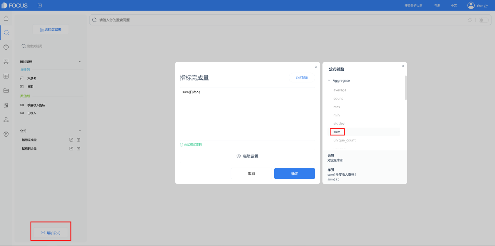

当今，数据可视化是一个热门领域，而图表是数据可视化的常用工具，将数据转化为图，能更直观表达所要传递的信息。一份专业的图表可以使数据分析更加形象化、更突出重点、更加专业化。那么，如何将Excel表中数据绘制成图表呢？我们先借助DataFocus系统来看下图表的选择与作用。

## 图表的选择

制作以数据为基础的图表时，需要让数据结果更加直观地展示出来，所以我们要先根据数据表确定想要表达的信息，再根据数据关系选择合适的图表。

### 1.1 确定要表达的信息

确定想要表达的信息就是根据想要表达的信息选择合适的图表类型并加以强化。

不同类型图表的分析重点不同，如饼图侧重于显示局部与整体的关系、折线图侧重于显示变化趋势。只有明确了想要表达的具体信息，才能正确选择图表类型。例如同一份Excel数据表：

1. 饼图强调的是2019年各季度的销售额不同

图1. 1 2019年各季度的销售额不同

1. 条形图强调的是2019年各季度销售额的排名情况。

图1. 2 2019年各季度销售额的排名情况

### 1.2 把关键点写入图表标题

若图表无标题，读者会按照自己的意愿理解图表所表达的重点，因此在制作图表时，需要将想表达的关键信息写入图表标题，以便能明确地传达重点信息给受众。

例如下图，若无标题，可以理解成华南区销量最高，也可以理解成西南区销量最低。

图1. 3 标题的重要性

## 二、增加说服力和可信度

由于图表运用了数字化和图形化的表现方式，因此比单一的数据更能准确的表达图表主题。

专业的图表一般有以下几个特点：

1. 类型简洁：使用基本类型的图表，任何人都能够看懂图表的意思，以起到真正沟通的作用。
2. 明确的观点：观点表达明确，标题无法完全标明时添加其他辅助说明或备注文字。
3. 细节完美：细节处理到位 ，不给人留下质疑点。数据使用谨慎，标明出处。
4. 设计的外观：以设计的原则去美化图表 ，把图表处理得技能明确反应数据，又能给人带来视觉享受。

了解了图表制作前的准备与要求，下篇文章，我们将继续探究如何用DataFocus将Excel表中数据绘制成图表，以及对图表的选择 。
