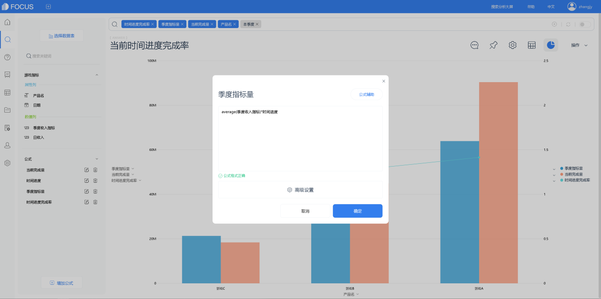

上篇文章，我们了解到，有些图表类型可以反应多种数据关系，有些数据关系可以用多种图表类型来反映。所以，制作图表前要先确认制作图表的目的，再根据目的选择所需图表。

接下来我们结合一些应用场景，来了解如何用DataFocus将Excel数据绘制成图表。

## 图表的制作

在用DataFocus系统制作图表之前，我们先看下如何将Excel数据表导入到系统中并进行选择，以及图表的制作方式。

### 1.1 数据表的导入

将本地Excel数据表导入到系统中，大致流程如下：

1. 数据表管理模块的“导入表”栏下选择导入本地文件（或资源管理功能模块中点击“创建资源”按钮）。
2. 选定“EXCEL”文件类型，并在选择本地文件后点击“上传“。
3. 上传成功后的 Excel表配置信息界面，可以选择导入的列、重新命名表名及列名、修改列类型等等，配置完成确认无误后点击“确定”完成上传。

### 1.2 数据的选择与图表的制作

DataFocus的数据分析以及制图，是在搜索界面完成的。在数据表导入到系统后，先在搜索界面选择数据源表，再开始“搜索数据”以制作图表。系统会根据搜索出的数据自动匹配一张图表，如需更改图表类型，在“图形转换”中手动选择。制作好的图表，在操作栏下保存并命名。

搜索数据的方式有两种：

1\. 双击搜索功能模块页面左侧数据表下的列名，以添加列名至搜索框中进行搜索，搜索的结果会显示在页面中间空白部分；

2\. 直接在搜索框里输入想要搜索的内容，例如输入：按订单日期计算的销售金额的月增长率，DataFocus会根据搜索条件返回结果。

图表 1. 1 搜索页面

选中搜索框内的标签进行拖动，可以改变该标签的位置，进而改变数值表的列顺序。点击搜索框内标签右边的“X”，可去除该标签重新搜索结果。

DataFocus搜索基于数据表，所以在搜索框里可以输入任何相关的单词进行搜索，如列名称、关键词、同义词、列中值。

## 图表的应用

我们结合一些应用场景来了解图表的选择使用。

### 2.1 实际与预算比较的图表

比较实际金额与预算金额并分析预算完成情况。最常用“柱状图”与“条形图”来表达这种数据关系。柱状图可对各项费用类别的实际金额与预算金额直观比较的同时对各项费用类别中的实际金额或预算金额进行比较。条形图可以更直观看出实际金额与预算金额的差距。

图表 2. 1 柱状图

图表 2. 2 条形图

### 2.2百分比数据比较的图表

常用饼图表达各数据类型所占百分比情况。例如下图所示，显示不同费用类别的占比情况时，我们可以从饼图中直观看到各项费用支出中哪个比例最高，哪个比例最低。

图表 2. 3 饼图

表达一组数据局部与整体的关系时可以使用饼图。若需要在一张图表中反映多组数据局部与整体的关系，可以使用堆积柱状图和堆积条形图，既可以单项比较，也可以同类数据进行比较。

图表 2. 4 堆积柱状图

### 2.3体现相关性的图表

相关性指两个变量的关联程度，即观察其中一类项目大小是否随另一类项目大小有规律地变化。常用散点图和气泡图表达相关性，可以观察到两个变量有以下三种关系之一：正相关、负相关、不相关。

以上是在对Excel表中数据进行比较、百分比数据比较和查看相关性时常用的图表选择，下一篇，我们将继续探究其他应用场景下，用DataFocus将Excel数据绘制成图表时的类型选择与使用。
