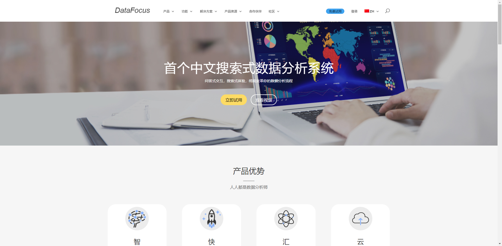

**相信事实，而不是直觉。任何可靠的决策，都依赖于客观的依据。财务部门是企业的中枢，优秀的企业都是有一套客观的数据分析体系去支撑的。DataFocus是一款创新的数据分析软件，运用它，可帮助财务经理花更少的时间收集财务和运营数据，并将更多时间用于建模方案和预测结果。**

DataFocus的商业智能套件提供了对整个业务的360度视图，因此管理人员可以每天了解每个客户，产品和流程的数量，并自信地做出重大的战略决策。**有了坚实的数据做支撑，并且来源于DataFocus高效的搜索分析展现形式，使得快速响应业务的变化成为可能，最终使得“运筹于帷幄之中，决胜千里之外。”不再是一句口号。**

**让我们来看看，如何开始使用DataFocus分析大量的财务数据，以回答改变游戏规则的问题，例如：**

#### **企业的财务整体情况如何？收入和利润是否有增长？**

#### **我们的财务运营能力到底如何？债务风险会发生吗？**

#### **未来会存在财务风险吗，应收款的情况是否健康？**

#### 有了DataFocus，财务人员可以全面了解组织的盈利能力和流程，并充满信心地制定战略决策。
