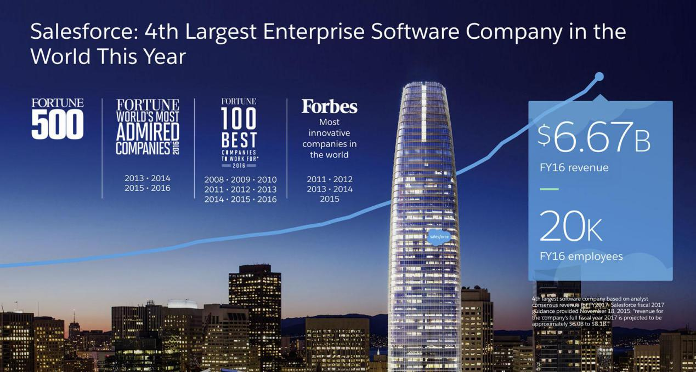

参考标题： 让数据可视化作品自己说话，有哪些诀窍？

## **好的演示必须讲述一个动听的故事**

大家一定有这样的经历。有时候，我们会碰到一位印象深刻的演讲者，他的ppt可能做得并不好，甚至都没有，但是他总是能通过曲折动人的故事，引起听众的共鸣和关注，最终，大家都会陷入他的故事里；有时候，我们会碰到一些乏味的报告，演讲者振振有词，甚至幻灯片也充满了各种图表、明亮的配图，然而，你还是意兴阑珊。

瞧，精彩的演示都是从故事开始，而不是平铺直叙的列表。故事都有结构，建立一个冲击力矩，释放一股动力，改变人们的认知和先入为主的观念。好故事并不乏味。

我们在用DataFocus进行数据可视化创作时，可以从上面借鉴到什么经验呢？有没有好的方法？答案是肯定的。在开始你的创作之前，首先，让我们认识一下通过可视化进行信息传播的目的有哪些：

**通知：**为观众、读者传授新的，有时是改变认知的知识。

**指导****：**为某些工作进行实用方法的讲述。

**评估****：**可视化能够吸引观众的想象力并引导他们考虑其价值。

**启发：**精心设计的可视化有能力唤起可影响观众行为的感受。

**说服：**最终，可视化会吸引观众的逻辑，情感，以试图说服他们采取行动。

我们需要将可视化设计视为一个制作引人注目的叙事的机会，并为他们带来成功。最后，让我们快速了解几个大品牌如何将讲故事与世界级的设计融为一体。

## **Salesforce - 从叙事开始**

Salesforce的Visual Storytelling

任何演示的首要重点就是叙述。在添加任何华丽的视觉效果之前，设计师与客户携手合作以建立叙述并提出如下大问题：

- 信息接受对象是谁？
- 我们为什么要向他们展示？
- 我们如何让他们回应？

大家可以看到，这些图片提供了受众需要了解的最具影响力的主题和信息。只有少数选择的单词和短语会出现在屏幕上，汇报人可以通过补充更详细的信息，将整个可视化信息丰富、完善起来。

## **德勤 - 建立诚信**

Deloitte - Achieving Digital Maturity

第一印象非常重要，通过第一印象通常会和信息接收者之间建立某种程度的信任链接，如果这种信任在演示的第一分钟内没有得到巩固，它就会在瞬间消失。

Deloitte是全球财富500强公司中80％的全球财务顾问。当然，他们理解快速建立信誉的必要性。上面例子中，从一开始，德勤就这个话题建立了自己的权威。

## **iControl - 直观地定义问题**

iControl - 在建筑工地取代纸张

用单一的视觉效果来表达复杂的问题或解决方案并不总是可能的，但是当它发生时，它对观众来说可能是一种强大的体验。

iControl是一家瑞典创业公司，它建立了一个iPad应用程序，旨在取代纸张并在建筑工地创建更好的文档。他们不是一个大品牌，但是他们通过一张幻灯片有力的向受众展示了问题--传统的建筑设计浪费了太多的纸张，需要跟踪的文档太多。

在视觉上定义问题是一个很棒的策略，但要小心使用它，因为一个令行业混乱或过于具体的图像会让观众感觉你像外行人一样。

## **安排令人信服的叙事**

如今，“讲故事”无处不在。我们称之为“故事”的情节，大多数都是由时间和技术的偶然事件串联起来的松散事件。那么叙事和故事之间的区别是什么？它们如何相关，它们有何不同？最重要的是，它们如何与引人注目的演示相结合？

### **故事**

故事受时间限制。它有一个开头，一个中间和一个结尾。它以一种有意义的方式详细说明事件并对它们进行排序。

### **叙述**

叙事不受时间限制。它将单独的时刻和事件与中心主题联系起来，但不寻求解决方案。叙述包括过去，现在和未来 - “我们来自哪里。我们在哪里。我们前往何处？”

运用以上要点，结合DataFocus的时序可视化技术，将数据与时间关联起来进行展示，从而达到一种叙事的效果，如果能有一些引起戏剧效果的事件作为转折，那么你的可视化作品就可以自己讲故事了！
