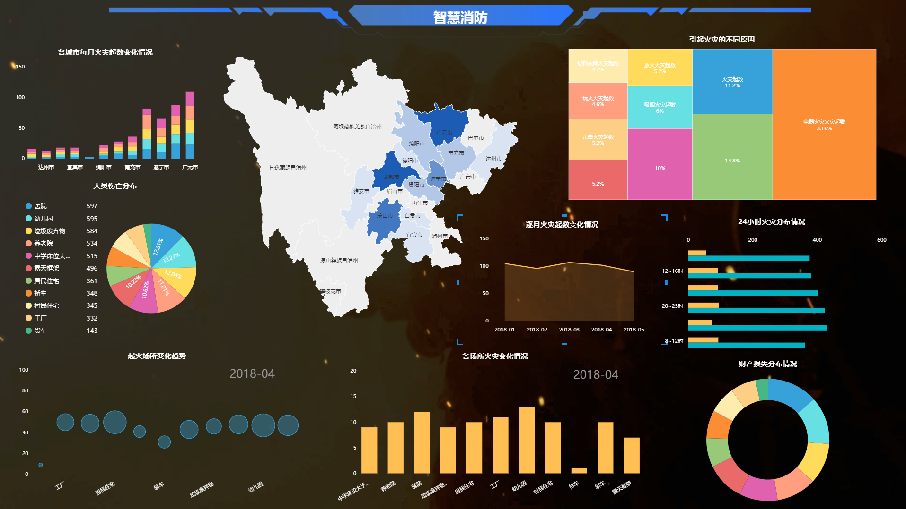

数据分析的发展趋势如此迅猛，相信大家都听过或者看到过不少数据分析相关的信息。对于数据分析工具，相信也有很多人都听过不少，那么，这一款最具创新、性价比最高的数据分析工具有听过吗？如果还不知道有这么神奇的一款工具存在，那你就out啦！

究竟是哪款数据分析工具呢？它就是DataFocus，是国内首个中文自然语言搜索式数据分析工具。不知道什么是搜索式数据分析？那说明你真的是out了！这是最新的一种数据分析方式。DataFocus采用搜索的交互方式，把数据分析的难度降低好几个层次，把数据分析变得像百度搜索一样简单，只要输入问题，系统自动以图表的形式来回答你的问题，非常创新，非常有趣，同样地也非常简单。

DataFocus以其自身的特点，在众多数据分析工具中脱颖而出，形成一道独特的风景。它不随波逐流，专注做自己的特色，区别于传统的拖拽，代码，SQL语句，开创出新型的交互方式。DataFocus不仅数据分析做的好，其数据可视化功能也毫不逊色，同样值得一说。

DataFocus可视化图表类型丰富，有30多种，其中包括有像桑基图、词云图、时序图等高级图形，也包括有柱状图、折线图、饼图等基础图形，而且据说DataFocus会一直开发新的图表类型。它的大屏展示也非常美观，可以个性化设置，按照自己的视觉习惯，设置不同的背景，色调等，最后效果完成不输定制大屏。

对于数据分析工具来说最重要的分析功能和可视化功能，DataFocus都做的非常好，值得大家进一步了解。
