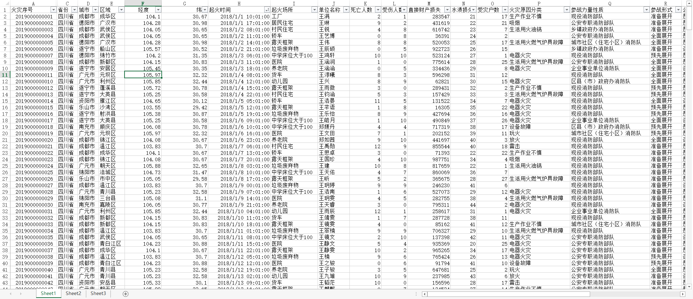
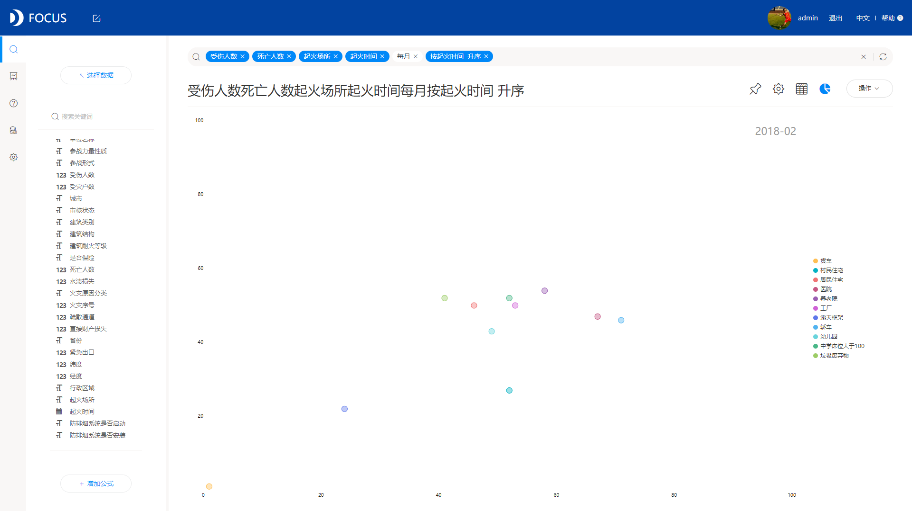
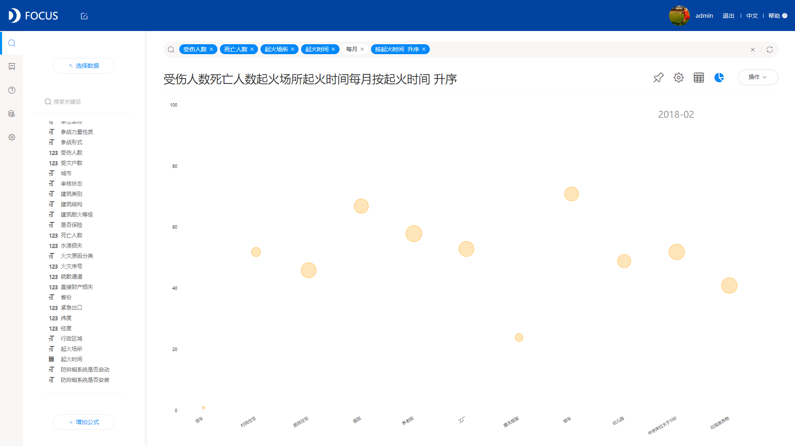

今天，我们主要来探讨下时序图。不知道大家有没有了解过，市场上哪些数据分析工具拥有制作时序图的功能？据我了解，DataFocus这款工具，不仅可以制作时序图，而且具体来算可以制作四种不同的时序图，分别是时序柱状图、时序散点图、时序条形图、时序气泡图。同类的数据分析工具，我没看到可以制作这么多时序图的。

先来了解下什么是时序图。时序图（Sequence Diagram），又名序列图、循序图，是一种UML交互图。它通过描述对象之间发送消息的时间顺序显示多个对象之间的动态协作。它可以表示用例的行为顺序，当执行一个用例行为时，其中的每条消息对应一个类操作或状态机中引起转换的触发事件。

如何制作时序图？这里我们统一用上述提到的DataFocus数据分析工具，下面就跟着我一起来制作一个时序图。

1、准备数据。不管什么图形，数据分析的前提是要有完整可分析的数据，在这里，我们准备了如下的数据：

2、数据导入系统。我们要利用DataFocus制作时序图，那我们必须把数据导入DataFocus，DataFocus支持本地数据导入：

3、搜索分析。DataFocus的一大特点就是它的搜索分析，不同于传统的拖拽式，其采用的是跟百度搜索一样的方式，搜索提问，系统图表回答。在这里，我们只需要在搜索框内输入：受伤人数 死亡人数 起火场所 起火时间 每月 按起火时间 升序，系统默认以折线图展示：

4、更改图表类型。将图表类型从折线图改为时序图，但是时序图可以有四种选择，分别为时序柱状图、时序散点图、时序条形图、时序气泡图：

时序柱状图

时序条形图

时序散点图

时序气泡图

至此，时序图制作完成，其实真正的制作过程只有两步，就是搜索分析，更改图表类型。时序图制作是不是很简单呢？
