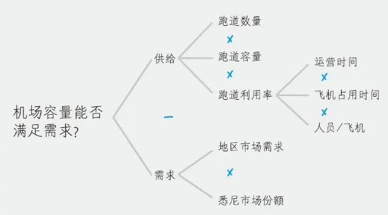
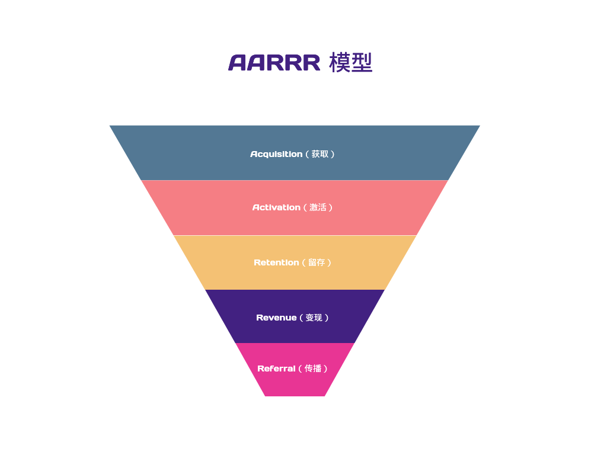
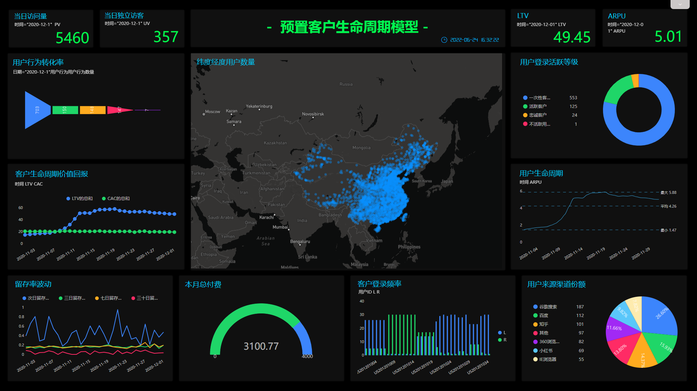
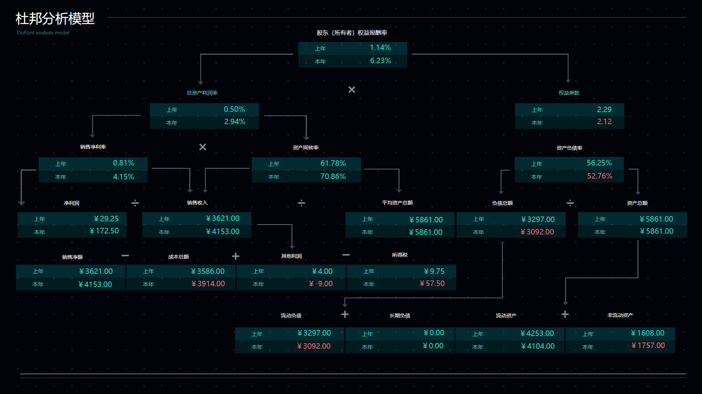

**萌新小白如何开始数据分析？**

**专职想做数据分析该如何开始？？**

大部分人听到“数据分析”，都觉得这是一个非常高大上的词汇，似乎高不可攀。

但在我看来，数据分析并不是一种冷冰冰的工作类型，而是基于目前的大数据时代、AI人工智能调下的一种通用的能力。我们在日常生活的方方面面都会接触到它，我们也离不开它。

而在迈入数据分析的门槛的初期，除了培养数据思维意识、学会使用趁手的数据分析工具，还需要培养自身解决问题的思路，也就是我们常说的，学会使用数据分析方法。通过分析方法，将零散的思维整理成有逻辑、有条理的分析思路。

今天我们就来浅谈一下最适合小白分析师的8种常见数据分析方法。

### **1.逻辑树分析**

分析目的：将复杂问题简化。

顾名思义，和树枝的层层分叉一样的，逻辑树分析方法将一个复杂问题细分到具体可量化的问题上，分层排列，逐级延伸。

### **2.PEST分析**

分析目的：市场调研，分析外部市场环境。

PEST分析中P是政治（politics），E是经济（economy），S是社会（society），T是技术（technology）。

PEST分析主要是对企业判定所处的外部市场环境的分析，是从比较宏观的角度对行业进行分析，最常见的是用于市场调研。

### **3.对比分析**

分析目的：进行比较，寻找差异。

**好的数据指标一定是比例，好的数据分析一定有对比。**

对比分析是将多个数据放在一起进行比较，分析其差异，从而找出这些数据所代表的事物发展变化情况和规律性。

例如，可以用平均值、中位数判断数据整体的大小；用方差、标准差判断数据波动情况；用环比、同比来展示随时间变动的数据趋势等；

在进行对比分析前，首先要明确对比对象，可以分为自身对比和行业对比。

_截图来源：DataFocus（数据已脱敏）_

### **4.相关分析**

分析目的：挖掘事务相关性。

雨后一定会出现彩虹吗？

如果想知道下雨和出现彩虹这两个事件存在什么样的相关性，就会需要用到相关分析法。事件之间的相关性主要可以分为正相关、负相关、不相关和非线性相关，在实际工作中，可以选择绘制散点图来分析其相关关系。

### **5.假设检验**

分析目的：解决业务问题，提升业务思维。

假设检验分析方法是逻辑推理并验证的过程，首先对业务问题提出可能性假设，然后搜集相关证据，验证假设，最后得出结论。假设检验可以快速提升逻辑思维能力、分析问题发生的原因（归因分析）。

### **6.AARRR漏斗模型**

分析目的：用户行为分析/产品运营。

AARRR漏斗模型分别代指是获客（Acquisition）、激活（Activation）、留存（Retention）、变现（Revenue）、自传播（Referral），分别对应用户生命周期中的5个重要节点。

例如用户从进入网站到最后点击付费经过的用户行为分析，还可以通过转化漏斗反馈其中的问题，精细化产品运营。

_截图来源：DataFocus（数据已脱敏）_

**7.RFM模型**

分析目的：用户价值分类。

RFM模型将Recency、Frequency以及Monetary3项指标带入三维矩阵，类似象限法，将客户价值划分成不同区域，衡量其对应的价值状况。

三个指标的含义分别是：

- 最近一次消费（Recency）：客户最近的一次购买是在什么时候
- 消费频度（Frequency）：客户在限定的期间内所购买的次数
- 消费金额（Monetary）：客户的消费金额

_截图来源：DataFocus（数据已脱敏）_

### **8.杜邦分析**

分析目的：财务分析。

杜邦分析法（DuPont Analysis）是利用几种主要的财务比率之间的关系来综合地分析企业的财务状况。以企业的净资产收益率为核心的财务指标，逐级分解为多项财务比率乘积，目的是深入分析比较企业经营业绩。

_截图来源：DataFocus（数据已脱敏）_

最后总结一下，上述介绍的分析方法属于基础的数据分析方法，在实际工作中，还需要结合具体的业务问题，灵活变通，将多个分析方法结合起来使用，真正做到活学活用，融会贯通。
