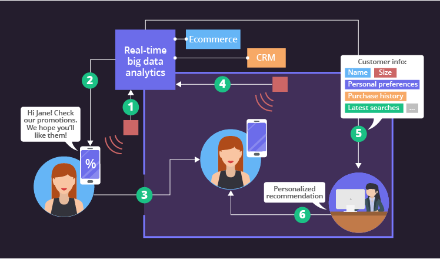
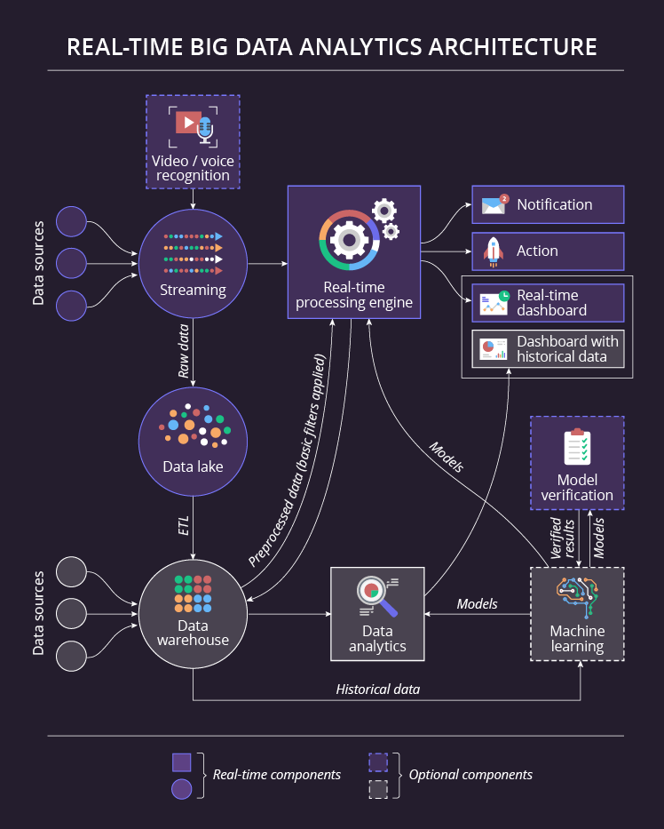

虽然实时分析和大数据都是趋势，但它们的组合实时大数据分析似乎应该是一个非常有前途的举措，应该是许多企业所渴望的。让我们看看这是否真的如此。

您会发现本文提供了丰富的实时客户大数据分析示例。我们这样做是为了方便和一致性。尽管有更多领域可以应用实时数据分析。

## 让我们从定义术语开始

如果您因为认为实时不可能有两种定义而打算跳过本节，请不要感到惊讶——确实有。事实上，实时的定义非常模糊，它因公司而异，或者更准确地说，因业务任务而异。

我们的大数据咨询团队提出了以下定义：

> **实时大数据分析**意味着大数据在到达时进行处理，并且业务用户在不超过分配给决策制定的时间段的情况下获得有用的见解，或者分析系统触发操作或通知。

由于实时经常与瞬时混淆，让我们澄清数据输入和响应的时间范围。就数据输入而言，实时处理引擎可以设计为推送或拉取数据。最普遍的例子是具有不断流动的大量数据（也称为流）的推送选项。然而，实时处理引擎并不总是能够摄取流数据。或者，它可以设计为通过询问是否有新数据到达来提取数据。此类查询之间的时间取决于业务需求，可能从几毫秒到几小时不等。

相应地，响应时间也不同。例如，自动驾驶汽车需要非常快的响应时间——只有几毫秒。如果我们处理安装在风力涡轮机上的传感器，并且它们传达缓慢增长的齿轮箱油温，该温度仍低于临界水平但高于正常水平，我们需要一分钟的响应时间来改变叶片桨距，从而卸载涡轮机并防止机器故障甚至火灾。但是，银行的分析系统需要几分钟时间来评估申请人的信誉；零售商的动态定价可能需要长达一个小时才能更新。尽管如此，所有这些例子都被认为是实时的。

## 实时大数据分析作为竞争优势

尽管一般 组织重视实时管理数据，但并非所有公司都采用实时大数据分析。原因可能有所不同：缺乏专业知识或资金不足、担心相关挑战或整体管理团队的不情愿。但是，那些实施实时分析的公司可以获得竞争优势。

假设您是一家时装零售商，希望通过提供一流的客户服务来利用这一优势。实时分析大数据有助于将这一伟大举措付诸实践。例如，一旦客户经过零售商的商店，他们就会在智能手机上收到推送通知，以激励他们进入。通常，它是基于客户的购买或什至在网站上的浏览历史的个性化促销优惠。一旦顾客进入商店，员工就会在他们的移动应用程序中收到通知。这让他们了解客户的最新购买情况、整体风格偏好、对促销的兴趣、典型消费等。这对客户和零售商来说似乎是双赢的局面，不是吗？

电子商务零售商还可以通过实时分析大数据来获得更好的绩效。例如，他们可以减少废弃手推车的数量。假设客户已经走了那么远，但出于某种原因，他们决定不完成购买。尽管如此，仍有很好的机会激励他们改变主意。该系统正在转向客户的个人资料数据以及购买和浏览历史，以将客户的行为与来自同一细分市场的其他客户的行为以及他们在类似情况下对不同行为的反应进行比较。根据分析结果，系统从所有可能的操作中选择最合适的——例如，提供折扣。

## 实时大数据分析的典型架构

让我们来看看典型的实时大数据分析解决方案是如何工作的。为了使说明更加生动，我们将附上一个对每个人都具有说明性的示例，因为我们时不时地都扮演着客户的角色。

想象一家旨在提供个性化客户体验的零售商。这条漫长道路上的第一步是识别顾客，一旦他们进入商店。零售商可以通过多种方式实现这一点，例如，通过实施人脸识别。

有了这个唯一的**数据源**，零售商可以做一个简单的分析，比如计算商店里目前有多少男性和女性顾客。然而，零售商不会只满足于一个数据源。即使要知道有多少客户是第一次来，有多少是常客，也需要另一个数据源，例如 CRM。一般上下文也很有帮助，例如，有关商店营业时间的信息。

处理后，实时数据会进入**实时仪表板**或变成**通知**或**系统操作**。我们已经为第一种情况提供了示例，此时零售商可以了解目前商店中有多少顾客。让我们详细看看另一个选项。假设一位顾客在移动应用程序中形成了一个购物清单，并在商店里四处走动。根据客户当前的位置数据（由信标收集并由相同的实时分析处理），该应用程序可以提示沿着销售区的最佳方式，以便他们可以抓住清单上的所有内容。

让我们继续上面提到的例子来解释**机器学习**的贡献. 顺便说一下，机器学习本身并不是实时发生的。这是一个复杂的过程，系统需要大量的时间来分析海量的数据，这些数据通常涵盖 1 年以上的时间，从不同的角度得出有价值的模型和模式。这些模型帮助系统做出实时决策。现在，举个例子：系统已经分析了客户档案和他们所属的细分市场、他们的行为模型、购买历史、对营销活动的反应等，并构建了一个支持个性化推荐的模型。当客户走在过道上时，系统可以通知他们有关促销优惠或客户会感兴趣的相关产品。

机器学习的概念还需要**模型验证应用程序**，因为它们可以不断提高模型的准确性。此外，它们通过允许从错误或嘈杂的数据中进行基本过滤来提高输入数据的质量。

现在让我们将目光转向数据存储。它由两部分组成：**数据湖**和**数据仓库**。前者是存放所有原始数据或经过非常简单处理的数据的地方。数据仓库可以通过仅从数据湖中提取、转换和加载一些数据，将大数据缩小 2-10 倍。

总之，零售商不能仅靠实时分析生存。您可以看到该方案的其他一些不实时的重要组件。尽管如此，如果零售商想要获得有价值和深入的洞察力，它们仍然至关重要。例如，我们还没有提到的**数据分析**模块负责通过应用由数据分析师驱动的精心设计的算法和统计模型来运行复杂的分析。事实上，这个过程可能需要几个小时或更长时间，但结果值得等待。相应地，零售商的**分析仪表板**将始终不仅包含实时数据，还包含历史数据。

## 把它们加起来

如果周密计划并正确实施，实时大数据分析绝对可以成为竞争优势。考虑到对实时性的解释有多么不同，重要的是要清楚地了解公司对分析系统的要求。
