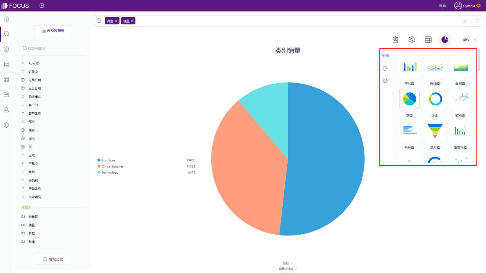
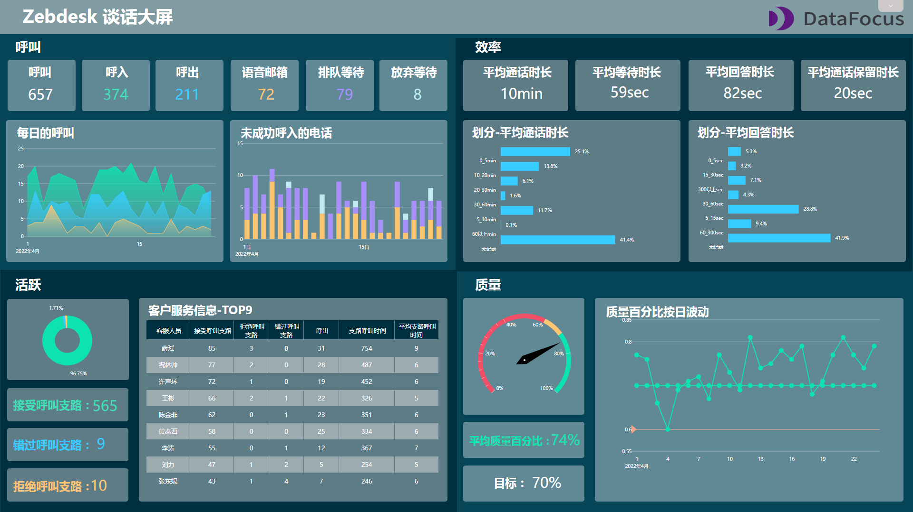

## 什么是客户成功？

客户成功是在SaaS模式下所形成的特有服务模式，指的是销售后留客的种种行为，围绕客户为中心展开，让客户启动、成长、继而达成续费，成为长长久久的客户，实现客户的终身价值。

如何创建一个有意义的、能辅助决策的客户成功数据看板呢？

本篇文章将结合一些客户制作数据看板的经验，给大家分享如何打造出出色的[客户成功数据看板](https://www.datafocus.ai)。

### 明确受众和目的

在开始制作客户成功数据看板前，首选需要考虑数据看板的用途。谁在看这个数据看板？他需要从看板中了解什么？这个答案对数据看板内核心指标的选择以及如何进行可视化有至关重要的影响，看板详细程度会根据使用对象（例如小组组长、部门经理、总经理等）以及是否用于特定项目而有所不同。

例如，如果使用对象是总经理，那么数据看板的创建方向应该是监控数据的长期波动趋势和识别大方向上的问题，所有数据需要进行汇总；但如果是小组组长使用，那么就可以创建多个小组之间的比较排行榜，或者跟踪首次呼叫解决和客户满意度得分等指标。

### 选择一组重点指标

通过了解看板受众以及他们的目的，接下来需要了解可以真正影响他们日常工作的那些指标。例如，为客户成功团队提供显示营销线索数量的仪表板则毫无意义。制作数据看板的宗旨是集中在受众最重要的指标上，而不是因为有空间就想添加指标和可视化。

在为客户成功数据看板选择指标时，还有一些其他陷阱需要避免：

- 虚荣指标看起来很不错，但它们并不能直接帮助做出对影响客户有意义的任何决策。
- 滞后指标：一般情况下，不要显示滞后指标，除非需要结合领先指标一起使用。它们通常很容易衡量，但在日常支持客户时很难改进或影响。例如，虽然流失率是客户成功团队的一个重要指标，但在大多数企业中，它是一个明显的滞后指标，最好将其与其他指标（例如首次响应时间和客户满意度）结合起来查看，因为这些指标是团队可以在日常工作中影响的指标，同时也将长期影响客户流失率。

### 有效的可视化指标

选择正确的数据可视化本身就是一大难题，但幸运的是，DataFocus系统中有40+的可视化图表类型可供选择，系统也会智能选择最合适的图表类型进行展示，如果不知道如何选择可视化图表类型的小伙伴们，可以直接选择DataFocus系统默认的图表类型，这大大降低了制作看板的难度。

### 展示数据看板

在浏览器选项卡和电子邮件报告中隐藏重要的客户成功数据看板会阻碍指标的传达。因此我们建议，将数据看板投影到办公室的大屏幕上，这样可以提高客户成功团队对关键指标的进度意识。

通过电视机屏幕使指标可见，方便客户成功团队在遇到问题时可以快速做出反应并确定工作的优先级，并根据重要指标取得进展。

简而言之，电视仪表板有三个明确的用途：

- 监控：实时查看是否有任何需要您立即关注的事情。例如，客户刚刚在满意度评分上评价为“差”。
- 动机和表扬：建立组内和组间的排行榜，看看谁提供了最快的响应或解决了最多的问题。
- 重点：团队中的每个人都知道他们想要改进什么，以及他们作为一个团队或个人的表现如何。

### 迭代，但不要频繁

数据看板制作完成后并不是一成不变的，至少需要每季度对数据看板的指标内容进行一个迭代。例如，可以去掉一些没有预期好用的小组件，或者换一种更好的方式计算关键指标等等。

例如，公司内部新推出一款集成软件——Zendesk，可以追踪客户成功团队每日接到的呼叫数量并创立对应的工单，还可以将这些工单按照一定的主题进行分类。因此，我们在DataFocus中创建了一个与Zendesk呼叫相关的数据看板，追踪指标。

接受找到一组完美的指标需要一些时间，并且在迭代时找到正确的平衡点很重要。确保始终跟踪最重要的内容并随时进行调整，但请记住，太快且太频繁地交换KPI会使团队难以专注于重要的事情。因此，定期在您的仪表板上进行迭代，但不要太频繁。

请记住，没有完美的仪表板，因为公司的目标和方向一直在变化。构建数据看板只是一段旅程，而不是目的地。

希望通过上述的5个步骤，可以帮助用户打造出色的客户成功数据看板。

使用DataFocus系统可以在十分钟内完成客户成功数据看板的创建，无需编码，低成本就可以学习如何创建数据看板。立即开始免费试用吧！
