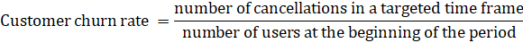
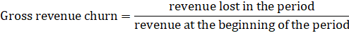

为了防止因客户流失而失去客户，公司转向流失分析。这种类型的分析帮助他们测量、监控和降低流失率。客户流失分析的需求是我们客户转向[BI 实施服务](https://www.datafocus.ai/analytics/business-intelligence/implementation)的原因之一。在本文中，我们的 BI 专家总结了客户流失分析可以带来的主要好处，并解释了如何进行。

## 为什么要分析客户流失？

### 提高利润

由于流失分析为您提供了如何留住客户的有意义的见解，因此您似乎有机会获得额外利润。只要看看这些数字：我把客户保留率提高5%，就能使你的利润增加25%，甚至更多。我们相信，它已足够令人信服，可以开始分析客户流失。

### 创造更好的客户体验

有效的流失分析有助于更深入地了解客户旅程。考虑到客户可能离开的点，公司可以开发一套保留活动，以创造更舒适的客户体验，更好地满足客户需求。这为培养一个忠诚的客户社区创造了条件，他们将分享他们的积极经验，成为品牌倡导者。

### 主动优化产品和服务

客户流失分析为公司提供了对客户偏好的相当准确的预测：他们在产品/服务中寻找的关键属性、他们不满意的功能、使客户更可能流失的触发因素等。通过这些见解，公司拥有有价值的数据，有助于优化现有产品或重新创建产品。

## 如何计算客户流失量？

单单计算客户（+订阅）流失对大多数企业来说都不够丰富，因为选择停止与公司关系的所有客户的百分比并不反映其对您的底线的影响。

要了解客户流失如何影响业务，您还需要计算总收入流失率（目标期间损失的收入百分比）

或采用更复杂的计算方法。

## 客户流失分析如何工作？

一旦您对客户流失进行了评级，[客户数据分析](https://www.datafocus.ai/blog/customer-data-analytics)和 BI 工具将授权您分析它。要定义导致客户退出的触发因素，您需要对离职客户进行细分（通过队列分析、按客户生命周期阶段和行为分析流失率）。触发器使您能够定义每个客户的流失可能，并为定义风险客户设置阈值。这样，您可以介入并采取补救措施，以预防流失。为了创建预测客户流失模型，我们建议在分析组合中添加[大数据技术](https://www.datafocus.ai/blog/what-is-big-data#technologies)。

## 阻止您的客户背弃您

到 2020 年，出色的客户体验有望成为主要品牌差异化器。客户流失分析使企业能够不断改善客户体验和整体品牌形象
