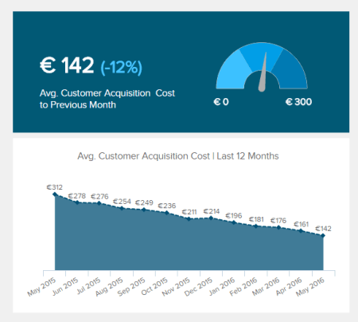

即使这个方面很重要，制定有效的产品路线图还是超出了产品经理的愿景或直觉。在日益受数据驱动的商业世界中，产品管理领域也不能免除这种需求。分析将帮助您提高产品意识，并为您提供给利益相关者的决策赋予更多的权重和可信度。

作为产品经理，收集有关产品性能、特点、市场采用率等方面的信息是必不可少的。正确的产品指标将为您提供有关其健康状况、优势和劣势、潜在问题或瓶颈的宝贵见解，并让您大大改进它。在本文中，我们将深入了解产品 KPI 的定义：它们是什么、谁需要它们以及为什么需要它们；然后，我们将详细介绍为您的产品找到正确指标的步骤；最后，我们将提供一些产品指标示例。

## 什么是产品指标？

与任何指标一样，它们是定量度量，可帮助业务人员深入了解其方法的有效性和项目的发展。在这种特定情况下，他们通过检查产品是否满足最初的业务目标以及产品策略是否有效来帮助评估产品的性能。如果没有产品 KPI，评估产品的性能很可能最终陷入一场现实扭曲的猜谜游戏。

产品 KPI 可以与用户需求、规模、质量、产品增长或用户舒适度相关。他们可以评估架构度量、质量度量、软件复杂性或功能规模。但是，根据您是谁或您向谁提交报告，产品指标可能会有所不同：在一天结束的时候，利益相关者关心的是现金，但 PM 想要了解客户如何与产品进行互动。

这就是最大的挑战所在。选择正确的指标并不像看起来那么容易，即使是经验丰富的产品经理也可能并不总是衡量正确的东西。首先，并非所有产品都是一样的，因此，并非所有数据都具有同样的重要性——有些数据比其他的更有价值。高管们经常陷入的另一个误区是监控越来越多的指标（因为害怕错过某些东西），这很可能会模糊他们的愿景。

让我们回顾一下帮助您为您的业务选择最佳产品指标的步骤。

## 寻找正确的产品指标

### 定义您的业务目标

建立数据驱动的产品管理，首先要对产品所服务的业务目标有清晰的认识。这对于构建您的产品战略是必不可少的，因此您需要明确定义它们：您想发展现有业务吗？保留已经存在的？瞄准新客户？目标可以定义为要达到的特定目标（百分比、金额等），并且应该与您的总体目标保持一致。

这第一步对于将每个人都处于同一水平上也非常有用：事实上，您团队中的不同成员可能对您的产品目标有不同的想法。第一步提供了一个机会，可以让你对自己的目标达成共识。

### 通过提出正确的问题找到正确的指标

我们都听说过“无法衡量的东西是无法改进的”——这就是第二步的目的：让你的目标可以衡量。你想知道你要测量什么，为什么要这样做，你需要开始问正确的问题。

在这方面，谷歌的HEART 框架可以提供很好的帮助：幸福感、参与度、采用、保留和任务成功是五个类别，您可以针对这些类别提出问题来定义您想要跟踪的指标。促进与产品团队中不同人员（经理、研究人员、设计师、工程师）的协作，拓宽问题的范围，并制定有效的成功指标。

不要将你的问题简化为纯粹的定量测量，这会给你一个简单而直接的结果。尽管这些指标更容易处理，但收集定性反馈将有助于理解为什么会发生某些事情（例如为什么用户不满意）。两者的结合将使您对您的产品有一个平衡的看法，并降低忽视最重要的成功因素的风险：数据背后的个人，购买和使用您的产品的人。

### 避免常见的陷阱

在一个完美的世界里，一旦你提出了正确的问题，你的指标通常应该是明确定义的，并且准备好可以开始使用的。然而，这是现实，我们很容易陷入一些陷阱——尤其是在数据方面。

第一个错误是为了衡量而尽可能地衡量。这样做，您将淹没在数据中，很难从表面上辨别出有意义的东西，浪费宝贵的时间和精力来分析这些几乎不能产生洞察的数据。

另一个错误是跟踪那些在表面上看起来不错的指标，但实际上对产品的改进没有任何帮助：臭名昭著的“虚荣指标”。根据您的产品，这些指标可能会有所不同，但它们总是归结为同一件事：它们感觉很好，但不具有可操作性。例如，您的应用程序的下载次数：相当多的人可能下载了该产品，但它仍然不能告诉您有关其性能或成功程度的任何信息。相反，衡量每日活跃使用或推荐率可能更相关。

引用广告大亨大卫奥格威的话：“大多数人使用分析的方式就像醉汉使用灯柱一样，是为了支持而不是照明”。不要像大多数人一样。

### 处理数据并将其可视化

一旦你为你的产品选择了正确的指标，你需要收集相关的并定期分析。更好的是，找到一种方法，将所有数据可视化在一个仪表板上，这将有助于一起理解所有数据，识别在其他情况下仍无法看不到的趋势或相关性。

[仪表板软件](https://www.datafocus.ai/infos/best-dashboard-software-features)对此有很大帮助。您可以将所有数据源连接到一个单一的事实点并联合处理所有数据源——这相当节省时间，因为您不需要执行复杂的跨数据库查询：软件会帮您完成这些工作。通过仪表板提供的数据可视化分享和交流您的见解也非常有帮助：无论您将它们展示给您的团队成员还是您的利益相关者，在一个控制面板上描绘所有重要的指标将使每个人的工作效率更高。

## 您可以使用的产品指标示例

现在您已经确定了自己的目标，向您的产品策略提出了正确的问题，并准备好将每个期望的用户行为转化为可衡量的价值。在本节中，我们将为您提供产品指标示例，您可以根据您在战略路线图上决定的优先级来监控您的产品性能。

### 以客户为导向的指标

\-**客户保留**：它衡量反复与您开展业务的客户数量。保持高水平很重要，因为留住客户的成本远低于获得新客户的成本。

\-**净推荐**值：[客户满意度指标](https://www.datafocus.ai/infos/customer-satisfaction-metrics-effort-score-nps-csat)之一，可让您了解用户推荐您的产品的可能性。它告诉您他们是否对您的产品感到满意，并提供有关客户促销和忠诚度的见解。

\-**流失率**：流失率与留存率相反，因为它衡量的是相反的情况（例如，通过退订停止与您开展业务的客户）。将其与之前的数据进行比较很重要，因为突然出现的高流失率可能意味着您的客户对功能、定价或结构的变化不满意。

\-**转化率**：转化为客户的免费试用用户数量。

### 参与度和功能指标

当您想要了解客户与您的产品如何进行交互，并确定哪些地方有改进空间时，用户参与度指标非常有用。

\-**产品使用情况**：一个好的起点是跟踪用户登录其帐户的频率。换句话说，它是每个用户的会话次数，是粘性和行为分析的一个很好的起点。采用中位数比平均值更可取，因为它们提供了对异常值不太敏感的更强大的统计数据。

\-**每个会话的关键用户操作数**：在选择了对您很重要的特定用户操作（例如单击共享按钮）后，随着时间的推移跟踪不同的用户群。您可以比较留存客户和流失客户之间的差异。

\-**功能使用**：使用功能的频率是多少，用户在功能上花费了多长时间？使用这个或那个功能的人的个人资料是什么？它们的使用有季节性趋势吗？这些是您可以回答以构建特定功能配置文件的关键问题。

### 面向业务的指标

这些指标相当高级，将帮助您塑造或重新塑造您的战略。这些指标源于客户的行为以及它们如何影响您的底线。它们包括：

\-**客户获取成本**(CAC)：将某人转变为客户所产生的所有成本。它们包括市场营销，销售，广告等。

\-**每月经常性收入**(MRR)：评估公司在给定月份的预期总收入。MRR 与收入流失密切相关，后者衡量的是您的公司每月因降级（或流失）而损失的收入百分比。关注这种流失比关注一般的流失率更重要：服务更少的客户但获得更多的报酬，最终比服务众多的客户却得到很少的钱更重要。

\-**客户终身价值**(CLTV)：通过预测您可以从客户那里赚取的平均金额，衡量您的客户在长期内的盈利能力。CLTV越高，您的业务就越可持续。它还有助于识别营销活动，在这些活动中，您为客户花费的钱最终超过了他的价值。

这个列表可能会很长，尤其是当您想要测试不同的假设和相关性，并且需要收集大量不同的数据时。然而，如上所述，跟踪与您的首要目标相关的指标并避免分散更为重要，因为您很容易失去对最重要的事情的关注。

重点是从这些数据中学习，通过做出更好的决策来改进你的产品。正如产品顾问 Vince Law所说，“指标会告诉你正在发生什么，但分析会告诉你为什么会发生某事”。您的产品指标不是独立的度量对象，它们需要理解上下文，这将为它们提供一个叙述和改进的杠杆。如果你只知道你的投资是成功的而不知道为什么，你就不会知道你的下一个投资应该是什么。

要引导您的产品走向成功，秘诀很简单：使用科学的思维方式来描述假设、定义测试并测量它。

作为产品经理，您将定义产品的战略目标，提出正确的问题，并设置指标来衡量您实现这些目标的进度。正如我们在产品指标示例中所展示的，这些 KPI 可以是面向业务的、面向客户的或是衡量用户参与度的。将您的指标限制在少数几个，这将为您提供最具战略意义的见解，而不会消耗您所有的时间和资源。在专业的[业务仪表板上](https://www.datafocus.ai/infos/dashboard-examples-and-templates)跟踪这些指标，以获得对总体战略所需的概览，您可以与团队成员、高层管理人员、投资者和利益相关者分享，向他们展示您在产品经理的直觉基础上提供了支持信息的证据。

实施[KPI 仪表板软件](https://www.datafocus.ai/infos/kpi-dashboard-software)将极大地帮助您传达通过产品指标分析获得的见解。如果您想从商业智能和数据可视化中受益，您应该测试我们的 30天[免费试用](https://www.datafocus.ai/console/)。
