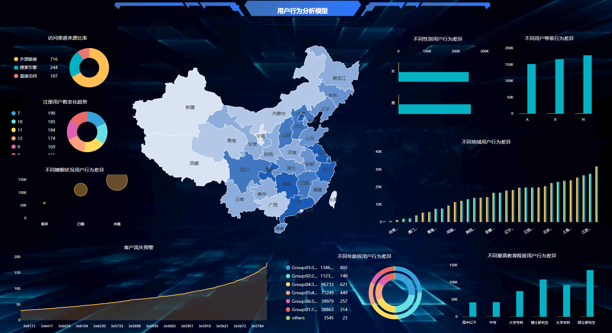

现如今进入大数据时代，很多企业都开始或多或少的利用大数据所产生的价值。对于企业来说，大数据能够起到的角色和分量因企业本身而异。但是有一点可以肯定的是，大多数企业尤其是依靠数据或互联网兴起的产业一定是需要赶上大数据这一趟高铁，否则就可能被时代抛弃或错失商机。大数据的应用案例不少，也有很多企业很好的利用了大数据并创造了商业价值，比如很多转型的传统巨头或是依托大数据建立的云服务企业等等。当然也有很多企业利用一些不需要IT技术的大数据分析工具，如DataFocus、Power BI等为企业提供大数据分析服务，继而进行决策。那么其实包含上述大数据分析工具在内，很多融合应用企业或是数据增至服务提供企业，也不断地在进行探索，并为整个行业提供更好的技术或产品。本篇我们来分享阿里在大数据实施尤其是存储方面是如何探索的。

简单来说，探索总共分为三代。第一代是本地盘模式，非常简单，和我们普通的PC一样，以磁盘-内存-计算的方式，当然这也是仍然是目前很多云厂商的数据库服务模式。第二代就是集中式存储。有主库和只读，模式都是内存计算模式，而还有以SSD支持的诸多阵列。到了第三代，就是分布式共享存储。内存计算的“并联”更加多样，并且出现以SSD支持的POLARSTORE，这第三代就是阿里云的POLARDB和AWS aurora的运营模式。

还有一些阿里产品探索我们可以为各位分享一下。上述说到PolarDB：又快(性能是官方MySQL6倍)、又大(磁盘规格支持高达100T)、又便宜(价格只有商业数据库的1/10。还有X-DB：双11核心交易系统100%流量，首次提供了跨Region强一致-X-Paxos、Pangu存储。然后是X-KV：SQL on Memcached。ESDB：合并买家、卖家分库；实现多维查询、模糊查询、深度分页。HiTSDB：Append Only，Batch Write，顺序写-每20分钟生成切片，300万doc仅5MB。
