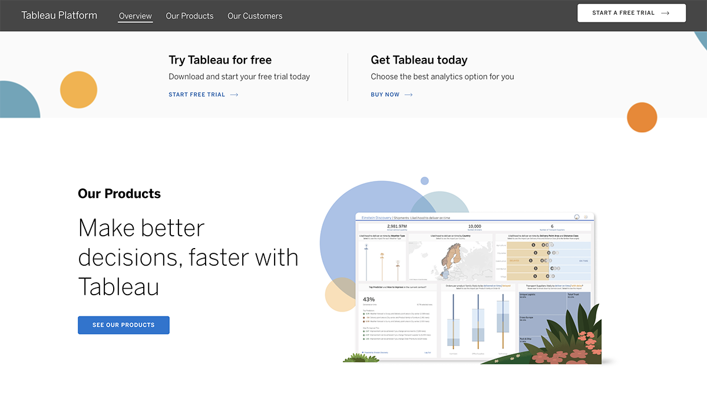
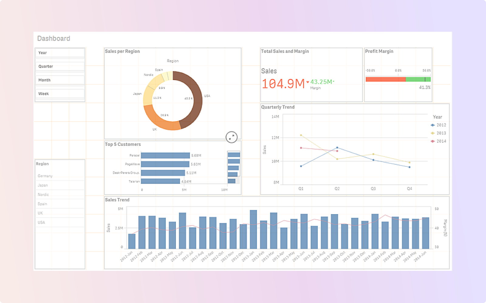

在数据驱动的商业环境中，ChatBI（聊天式商业智能）工具正变得越来越受欢迎。它们通过自然语言处理（NLP）技术，使用户能够以对话的方式进行数据查询和分析，从而简化了数据操作，提高了效率。本文将对比市面上最受欢迎的五款ChatBI产品，重点包括DataFocus旗下的FocusGPT，另外还将涵盖其他四款知名产品，分析它们的主要特点、优势和应用场景。

## 一、FocusGPT（DataFocus）

### 1\. 产品简介

FocusGPT是DataFocus旗下的旗舰ChatBI产品，旨在通过自然语言交互，为用户提供便捷的数据分析和洞察。FocusGPT利用先进的NLP技术，能够理解复杂的用户查询，并快速生成数据结果和可视化图表。

### 2\. 主要特点

- **智能搜索引擎**：强大的搜索功能，能够快速准确地响应用户查询。
- **丰富的可视化工具**：支持多种图表类型，用户可以根据需要选择合适的图表进行数据展示。
- **多数据源集成**：支持与多种数据源的无缝集成，包括数据库、Excel文件和第三方应用程序。
- **高度安全性**：采用多层次的安全机制，确保数据传输和存储的安全。

### 3\. 优势

- **用户友好界面**：界面设计简洁直观，用户无需专业培训即可快速上手。
- **实时数据分析**：支持实时数据查询和分析，帮助用户做出及时决策。
- **个性化推荐**：根据用户的使用习惯和需求，提供个性化的数据分析建议。

### 4\. 应用场景

FocusGPT适用于各个行业，如市场营销、销售管理、财务分析和运营优化。它可以帮助企业优化营销策略、提高销售效率、进行精细化财务管理和优化运营流程。

## 二、Tableau GPT

### 1\. 产品简介

Tableau GPT是Tableau推出的ChatBI产品，通过自然语言查询功能，使用户能够更加便捷地进行数据分析和可视化。作为传统BI工具Tableau的扩展，Tableau GPT整合了强大的数据可视化功能和先进的NLP技术。

### 2\. 主要特点

- **自然语言查询**：用户可以通过简单的自然语言查询数据，系统会自动生成对应的图表和分析结果。
- **高级数据可视化**：支持创建复杂的交互式仪表盘和报告。
- **广泛的数据集成**：能够连接多种数据源，包括数据库、云存储和第三方应用程序。
- **社区支持**：拥有庞大的用户社区，提供丰富的资源和技术支持。

### 3\. 优势

- **强大的可视化功能**：Tableau在数据可视化领域有着深厚的积累，能够生成高质量的图表和报告。
- **灵活的查询方式**：不仅支持自然语言查询，还可以通过拖拽操作进行数据分析。
- **丰富的扩展功能**：支持多种插件和扩展，用户可以根据需要定制功能。

### 4\. 应用场景

Tableau GPT适用于需要高质量数据可视化的企业，如市场分析、客户洞察、运营监控和财务报告。它特别适合需要创建复杂仪表盘和报告的用户。

## 三、Qlik Sense Chat

### 1\. 产品简介

Qlik Sense Chat是Qlik推出的聊天式BI产品，结合了Qlik强大的数据分析和可视化能力，通过自然语言查询简化了数据分析过程。

### 2\. 主要特点

- **自然语言交互**：用户可以通过自然语言提出问题，系统会自动解析并返回相应的分析结果。
- **自助数据分析**：支持用户自主探索和分析数据，生成定制化的图表和报告。
- **智能数据发现**：利用机器学习算法，帮助用户发现数据中的隐藏模式和趋势。
- **集成多数据源**：支持与多种数据源的集成，提供全面的数据分析能力。

### 3\. 优势

- **强大的数据发现功能**：智能算法能够帮助用户挖掘数据中的隐藏价值。
- **灵活的自助分析**：用户可以根据需求自主探索数据，提高分析的灵活性。
- **良好的用户体验**：界面设计直观，操作简便，用户可以轻松上手。

### 4\. 应用场景

Qlik Sense Chat适用于需要自主数据分析和智能数据发现的企业，如市场研究、业务分析、客户细分和运营优化。它帮助企业深入挖掘数据价值，做出更有洞察力的决策。

## 四、Microsoft Power BI Q&A

### 1\. 产品简介

Microsoft Power BI Q&A是Microsoft Power BI的一部分，通过自然语言查询功能，使用户能够轻松获取数据分析结果。作为Microsoft生态系统的一部分，Power BI Q&A具有良好的集成性和扩展性。

### 2\. 主要特点

- **自然语言查询**：用户可以通过自然语言提问，系统会自动生成相应的图表和报告。
- **强大的数据处理能力**：利用Power BI的强大数据处理和可视化功能，支持大规模数据分析。
- **集成Microsoft生态系统**：与Microsoft的其他产品如Excel、Azure等无缝集成，提供一体化解决方案。
- **实时数据分析**：支持实时数据流处理，用户可以随时获取最新数据。

### 3\. 优势

- **强大的集成能力**：与Microsoft生态系统的良好集成，使其成为企业级数据分析的理想选择。
- **易用性**：用户界面友好，操作简便，适合各种用户。
- **灵活的部署选项**：支持本地和云端部署，满足不同企业的需求。

### 4\. 应用场景

Microsoft Power BI Q&A适用于需要深度集成Microsoft产品的企业，如财务分析、销售管理、市场洞察和运营监控。它特别适合已经使用Microsoft生态系统的企业，提供无缝的数据分析体验。

## 五、ThoughtSpot

### 1\. 产品简介

ThoughtSpot是一款专注于搜索驱动的数据分析和BI工具，通过自然语言查询和搜索功能，帮助用户快速找到所需的商业洞察。ThoughtSpot结合了搜索技术和数据分析能力，为用户提供了强大的自助数据探索工具。

### 2\. 主要特点

- **搜索驱动分析**：用户可以通过类似搜索引擎的方式查询数据，系统会自动生成相应的分析结果。
- **强大的数据探索功能**：支持复杂的数据探索和分析，帮助用户发现深层次的数据洞察。
- **高性能分析**：利用内存计算和分布式架构，支持大规模数据分析和处理。
- **智能推荐**：基于用户行为和数据模式，提供个性化的分析建议。

### 3\. 优势

- **搜索驱动的直观操作**：用户可以通过简单的搜索操作快速获取所需数据，降低了使用门槛。
- **高性能数据处理**：支持大规模数据集的快速处理和分析，适合企业级应用。
- **智能推荐功能**：基于机器学习算法，提供个性化的数据分析建议，提升分析效率。

### 4\. 应用场景

ThoughtSpot适用于需要快速数据探索和大规模数据处理的企业，如市场研究、客户洞察、运营分析和财务管理。它帮助企业在海量数据中快速找到关键洞察，提高决策速度和准确性。

## 六、总结对比

### 1\. 功能对比

- **自然语言处理**：五款产品都具备自然语言查询功能，但在准确性和处理复杂查询方面有所不同。FocusGPT和Tableau GPT在处理复杂查询方面表现较好。
- **数据可视化**：Tableau GPT和Microsoft Power BI Q&A在数据可视化方面具有明显优势，提供了丰富的图表和报告选项。
- **数据集成**：Microsoft Power BI Q&A在与其他产品的集成方面具有明显优势，特别是与Microsoft生态系统的无缝集成。
- **智能推荐**：Qlik Sense Chat和ThoughtSpot在智能推荐和数据发现方面表现突出，能够提供个性化的分析建议。

### 2\. 适用场景对比

- **市场营销**：FocusGPT和Qlik Sense Chat适合需要深入市场分析和客户洞察的企业，提供全面的数据分析和智能推荐。
- **销售管理**：Microsoft Power BI Q&A和Tableau GPT在销售管理方面表现突出，支持创建复杂的仪表盘和报告，实时监控销售数据。
- **财务分析**：FocusGPT和Microsoft Power BI Q&A适合财务分析，支持实时数据查询和深度数据处理。
- **运营优化**：ThoughtSpot和Qlik Sense Chat在运营优化方面具有优势，支持大规模数据处理和复杂
