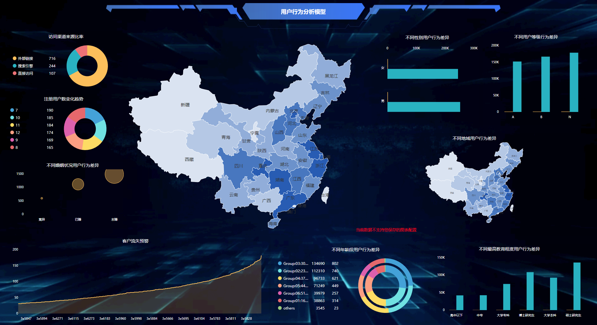

数据可视化的工具很多，也有不少人总结过，这里笔者就推荐一些简单的，日常工作能实际应用起来的工具。

**Excel**

传统的数据可视化工具，也一直在迭代更新，图表也是越来越丰富美观，比较普及。但仍然是把数据往模板里套的方式。适合普通的业务数据记录和简单的可视化。

**ggplot2**

ggplot2是R中最流行、最强大的绘图包。你可以的创意都可以通过其完备的画图语言进行实现。这个绘图包只限于静态图，如果想把图形变成动态交互式，需要下载R中其他相关的包，这也弥补了ggplot2本身不能交互的命点。由于需要用到数据挖掘编程语言，因此比较适合专业的数据分析师。

**Echarts**

Echart是百度旗下的产品，一个纯Javascript的数据可视化库，提供示例模板，把代码复制过去就行。图标种类丰富，3D绘图动态效果佳，缺点就是只能套用模板，不能自由创作。

**DataV**

DataV是阿里的产品，天猫双十一大屏就用DataV做的。DataV是一款拖拽式可视化工具，主要用于业务数据与地理信息融合的大数据可视化。价格不贵，一个可视化大屏年服务费是5100，相对于国外的大屏制作系统，可以说是很平价化了。

**DataFocus**

DataFocus和DataV类似，也是大屏制作选手之一。如果考虑到数据的敏感性，不方便进行云部署，DataFocus可以说是你的最佳选择了，其服务费也比DataV要低。另外DataFocus

使用自然语言搜索的分析方式，零代码，无拖拽，双击选择就可以完成整个可视化大屏的开发，用户可以自由发挥。

