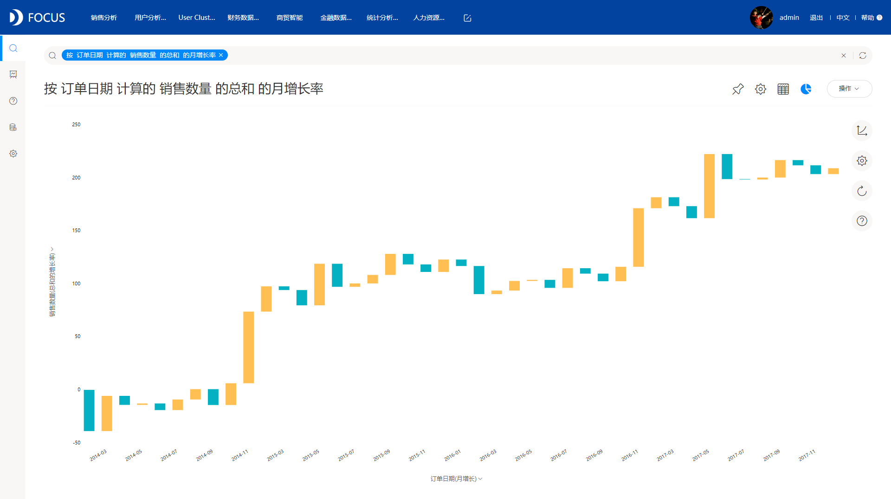

现代社会，随着数据时代的发展，大量的BI工具涌现，主要原因是企业越来越重视对于数据的有效利用，需要通过BI工具，辅助分析业务数据，从而实现业务推动决策。

本文，主要对比了QlikView与DataFocus。这也是近两年在市场比较火热的，也相对比较成熟的BI工具，通过对比一些主要功能，为企业或者个人选型提供一个参考。

QlikView

QlikView采用拖拽的狡猾方式，比较灵活，展示的样式也比较多样，可以自定义可视化大屏等，其可以对数据进行清洗操作，QlikView的一个特性，就是将数据输入保存在多个用户的内存中，这样可以加快查询速度，但是这个速度很大程度上依赖于内存大小，所以对硬件的要求很高，一般的企业配置，数据处理起来速度会比较慢，而且对于一些复杂的业务需要，需要高水平的开发人员参与，通过写脚本的方式实现。QlikView被誉为最昂贵的BI工具之一，定价高，性价比一般。

DataFocus

DataFocus是国内首个采用中文自然语言搜索的BI工具，其使用的交互方式不是传统的拖拽式，而是搜索式，类似于谷歌搜索的方式，这个功能非常智能，可以降低数据分析的难度，而且不需要任何代码，只需要搜索，就能进行简单的或者复杂的分析，图表样式也比较丰富，有30多种，而且图表制作也很简单，支持个性化设置大屏以及单个图表。DataFocus可以根据数据自动适配图表。

DataFocus性价比更高，功能齐全，图表丰富，但是价格却不高。而且其新颖的搜索式分析，吸引了很多关注。

最后我想说，所有的BI平台都有自己的优点和缺点，适合业务的才是最好的，希望这上述的功能对比对大家有帮助！
