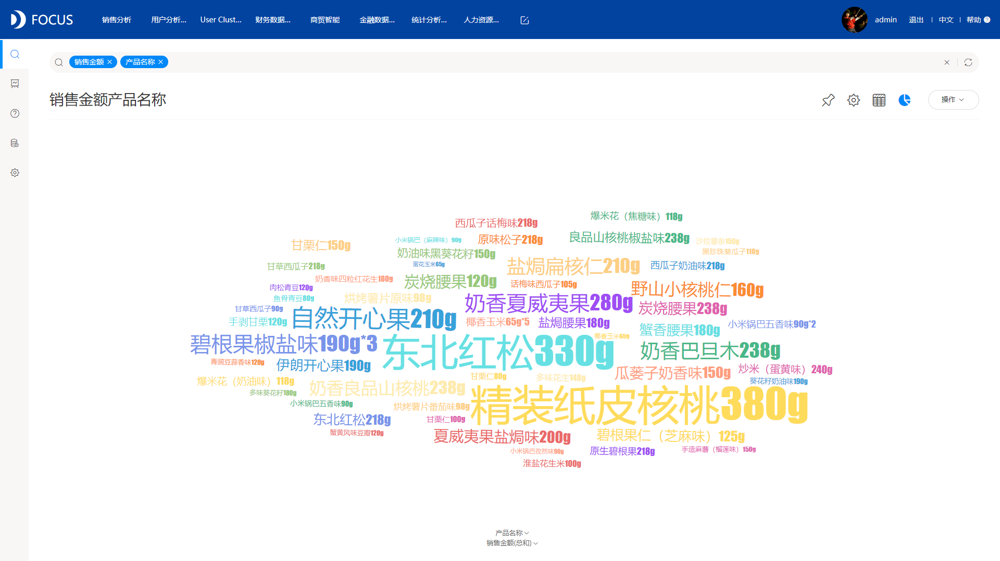

你的可视化作品是这样的吗？

还是说这样的？

可是别人的都是这样的：

甚至是这样的：

看完对比，是不是觉得自己的可视化弱爆了，很想知道为什么别人的可视化做得这么好看。别急，答案马上揭晓。上面可视化效果这么好的是因为借助了专业的可视化工具DataFocus，excel肯定是没法做出这种效果的。

什么是DataFocus？

这是一款强大的数据可视化工具，也是一款专业的数据分析工具。DataFocus拥有30多种图形，既有像是柱状图、折线图的基础图形，也有桑基图、箱型图、热力图等高级图形，而且数据可视化过程非常简单，只需要简单地搜索即可，系统会自动识别搜索的信息，以数据的特点适配图形展示，无需用户有多余的操作，即简单又高效。

在日常的业务中，常常会有跟地理位置相关的信息，有时候需要利用这些信息来进行分析并且展示，这时候，用地图展示就是一种最好的选择。比如现在有省份，然后有销售额，我想要查看不同省份的销售情况，我就可以直接在搜索框内输入：省份 销售额，系统立刻将结果以最适图表返回，默认显示成全国地图，效果如下图：

图中颜色的深浅代表销售额的高低，从图中可以直观地看到各个省份的销售差异，销售最好的以及销售较差的，一眼就能分辨。

有时候，我们也需要展示一些有层级关系的数据，例如有区域，省份，销售额，区域与省份有一定的层级关系，这时候，旭日图就能很好的展示这种特点：

从旭日图中，我们可以很直观地了解到每个区域下方有哪些省份，体现了这两者之间的层级关系。

现在，是不是也对DataFocus很心动呢？那就来实际试用吧！用了你就赚了！
