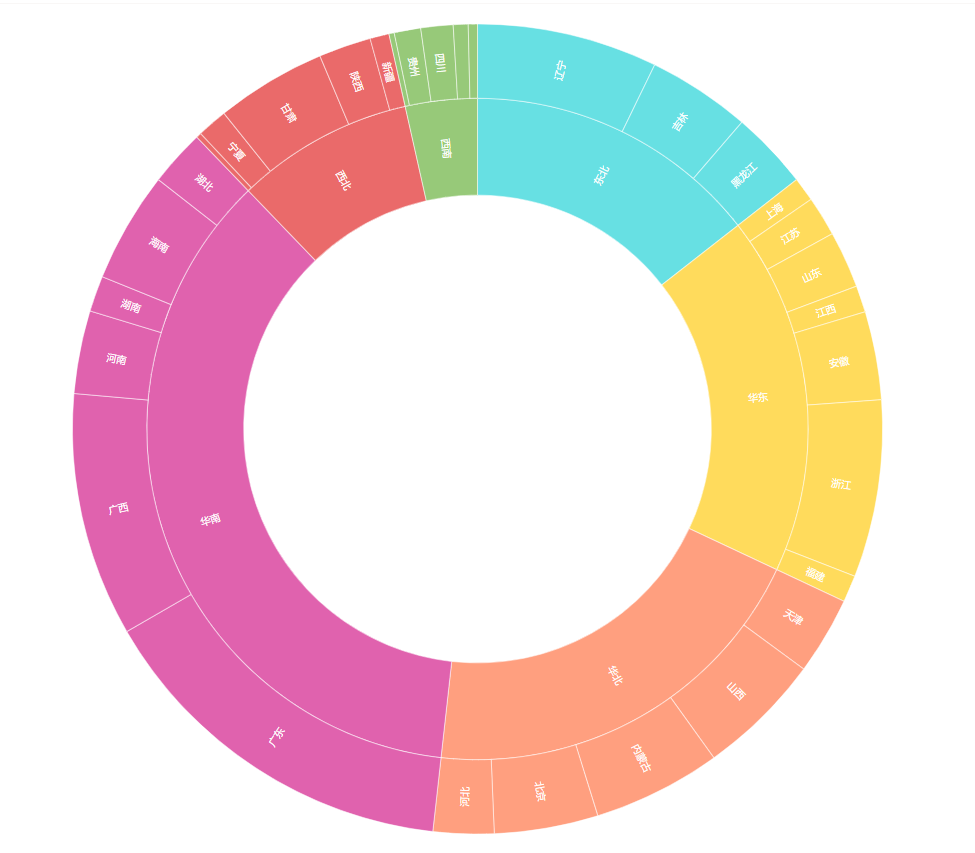
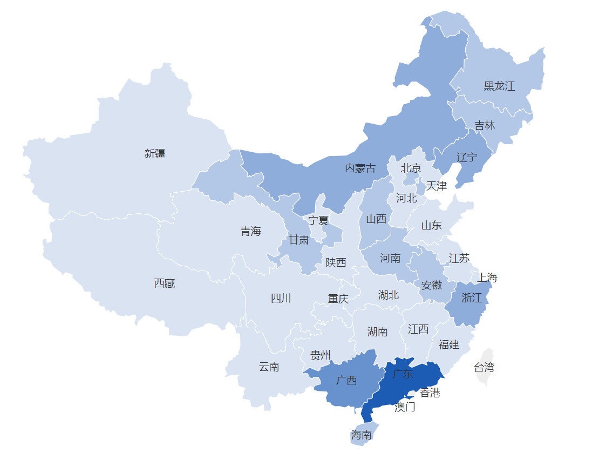

真正专业的大数据分析师，年薪百万不在话下，这也是为何有这么多人挤破脑袋也想进入数据分析领域，当这个数据分析师，当然了，年薪百万也不是这么容易拿的，那数据分析师需要具备哪些能力呢？有什么要求呢？

一、理论知识要宽泛。数据分析常常涉及统计学，数学的相关知识，所以要求专业的数据分析师一定要对数据敏感，需要有一定的统计知识，以及各大模型原理等。

二、理解能力要好。数据分析主要是分析企业业务数据，从而了解业务背后的商业规律与逻辑，只有了解了业务，才能更好地进行分析，故要求分析师还需要有一定的业务理解能力。

三、实际操作能力。数据分析师一定离不开数据分析工具，这里所说的能力，包括选对数据分析工具，以及运用这款数据分析工具的能力，因此，实际操作能力很大程度取决于数据分析工具是否选对了，选对了事半功倍，选错了会阻碍你的数据分析之路。

前面两点主要靠自己平时的积累，工作的经验等，而第三点，是可以通过选择一款好的数据分析工具来加分的。那怎么样的数据分析工具才算是好的呢？数据分析一般有四个步骤：数据获取、数据处理、数据分析、数据展示，我们判别工具好与不好，主要从这款工具的这四个功能入手。

数据获取：数据获取看似简单，但其实不易，因为数据获取是数据分析的基础，只有获取了完整的数据，才能分析出正确的结论，而且在实际业务中，数据常常来源于多个不同的业务系统，这就要求数据分析工具支持多源数据，而且操作不能太繁琐，要尽可能简单。

数据处理：此过程主要是对获取的数据进行一系列的清洗，通过公式、筛选、排序等日常手段，同样地，此操作过程也不应太复杂，而且要求分析工具能够支持百万甚至千万级别的数据量。

数据分析：此处才是真正地开始分析，通过多表联立，分类统计，模型应用等进行分析，分析过程要求迅速，高效，最好不要涉及代码，否则难度系数太高。

数据展示：数据展示的是数据分析的结果，展示的图表类型要丰富，图表的制作要简单高效，要支持可视化大屏，展示效果要美观，配色要符合大众的视觉习惯。

说了这么多，有没有这样的数据分析工具呢？当然有，DataFocus就是这样的一款数据分析工具，有了它，你可以节省很多时间精力，它不需要任何代码基础或者IT基础，而且图表类型丰富，配色人性化，大屏美观，最重要的是DataFocus采用搜索的方式进行数据分析，这是以前所有数据分析工具没有过的，而这种搜索的方式，也大大降低了分析的难度，真正做到了事半功倍的效果。

上面的大屏以及图表，就是用DataFocus制作的，制作过程仅花几分钟时间，简单又高效，有兴趣的可以尝试看看。
