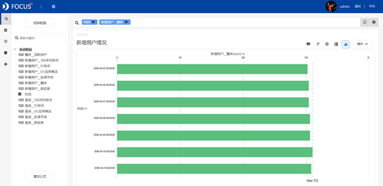
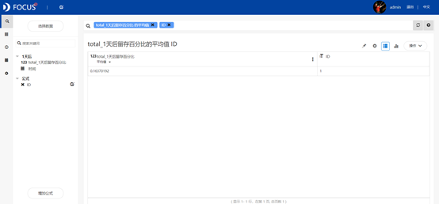

摘要 ：手机应用商店诞生的初衷，是为了使智能手机能完成更多的工作和娱乐。手机应用商店这一概念一经提出就迅速风靡起来，各大手机厂商开始搭建自己的应用商店，来提升自身手机产品的卖点和吸引力。此次案例分析的数据为2018年4月5日到2018年4月11日的应用商店APP用户使用状况数据。主要内容包括应用商店APP的新增用户情况，活跃用户情况，登录用户数，并计算新用户留存情况。新增用户数量、总注册用户量以及购买量最多的依次是在豌豆荚，360手机助手平台上；新用户留存百分比最高的是6天后，最低的是5天后。

关键词：Datafocus；应用商店APP；新增用户情况；新用户留存

## 一、案例背景

手机软件商店，又名手机应用商店，是2009年由苹果公司提出的概念。应用商店诞生的初衷，是让智能手机用户在手机上完成更多的工作和娱乐。在09年底，手机软件商店的概念迅速风靡起来，各大手机厂商开始搭建自己的应用商店，来提升自身手机产品的卖点和吸引力。

手机应用商店可以分为四大类：第三方应用商店（如360手机助手/应用宝等），手机厂商应用商店（如小米/华为等），系统运营商应用商店（如苹果App Store），运营商的应用商店（如联通沃商店/移动Mobile Market）。第三方应用商店三巨头360手机助手、百度手机助手、腾讯应用宝在加强自身平台建设的同时，加大推广力度，使得他们之间的竞争将更为激烈，同时与国内手机厂商自建的应用商店的竞争也将持续。

因此此次案例选取了2018年4月5日到2018年4月11日的其中5种类型的应用商店APP用户使用状况数据进行简单分析。主要内容包括应用商店APP的新增用户情况，活跃用户情况，5类应用商店APP各自的新增用户，登录用户数，并计算新用户留存情况。

## 二、案例问题

（一）应用商店情况统计

通过对使用豌豆荚、安卓市场、360手机助手、91助手、UC应用商店这5类应用商店APP进行数据统计，了解最近7天内5类应用商店APP的新增用户情况。接着将整体新增用户进行拆分，分别观察每种渠道的用户增加情况，进一步了解人们对于这5类应用商店APP的认识程度，帮助了解该阶段市场动向和变化，制定更加完善的计划。

（二）新用户留存

在传统的统计方式下很难直观的看出新用户的留存情况。通过对新用户留存情况的数据进行分析，了解每天的初始用户以及用户每天的回访情况，提出一定的建议。

## 三、案例分析

首先将分析的csv文件导入Focus系统，包括"渠道数据"、 "用户留存"和"天数"。

（一）各渠道用户情况统计

1.新增用户情况统计

通过条形图可以较直观的对比从2018年4月5日到2018年4月11日的5类应用商店APP的新增注册用户的人数，得到的图形如下图所示。

图 1 新增用户情况

从图中可以看出每日新增的用户数量相差不大，整体呈平稳的趋势，用户增加最多的1天是2018年4月10日。

2.活跃用户情况统计

饼图可以快速统计7天内5类应用商店APP的活跃用户的数量已经占比情况，得到的图形如下图所示。

图 2 活跃用户情况

从图中可以看出每日活跃的用户数量也是相差不大，但占比最大的1天是2018年4月10日。

3.各渠道新增用户情况

柱形图方便对比5类应用商店APP之间的新增注册用户情况，直观展现，可以对不同类型的应用商店采取不同的对策，得到的图形如下图所示。

图 3 各渠道新增用户

从图中可以看出新增用户数量大致按照豌豆荚，360手机助手，91助手，安卓市场，UC应用商店的顺序依次递减。

4.各渠道登录用户情况

通过堆积柱状图，可以明确的观察到5类应用商店APP每日的登录人数的差距，得到的图形如下图所示。

图 4 各渠道登录用户数

从图中可以看出基本上每日用户登录数量最多的应用商店APP是豌豆荚，其次是360手机助手和91助手，再次是安卓市场，最少的是UC应用商店。

（二）新用户留存

1.采用公式计算出用户留存百分比，公式为"1天后/初始用户"、"2天后/初始用户"、"3天后/初始用户"、"4天后/初始用户"、"5天后/初始用户"、"6天后/初始用户"。将得到的数据保存为中间表并命名"用户留存百分比"，如下图所示。

图 5 用户留存百分比

2.对"用户留存百分比"中间表中的数据进行筛选，然后添加公式"to\_string(1)"，将其保存为中间表，命名为"1天后平均值"。同样的，分别生成其余5个中间表。

图 6 1天后平均值

3.将6个平均值进行整理，放入一张表中，创建 "留存百分比"。选择"天数"，"留存百分比"数据源，添加公式：if 天数='1天后' then 1天后留存百分比 else （if 天数='2天后' then 2天后留存百分比 else （if 天数='3天后' then 3天后留存百分比 else （if 天数='4天后' then 4天后留存百分比 else （if 天数='5天后' then 5天后留存百分比 else 6天后留存百分比 ) ) ) )。得到的图形如下图所示。

图 7 新用户留存

从图中可以看出，新用户留存百分比最高的是6天后，最低的是5天后，总体上没有较大的波动。

（三）数据看板

最后将这5个结果图导入"应用商店用户情况"数据看板中，为了使数据看板更为美观，对看板进行了以下布局操作：

进行全局样式设置：将界面背景设置为图片，上传图片并设置为平铺；将组件背景设置为颜色——半透明；将标题栏设置为颜色——半透明；组件文字设置为黄色；标题文字设置为黄色并居中。

操作结果如下：

图 8 数据看板

## 四、结论

综上所述，可以了解到5类应用商店APP的新增注册用户的人数和每日活跃用户数量都相差不大，整体呈平稳的趋势。

比较5类应用商店APP的新增用户数量，大致按照豌豆荚，360手机助手，91助手，安卓市场，UC应用商店的顺序依次递减。同样的，每日用户登录数量最多的是豌豆荚，最少的是UC应用商店。

计算新用户留存百分比则了解到，新用户留存百分比最高的是6天后，最低的是5天后，总体上不存在较大的波动。

## 五、对策建议

1.加大宣传推广的力度。合理利用网络宣传，通过各类活动推广自身平台，持续推进市场推广，加固自己的优势壁垒，巩固自己的竞争优势。

2.了解社会需求，调整产品结构。应用商店应通过对现阶段社会需求的了解，引入社会最需的产品，在尽量扩充自己的应用商店的前提下，创造出独属于自己的特点，增加自己在市场上的竞争力。

3.手机应用安全问题突出，对应用商店提出了更高要求。智能手机用户将对安全性的问题越发重视，权限意识的树立意味着对手机应用商店的更高要求。手机应用商店完善监督功能，做好检测工作等，都是移动互联网安全背景下用户对应用商店提出的要求。
