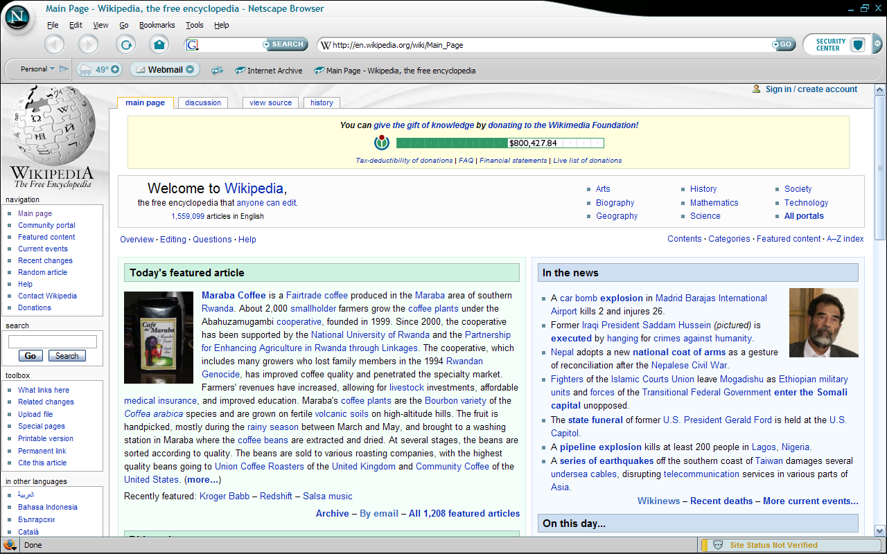
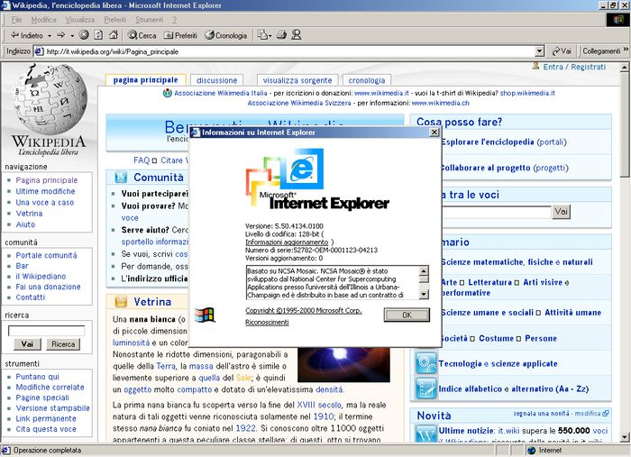
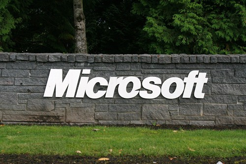
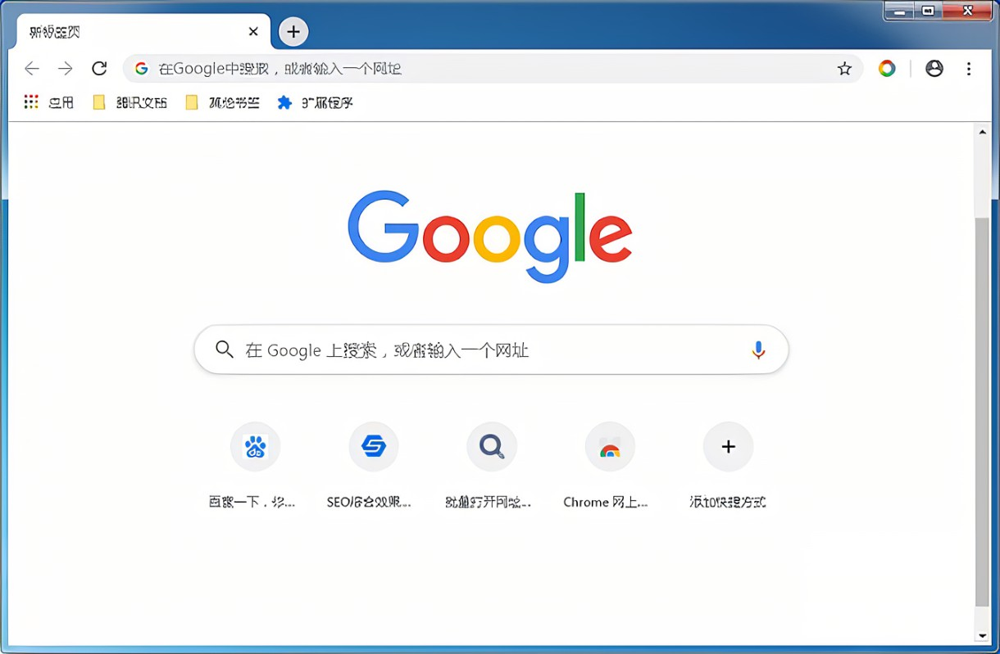
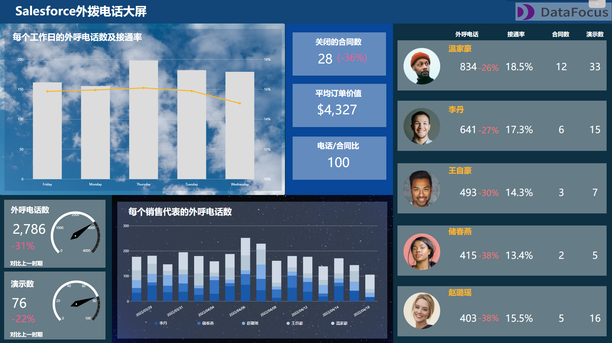
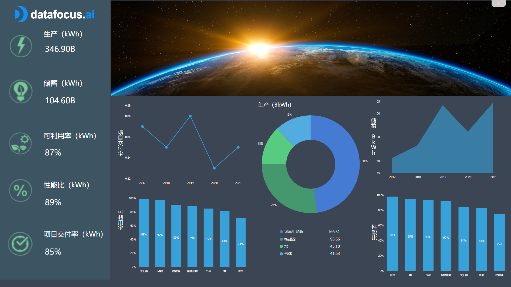

谁也没想到就在今天，我们亲眼目睹了一代巨头IE浏览器退出历史舞台。

微软Edge浏览器已发文告别，表示Edge浏览器将接力IE继续走下去。

不得不说，虽然曾经的IE浏览器被不少人诟病，但一说起告别还真有点让人舍不得，毕竟也已经成为我们青春的记忆。

现在我们就来回顾一下这几年IE浏览器的发展史以及那些年对它的爱恨情仇，以表达对它的怀念和致敬。

### 1.IE发展史

其实世界上第一款浏览器并不是IE，而是Netscape。在当时使用这款浏览器是需要付费的，并且被绝大多数的用户选择。

不过很快，微软就盯上了这里面的市场，觉得大有商机。于是它就亲自出了一款免费浏览器，并且和Windows系统捆绑起来。这便是初代IE浏览器。

诞生后的IE对Netscape产生了巨大的威胁。毕竟用户在使用Windows系统时都用IE了，谁还用别的浏览器，何况如果删掉IE，就很难访问互联网了。

于是3年后，IE就成为**全球市场份额第一的浏览器**。到了2003年更是进入鼎盛时期，**市场份额一度高达95％**。

当时的微软强大到，别的浏览器认为微软再出新的浏览器，会导致它们无法生存。

于是后来，微软就被指控违反了反垄断法，是出于对浏览器的限制而维持Windows的统治地位。但微软胜诉了，表示只是进行了合理的资源整合。

事实证明，微软并没有达成垄断。由于用户体验不尽人意，产品优化速度缓慢，浏览器市场就逐渐被其它新兴浏览器给蚕食了。像比较知名的谷歌Chrome和Mozilla火狐等浏览器，现在全球还有非常多的用户在使用。

如果没有那些更优质的浏览器，恐怕还要戴上“痛苦面具”，被IE折磨很久。

### 2.那些年对IE吐过的槽

要说起IE浏览器那些最让人抓狂的瞬间，这里涵盖了最有代表性的。

首先，打开IE浏览器最常见的状况，就是一直在加载中，所以每次都不得不等待很长时间。

其次就是IE的兼容性。由于IE浏览器独大的时候吸引了大量网站使用，所以很多网站不得不使用IE独有的控件，结果网站就只能在IE浏览器上访问，否则很多重要的功能无法显示。

对于国内用户而言，很多银行、考试等网站在别的浏览器都不兼容，必须使用IE浏览器才行。

最被人诟病的还有卡顿问题。当浏览器打开多个窗口后就会开始卡顿，那时候还没有保存功能，卡顿闪退后就只能重新打开。

其实很多微软内置软件都或多或少存在这样的问题，不过好在随着科技水平的进步，如今的用户体验大幅提升了。

同为微软的Excel，虽然也能满足一些基础的数据分析需求，但是该卡还是卡，操作麻烦也还是麻烦。

正如后来者谷歌浏览器的崛起，新兴的商业智能BI工具打败了Excel、陈旧的报表工具，成为当代职场人数据分析工具的新选择，尤其是**无代码式的数据可视化BI工具**更受青睐。

### 3.长江后浪终将推前浪

长江的后浪终将推前浪，有这样一款工具终于在无代码式BI工具中脱颖而出，它便是DataFocus。

彻底告别Excel的卡顿，也不需要学习Sql、Python等代码知识，通过像谷歌一样搜索关键词，系统会自动以可视化图表回应。

将所需要的图表放置于可视化大屏上，还可以实现炫酷的效果。

 

它由一群热衷于技术的极客倾情 7 年打造，除了搜索式系统及数据可视化以外，其功能涵盖了一体式湖仓、ELT、数据链接器和转换器，提供全功能的一站式数据分析服务。

目前DataFocus也已成为全国知名5G供应商，并被清华大学、万向集团等知名组织和企业选择。

无代码式BI系统的存在，对于Windows系统自带的Excel而言简直就是降维打击。

### 小结

IE时代已落幕，不过更智能的时代已到来。是时候拥抱新技术，并提升自己的业务水平了。对此，你怎么看？欢迎评论区评论、分享。
