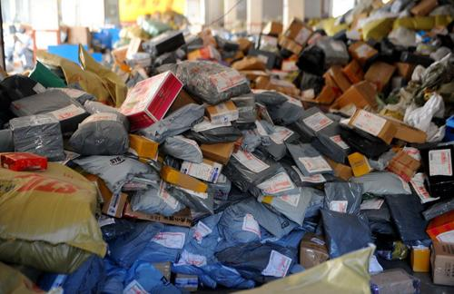

今年第二季度开始，我国常态化进入单日快递亿件时代！从2012年的不到57亿件，到2016年的312.8亿件，党的十八大以来，我国快递业务量连续5年保持了平均50%以上的增速，市场规模自2014年开始稳居世界第一。5年来，中国快递“火”起来，成为经济发展的一抹“亮色”。

**更快捷**

**八成千公里内快件用时**

**48小时内**

“前段时间充电线坏了，手机又快没电，在淘宝上看到标有 当日达 的同城店铺就选了。10点下单，14点就送到我手上，还包邮。”在北京一家互联网公司工作的谢轩说道。5年来，快递发展摁下“快进键”。以历年“双11”为例，从签收1亿个包裹的时间看，2013年用了9天，2014年用了6天，2015年提速到4天，2016年只用了3.5天。

国家邮政局市场监管司司长冯力虎介绍，在快递业务量持续高速增长的背景下，我国快递服务时限水平基本保持平稳上升趋势，全程时限处于58—60小时，72小时准时率从2012年72.4%提升到2016年75.53%；距离在1000公里以下的快件中，有84.62%能够在48小时内送达。

不仅国内，跨境物流的时效和成本也在持续优化，菜鸟联盟负责人周轩榕告诉记者：“以西班牙为例，过去国内包裹妥投时效平均长达26天，如今提高到平均14天。海外仓开设后，更是基本实现了西班牙全境72小时签收。”速度快了、性价比高了，服务品质得到保障。根据国家邮政局发布的通告，我国快递服务满意度得分连续5年上涨，由68.9分提升至74.7分。

**更普惠**

**乡镇快递网点覆盖率**

**80%**

百色芒果、烟台大樱桃、松原查干湖鱼……快递企业与当地农户形成合作模式，一批具有地方特色的农产品通过冷链运输、定制包装等方式，实现从田间到餐桌的无缝对接。农村收投快递包裹量超80亿件，直接服务农产品外销超1000亿元。以EMS“极速鲜”业务为例，已覆盖29个省，涉及25个大类100多个品种，服务原产地数以万计中小农户、大型农村电商客户。

近年来，快递向西向下步伐加快，各地也在因地制宜探索“快递下乡”新模式。江西宜春加强快递和电商的互动，打通“产品出山”“网货下乡”双向通道，引进阿里“村淘”项目落户万载县。万载县阿里巴巴农村淘宝县级服务中心开业当天，交易单数突破1万单。

农村快递活起来，贫困群众富起来！冯力虎认为，“快递下乡”工程有效促进了城乡生产要素的有序自由流动，为释放农村消费需求提供流畅的通道，“推动快递与现代农业协同发展，扶到了产业调整的重要节点，扶到了老百姓的致富之门。”《快递业发展“十三五”规划》提出，到2020年基本实现乡乡有网点、村村通快递。

**更智能**

**一台机器人日处理包裹**

**1700件**

在浙江义乌申通智能机器人分拣系统仓库，一群机器人“头顶”黄色小托盘，仓库两侧的放件员将快件放在托盘上，面单朝上进行信息采集。机器人根据后台传送的路径信息，沿着地面上的二维码“路标”，到达指定地域格口，托盘翻起，快件顺着格口滑槽落入编织袋中，再由人工进行打包。“350台机器人同时作业，日均处理快递包裹达60万件，可减少70%的人工。”义乌申通公司总经理办公室主任陈振龙介绍。而在末端，全国已建成并投入使用的智能快件箱超17万组，为用户提供了更多投递服务选择。

除了自动分拣机器人、智能配送机器人、无人机等高科技设备，运用大数据智能销售预测和补货也助力快递业提质增效。“过去逢大促就出现供货过多、过少或各仓匹配不均衡的情况，我们建立了基于大数据和机器学习的销售预测平台，根据居民收入水平增长趋势、历史销量、促销计划等一系列宏微观数据建模，智能指导和触发从供应商采购到不同仓库层级间补货、调拨。”京东有关负责人举例，京东雀巢联合预测补货项目开展后，订单满足率从60%提高到87%，平台产品有货率从73%提高到95%。

**更安全**

**寄递企业配备安检机**

**8869台**

为了实现寄递流程可跟踪、隐患可发现、责任可追溯，近年来收寄验视、实名收寄和过机安检制度正大力推广。2016年全国寄递企业已配备安检机8869台，截至6月底，国家邮政局实名信息监管平台共接入邮政EMS、顺丰、申通、中通、圆通、韵达、百世等主要品牌寄递企业数量达10家，占行业业务总量约90%。

为了解决信息安全问题，降低企业投入成本，统一信息标准和操作标准，国家邮政局推出邮件快件实名收寄信息系统——“安易递实名收寄公共服务平台”。

使用用户版APP时，用户可通过扫描身份证进行实名认证，并自动生成身份二维码。每次寄件时，只需出示手机上的身份二维码，快速验证身份信息，可避免频繁出示身份证的麻烦和信息泄露风险。

“在防止信息泄露方面，系统的信息数据实行 总对总 共享模式，由企业总部将前端采集的实名信息统一上传至国家邮政局信息监管平台，从而形成实名信息数据单向封闭流动，确保实名信息安全。”冯力虎表示，力争到2018年底基本实现实名收寄信息化全覆盖。

**更绿色**

**协议客户电子运单使用率**

**60%**

党的十八大以来，低污染、低消耗、低排放的绿色快递正助推美丽中国建设。全国快递企业共投入使用新能源汽车4545辆；顺丰将包装材料满版印刷改为无底纹印刷，节省油墨用量70%，蜂窝箱代替木箱包装，每年节约原木360吨；京东研发“专利防撕袋”，采用安全环保的新型塑料，消费者可在日常生活中循环使用；菜鸟通过“智能打包算法技术”，可迅速将商品与箱子的长宽高、承重量进行匹配，一年可节省约10亿个包装箱，保护324万棵树木……

继2016年出台《推进快递业绿色包装工作实施方案》，提出到2020年基本淘汰有毒有害物质超标的包装物料，基本建成社会化的快件包装物回收体系之后，今年2月，国家邮政局又选取顺丰等5家品牌快递企业和北京等8个省市开展快递绿色包装应用试点，目前累计采集数据2323组，在包装纸箱规范化回收、可降解生物塑料使用等多方面取得了阶段性成果。截至今年7月，数百个商家加入菜鸟绿色联盟，累计发出绿色包裹超过200万个。“绿色快递不能只依靠企业，也需要政府或协会推出可操作标准，以及消费者的理解与支持。”快递物流咨询网首席顾问徐勇说。
