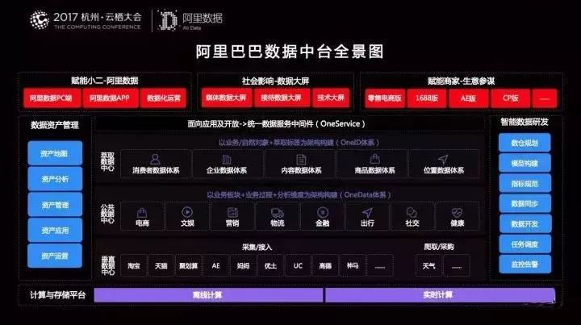

怎样用DataFocus构建企业的数据中台

数据中台最早是阿里巴巴提出（chaozuo）的概念。起因是阿里巴巴内部的淘宝、天猫、支付宝等等，都是巨无霸，都积累了一堆数据。于是就想着怎么打通这些数据，整个集团统一使用。其实也不是什么新鲜概念，大数据说了很多年的数据孤岛，讲的也是这么个事儿。但是从始至终，数据中台也没有一个标准的定义。这里综合整理了各种方案，汇总出这样几个关键功能，我们企图给数据中台画一个范围。第一点，一个全局的数据视图，融合了一个组织（通常是一家企业或者企业集团各个业务部门或分、子公司）的全部数据，并且能够很方便的提供给组织内任意部门获取；第二点，数据的能力的释放（各部门、人员取用数据），得有一套标准规范。比如，部门A来取数据，说的是“给我一条咸鱼”，部门B来取数据，如果也说“给我一条咸鱼”，那他们拿到的就应该是一样得东西：第三点，要能提供标准接口，方便组织的各部门按需封装自己的应用。比如，部门A可以通过组装“四个轮子”（接口1）和“一个沙发”（接口2），封装自己的应用，提供给外部使用，或者给组织其他人员使用，而不是还要自己区制造轮子和沙发。

看完上面的描述，聪明如你，应该已经了解了。所谓数据中台，应该是工程师、数据分析师，IT、研发、业务人员，甚至公司老板进行数据交互的集中式控制台。再来看DataFocus这个产品，它有数据仓库模块，用于整合企业的整个数据资产，提供了丰富的中间表开发和定义功能，便于用户进行数据规范的制定。最后，它的搜索式分析功能，将数据能力的释放变得极其简单，用一种上至领导，下至业务人员，左至IT工程师，右至数据分析师，都能看得懂的语言（自己母语），进行数据交互，使得各种ad-hoc分析变得异常简单。

