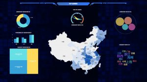

可视化数据分析已经成为了各个行业争相竞争的一个词汇，从建筑设计，再到景观、城乡规划等各个行业也是喷薄而出，这些项目的前期可视化数据分析软件datafocus，已经能够成为了市场经济下发展不可或缺的一环。

随着大数据时代的到来，对于传统城市规划的编制还有管理带来了巨大冲击，不管是从技术层面还是思维层面，都要求城市规划能够做出及时的响应，规划师应该了解大数据分析，并且学会利用大数据分析，来提高规划水平，并积极推动产业的转型。可视化数据分析虽然可挖掘到的价值有很多，但同时还应该注意到它带来的数据采集还有处理难度的增加。

城市的规划建设行业要做到能够高效、合理的利用这些可视化数据量庞大、价值密度低、种类繁多、处理难度相对较大的数据，需要专业的技术人员以及规划人员进行很好的结合，并且完成大量基础性的处理、分析工作。

相信各省市规划局、交通规划设计院、城乡规划设计院、公司相关领导以及技术骨干；各大院校担任规划教学及科研的老师还有研究人员都在日常工作当中遇到采集可视化数据分析城乡规划大数据的问题。

所以关于这个问题的解决方案：通过本篇文章可以学习到可视化数据分析的获取与处理，数据的分析，数据的表达，datafocus分析框架研究和应用多源数据开展城市分析等内容。
