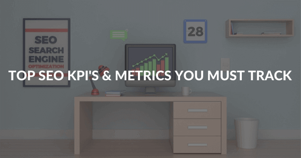

无论您支持哪种类型的网站，您的 SEO 努力都决定了它的成功和性能。作为网站所有者，您可能已经在实施多种数字营销和 SEO 策略来提高网站的性能。但是，很少有人知道这样做的有效方法是通过跟踪和管理可以描述您网站的 SEO 性能的[KPI 指标。](https://www.datafocus.ai/infos/kpi-examples-and-templates)即使在今天，谷歌上15% 的搜索都是新的，这为公司提供了很多提高排名的机会。

考虑到这些事情，以下是您应该为您的网站跟踪的一些最重要的 SEO 指标和 KPI：

## 要跟踪的前 9 个 SEO 指标

### 1\. 自然流量

让我们问您一个问题：您希望通过 SEO 实现的最重要目标是什么？更高的可见性？更多客户？实现所有这些目标的道路是在您的网站上获得自然流量。自然流量是衡量您的 SEO 性能的最强指标之一，其中稳步增长表明您在自然搜索中的排名也在提高。 这个指标可以让您知道您所做的所有努力是否能有效地将新客户吸引到您的网站，以便您开始提高转化率。如果您有 WordPress 网站，一些WooCommerce SEO 指南可以帮助您处理此指标和此处提到的其他指标。

### 2\. 跳出率

跳出率是网络流量分析的一个重要指标，它表示访问过您网站上的一个页面并且没有访问任何其他页面就离开的人的百分比。更恰当地说，它指的是在没有采取任何行动（例如点击链接、订阅或填写表格）的情况下离开您的网站的人数百分比。

但是，如果网站是围绕内容构建的，并且您希望人们只访问单页会话，那么高跳出率不一定对您的网站来说是一个坏信号。另一方面，基于转化率的网站（例如在线产品销售商或电子商务商店）等需要主动降低其网站的跳出率。

### 3.关键词排名

作为当今存在的最强大的搜索引擎，Google 的搜索算法构成了企业进行 SEO 工作的基础。检查您的关键字排名将确保您对 SEO 工作的方向有一个大致的了解，并将帮助您选择正确的关键字以整合到您的内容中。

在跟踪此指标时，您需要评估您是否为您的网站定位了正确的关键字，如果没有，则包括高性能的新关键字以有机地吸引更多流量。为获得最佳效果，您应该定位在本地以及您想要瞄准的市场中表现良好的关键字。

### 4.平均页面加载时间

以防万一，这个指标一开始听起来技术性太强，您应该知道它与您网站的跳出率直接相关。您的网站加载速度可以决定或破坏您的 SEO 性能。事实上，您是否知道如果加载时间超过 4 秒，每 4 个访问者中就有 1 个会放弃您的网站？

如果您的网站加载时间过长，您的跳出率可能会更高，这表明您的访问者没有在您的网站上找到他们需要的内容。此外，随着手机上的互联网用户数量迅速增加，值得注意的是，与台式机相比，您的网站在移动设备上加载需要更多时间。

### 5\. 自然转化

与定义网站 SEO 性能的其他指标类似，自然转化对于确定网站的成功至关重要。每个不断发展的网站都旨在将自然流量转化为合格的潜在客户，这有助于其成功和业绩。您网站上的自然转化决定了您网站流量的质量。没有产生任何潜在客户或销售的高流量流入对您网站的整体性能没有用处。通过确保客户在您的网站上采取行动，您可以确保始终如一地获得更好的结果。

### 6.新的反向链接

虽然成功没有捷径，但创建反向链接通常被吹捧为提高 SEO 性能的最快方法之一。反向链接可以为您带来新的流量并通过多个来源覆盖您的目标受众，从而增加您网站上更高流量的可能性。当您比较两个具有相似页面指标的网页时，反向链接所产生的差异是显而易见的 - 来自高域权威来源的反向链接的网页将获胜。

更多的反向链接转化为更多的流量以及更好的谷歌排名，从而照顾您的完整的 SEO 性能和在线可见性。为了获得有效的结果，您应该不断更新您的反向链接，保持其准确性并定期跟踪与反向链接相关的趋势。

### 7\. 权威KPI

当我们讨论您需要为您的网站跟踪的 KPI 和指标时，不提及哪些决定您的网站权限的因素是错误的。谷歌算法不时更新，但每个网站追求的目标始终如一——持续增加域权限。

在 SEO 中，域权限通过以 0-100 的等级衡量网站，直接确定网站的可信度。分数越高，网站越值得信赖。新网站的分数通常较低，但是，成功的您的 SEO 努力应该能够持续提高这个分数。可以通过反向链接增加域权限，但是，这个系统经常被网站滥用，在多个域名上发布低质量的反向链接。[在KPI 工具](https://www.datafocus.ai/infos/kpi-reporting)的帮助下跟踪您的权威指标将使您能够不断监控您的策略是否带来了预期的结果。

### 8\. 移动流量和排名

最后一点很重要，那就是对移动流量和排名的持续审查和管理。截至 2020 年，有36 亿人使用智能手机，并在移动设备上浏览互联网。可以理解的是，过分重视桌面用户而忽视网站的移动友好性不再是一种选择——无论您在哪个垂直领域开展业务。

拥有一个适应性强的界面，包括便于移动用户浏览和使用的功能和元素，对您的网站的成功至关重要。为了能够有效地满足移动用户的需求，不断跟踪您的网站在移动设备上的行为和性能是很重要的，这样您就可以在移动搜索结果中表现出色 - 现在移动搜索占所有搜索结果的近 60%搜索。

### 9.图像搜索引擎优化

您必须确保您的目标受众可以通过图片搜索找到您的网站。为了确保您的图片出现在 Google 的图片搜索中，我将分享一些方法。

优化图像 SEO 的最理想方法是在网站上编写更新的图像 ALT 标签。

一个描述性 ALT 标签将帮助搜索引擎机器人了解图像的内容，因为搜索引擎爬虫还不够智能，无法理解视觉效果。

另外，确保您的图像是相关的。一个很好的图形摘要将您的博客信息拟人化将是无价的。它将直接相关并有效地传递文本的信息。

您需要确保图像的尺寸经过优化，这将有助于您的登录页面在 Web 浏览器中快速加载。

## 总结

虽然有很多方法可以增加您网站的流量和收入，并管理您的 SEO 性能，但上述指标可能是一个很好的起点。[通过在数据分析工具](https://www.datafocus.ai/infos/data-analyst-tools-software)的帮助下监控这些指标，您可以确保您的 SEO 性能是有效的，并为扩大规模做好准备。

在这些指标上保持一致的性能非常重要，这样您的网站才能为您的业务产生预期的结果。有效的 SEO 性能可以帮助您获得更多的品牌知名度、认可度和建立更大的品牌价值。
