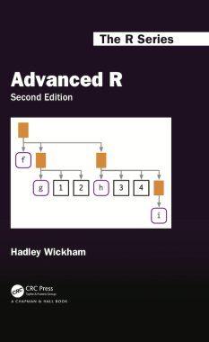
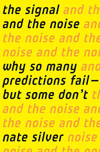
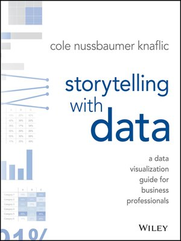
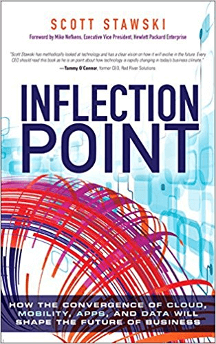
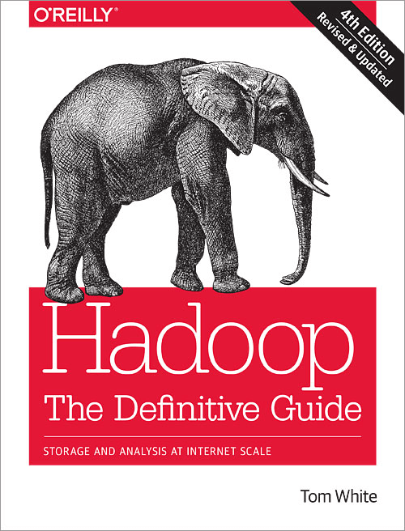

_“大数据是所有正在发生的大趋势的基础。” ——克里斯·林奇，大数据专家_

我们生活在一个充满数据的世界。据 AnalyticsWeek 称，目前，在我们的数字宇宙中，大约有 2.7 Zettabytes 的数据正在等待分析和探索。

通过获得理解、量化和利用[在线数据分析](https://www.datafocus.ai/infos/data-analysis-tools)的优势的能力，您将获得大量宝贵的洞察力，这将有助于您的业务蓬勃发展。

不断发展、不断扩大的数据科学学科几乎与全球范围内所有可以想象的部门或行业都相关。通过深入了解数据科学及其众多[商业智能](https://www.datafocus.ai/infos/bi-skills-for-business-intelligence-career)分支，您将获得至关重要的竞争优势，这将有助于将您的企业定位为该领域的领导者。[在业务环境中明确区分数据科学和数据分析](https://www.datafocus.ai/infos/data-science-vs-data-analytics)也是明智之举，这样对该领域的探索可以为感兴趣的各方带来额外的价值。

话虽如此，在这里，我们探索了当今世界上14本最优秀的数据科学书籍，重点介绍了这些以机构数据为中心的书籍对您的职业和业务成功至关重要的特性、主题和见解。

那么，什么才是最好的数据科学书籍呢？请继续阅读并找出答案。

## 为什么需要阅读数据科学书籍

在我们告诉你为什么我们的每一篇文章都是关于数据科学的最佳书籍之前，有必要给你介绍一下这个最令人兴奋的现代领域的背景知识。

2013 年，只有不到0.5% 的可用数据被分析、使用和理解。即使是现在，仍有大量数据流有待探索——如果以正确的方式使用，这种洞察力可能会被证明是开创性的。对于精明的数据科学家来说，解锁这个看似无限的信息海洋所带来的潜力是巨大的。

数据科学，也被称为数据驱动科学，涵盖的范围非常广泛。这个由科学方法、过程和系统组成的跨学科领域帮助人们以多种形式（结构化或非结构化）从数据中提取知识或见解，类似于数据挖掘。

通过了解数据科学的所有关键要素，并能够将这些方法应用于您业务的各个方面，包括内部和外部，您将获得广泛的长期成果，确保您在这个过程中保持相关性和竞争力。

我们为您精心挑选了 15 本[数据分析书籍](https://www.datafocus.ai/infos/best-big-data-and-data-analytics-books)、18 [本数据可视化书籍](https://www.datafocus.ai/infos/best-data-visualization-books)、16 [本 SQL 书籍](https://www.datafocus.ai/infos/best-sql-books)的精选列表——并且，正如承诺的那样，我们将向您介绍世界上最好的数据科学书籍。

如果您想获得对数据科学的全面实用理解，或将您现有的技能提升到令人兴奋的新高度，那么这些关于数据科学的最佳书籍是必读的。

事不宜迟，这里是我们的顶级数据科学书籍。

## 1) Bernard Marr 的《人工智能实践》

**最适合：**那些正在寻找一种实用的方法来理解人工智能如何增强数据科学，并利用这些知识来改进他们的数据分析策略的人。

作为数据的心血结晶，传奇人物Bernard Marr创造了《_人工智能实践_》，将数据科学应用于最高商业智能的大师级课程。

这本书基于 50 个现实生活中的[商业智能示例](https://www.datafocus.ai/infos/analytics-and-business-intelligence-examples)和案例研究，制作精良、令人难以置信的有趣、深刻、启发性、耐人寻味和以结果为导向。

作为 Bernard Marr 迄今为止最好的作品之一，这确实是当今最好的数据科学书籍之一——当今世界的必读书籍。

## 2) Ian Goodfellow、Yoshua Bengio 和 Aaron Courville 合著的《深度学习》

**最适合：**这本最好的数据科学书籍对于那些希望进入该领域的数据驱动机器学习和深度学习途径的人特别有效。

由一群多产的数据科学专家（Ian Goodfellow、Yoshua Bengio 和 Aaron Courville）共同撰写的《_深度学习_》为广泛的学科提供了丰富的见解，正是这种范围使其成为地球上最好的数据科学书籍之一.

从数据科学的基本实践方面，到复杂网络的权利以及机器学习在商业及其他领域的应用，这本数据科学书籍既全面又有趣。

每章都细分为易于理解的部分，如果您希望获得该领域最前沿元素的广泛基础知识，这本书就是为你准备的。

## 3) Hadley Wickham 的《高级 R》

**最适合：**初露头角的“R”语言用户，以及那些希望提高整体编程能力和分析技能，并细读这门宝贵的数据驱动语言的复杂细微差别的用户。

对于那些踏上掌握“R”语言艺术之旅的人——一种统计计算程序和框架，可提高基于商业智能的成功——_高级 R_直观且易于理解，并将为您提供这一宝贵的数据科学领域的全面概述。

作者哈德利·威克姆（Hadley Wickham）的章节逻辑清晰，行话保持在最低限度，这本书的实用性是成功的秘诀——是您书架上必不可少的补充。

## 4) Andrew Ng 的《机器学习向往》

**最适合：**已经非常了解机器学习和人工智能热潮，但需要掌握该主题的人。如果您希望通过自主技术方面取得进展，那么这是数据科学方面最好的书籍之一。

在获取和处理复杂信息的推动下，机器学习是近年来兴起的一个数据科学领域。事实上，全球20% 的 C 级高管已经在使用机器学习，使其成为其业务的核心部分。

随着人工智能改变我们个人和职业生活的面貌，如果你想了解数据的重要性以及它在现代世界的使用方式，理解机器学习的概念以及大数据的孤岛如何被用来创建自主、自我进化的机器学习系统是必不可少的。

这本引人入胜的读物由著名的计算机科学家Andrew Ng撰写，不仅提供了对机器学习和大数据的通俗易懂的介绍，而且证明了收集数据、利用深度端到端学习的力量以及促进与机器学习系统共享关键见解。

## 5) Wes McKinney 的《用于数据分析的 Python：与 Pandas、NumPy 和 IPython 的数据争论》

**最适合：**具有良好Python工作知识，并希望了解如何使用该语言来增强数据洞察力的人。当之无愧地出现在我们的数据科学最佳书籍清单中。

作为世界上最受尊敬和使用最广泛的高级编程语言之一，Python 是一种强大且多功能的工具，尤其是在现代。

美国统计学家和数据科学家Wes McKinney创作的《用于数据分析的 Python：与 Pandas、NumPy 和 IPython 的数据争论》将读者带入该语言的领域，以及它在Python中操作、处理、清理和处理数据方面的巨大潜力。

如果您希望使用 Python 作为一种解决广泛的数据分析问题的有效方法，从而提高您的业务的智能和生产力，那么本书拥有大量可操作的技巧和发人深省的要点。对于任何与Python搏斗的人来说，这是一本顶级数据科学书籍。

## 6）《信号与噪音：为什么这么多预测都失败了——但有些预测没有》Nate Silver

**最适合：**首席执行官、首席数字官、首席信息官，或者希望切实提高他们的预测分析技能的企业主，无论是在实践上还是理论上。毫无疑问，这是传授数据科学的最佳书籍之一。

《纽约时报》畅销书——_《信号与噪音》_是利用大数据分析的力量，以一种明智和有效的方式做出有价值的预测的大师级作品。它也是有关数据科学的最佳书籍之一。

这本书由曾经成功预测 2012 年美国总统大选结果而闻名的美国统计学家内特·西尔弗 ( Nate Silver ) 撰写，揭示了根据数据进行预测的真正艺术和科学。这本书穿插了真实世界的案例研究、数据预测领域中有趣的[大数据示例](https://www.datafocus.ai/infos/big-data-examples-in-real-life)，以及引用了数据的史诗级失败案例，向读者展示了如何过滤掉噪音，并磨练正确的见解，做出不仅很重要而且还确保可持续水平的成功预测。一本顶级的数据科学书籍，用于理解构成我们这个数据驱动时代跳动心脏的海量数据。

## 7) Christopher Steiner 的《自动化：算法如何统治我们的世界》

**最适合：**具有技术头脑的向导或数字技术爱好者，希望弥合大数据分析、复杂算法以及这些元素塑造我们未来生活的方式之间的差距。如果您痴迷于算法的内部工作原理，那么这是数据科学方面最好的书籍之一。

数据科学主要是关于预测，但这一不断扩展的学科的一个重要部分也可以归结为复杂的算法。

在这篇发人深省且在许多方面经久不衰的数据科学著作中，作家、多产程序员Christopher Steiner解释了算法如何越来越多地被用于承担曾经只有经过小众培训的人类才能解决的高水平追求——包括医学诊断和外交政策分析等领域。

一旦你拿起它《自动化：算法如何统治我们的世界》几乎就不可能放下的，它以其直观的风格和大量令人惊叹的观察从头到脚抓住你，在当今世界，算法已经远远超过他们的创造者的预期。这是任何崭露头角的数据科学家的家庭图书馆的必备品。这是对我们的数据科学书籍纲要的一个鼓舞人心的补充。

## 8) Cole Nussbaumer Knaflic 的《用数据讲故事：商业专业人士的数据可视化指南》

**最适合：**初出茅庐的数据可视化人士和那些希望用他们的数据为广泛的受众和结果创建鼓舞人心的故事的人。您阅读清单中必不可少的一本数据科学书籍。

这本有条不紊的手册由叙事专家Cole Nussbaumer Knaflic 创作，不仅有趣，而且还为数据科学的一个经常被忽视的分支提供了深刻的见解：_通过指标讲故事的艺术_。

作为这十年你可能会读到的最好的数据科学书籍之一，Cole 解释了如何摆脱不必要的数据的方法，这些数据会掩盖清晰的沟通，并利用这些见解来建立一个有效的叙述，在不可否认的个人层面上与用户建立联系。现代内容作家的梦想门票。一本必须探索的数据科学书籍，既有趣又有益。

在您等待获得副本时，请查看我们的[仪表板讲故事](https://www.datafocus.ai/infos/dashboard-storytelling-with-kpis-presentation-examples)技巧，学习如何通过九个简单步骤[制作仪表板，并讲述一个精彩的故事。](https://www.datafocus.ai/infos/how-to-make-a-dashboard-with-ease)

## 9) 《拐点：云、移动性、应用程序和数据的融合将如何塑造商业的未来》，Scott Stawski

**最适合：**崭露头角的数据经理或数据挖掘者，他们希望了解现代及未来的信息。没有比这更好的数据科学书籍了。

就数据科学方面的书籍而言，这本书可能是现存的最具前瞻性的书籍之一。

《拐点》一书的作者是惠普数据管理负责人Scott Stawski，该书聚焦于云计算、大数据、移动设备和应用程序的快速变化如何改变企业的竞争方式。凭借令人兴奋的观察、敏锐的预测和有价值的结论，这本数据科学书对于任何试图筛选信息孤岛并在当今和未来的世界中取得成功的人来说都是必读的。未来所有的数据科学书籍都应该借鉴这本书。

## 10) Tom White 的《Hadoop，权威指南：互联网级别的存储和分析》

**最适合：**大开眼界的 Apache Hadoop 战士，对利用数据创建可扩展系统有着无法抑制的渴望。这是我们列表上最令人兴奋的数据科学书籍之一。

在有关处理语言的最佳的数据科学书籍之一中，Tom White带领他的读者踏上了一段基于数据的旅程，以帮助他们了解 Hadoop 的重要性，以及如果使用得当，它如何能够完成许多令人难以置信的事情。

这些不可思议的事情包括使用 Hadoop 构建和管理可扩展系统以及成功运行大型Hadoop 集群的能力。由于这本书的格式很好且易于理解，因此可以轻松地进入和退出本书的各个章节。

## 11) Cathy O'Neil 和 Rachel Schutt 的《做数据科学：来自前线的直接对话》

**最适合：**崭露头角的数据科学家，正在寻找对该领域的全面、可理解和切实的介绍。

目前最好的数据科学书籍之一，《做数据科学：来自前线的直接对话》清晰、简洁、引人入胜地介绍了该领域。

本书以哥伦比亚大学权威的数据科学概论课程为基础，深入探讨了围绕大数据的流行炒作。这本数据科学的基本指南充满信心并对该主题有清晰、实用的理解，将帮助您顺利起步并为您提供在这个不断发展的专业领域中茁壮成长所需的知识。

这本书是数学家Cathy O'Neil和新闻集团的 Rachel Schutt共同合作的成果，内容连贯且易于理解，是任何有前途的数据科学家的首选资源。

## 12) Jake VanderPlas 的《Python 数据科学手册》

**最适合：**任何希望通过对这一关键主题获得更深入、更相关的洞察力来提高、扩展和升级其现有 Python 技能并在竞争中获得优势的人。

这本关于数据科学的书籍由软件工程师Jake VanderPlas 撰写，对于任何将 Python 作为其工作角色或业务战略的日常组成部分的人来说，它都是一本瑰宝。

这本同类中最广泛、最实用和最有价值的数据科学类书籍将让您发现大量新方法论，同时在商业智能环境中构建您对 Python 的核心知识。

如果你想成为 Ipython 的传奇人物，这是目前最好的数据科学书籍之一。《Python 数据科学手册》的优点在于，您可以在处理重要任务或项目时使用它作为快速参考。一本数据科学的书，在你完成后很长一段时间内还在提供信息。

## 13) Hadley Wickham 和 Garrett Grolemund 的《R 代表数据科学》

**最适合：**任何希望深入研究数据科学，并学习更有效地组织数字洞察力，同时从触手可及的信息中提取更大价值的人。我们名单上最发人深省的数据科学最佳书籍之一。

作者Garrett Grolemund和 Hadley Wickham 创作了数字时代的顶级的数据科学书籍之一。《R 代表数据科学》提供了大量基于该领域许多核心途径的独特见解，将告诉您成功转换、转置、调整和结构化数据所需的所有知识。

通过学习如何更有效、更有策略地管理数据，您将变得更有能力使您的见解更有价值、更有影响力和成倍地增强。这本最好的数据科学书籍将帮助你一步一步地做到这一点。

不要错过——毕竟，它是世界上最好的数据科学书籍之一。

## 14) Lillian Pierson 的《傻瓜数据科学》

**最适合：**任何想要在实践中对数据科学进行有趣且易于理解但又全面的介绍的人。这本书涵盖了所有基础知识——还有更多内容！

如果您对数据科学比较陌生并且希望获得有关该主题的完善的工作知识，那么《傻瓜数据科学》是您随时需要的资源。

作者Lillian Pierson创建了一本工作手册，可帮助您磨练大数据分析、Hadoop、MapReduce、Spark、MPP 平台和 NoSQL ，以及机器学习 (ML) 或人工智能 (AI) 最佳实践等领域的技能。对于寻求快速而有意义的数据科学解决方案的有抱负的新手来说，它是业内最好的工具之一。

_“我们的目标是将数据转化为信息，将信息转化为洞察力。” ——卡莉·菲奥莉娜_

为了快速浏览我们关于数据科学方面的 14 本最佳书籍，以下是这些令人难以置信的资源的摘要列表：

1. Bernard Marr 的《人工智能实践》
2. Ian Goodfellow、Yoshua Bengio 和 Aaron Courville 合著的《深度学习》
3. Hadley Wickham的《高级R》
4. Andrew Ng 的《机器学习向往》
5. Wes McKinney 的《用于数据分析的 Python：与 Pandas、NumPy 和 IPython 的数据争论》
6. 《信号与噪音：为什么这么多预测都失败了——但有些预测没有》Nate Silver
7. Christopher Steiner 的《自动化：算法如何统治我们的世界》
8. Cole Nussbaumer Knaflic 的《用数据讲故事：商业专业人士的数据可视化指南》
9. 《拐点：云、移动性、应用程序和数据的融合将如何塑造商业的未来》，Scott Stawski
10. 《Hadoop，权威指南：互联网级别的存储和分析》，Tom White
11. Cathy O'Neil 和 Rachel Schutt 的《做数据科学：来自前线的直接对话》
12. Jake VanderPlas 的《Python 数据科学手册》
13. Hadley Wickham 和 Garrett Grolemund 的《R 代表数据科学》
14. Lillian Pierson 的《傻瓜数据科学》

_“信息是 21 世纪的石油，而分析是内燃机”——Peter Sondergaard_

## 立即开始您的数据科学之旅！

说到数据科学，有大量的东西需要学习。在我们看来，这 14 本最好的数据科学书籍将帮助您获得所需的知识，从而开始您漫长、曲折且令人难以置信的数据驱动启蒙之旅。

凭借您对数据分析的新认知，这些数据科学的最佳书籍将赋予您挖掘商业智能数据潜力的能力，为您的业务创造丰富的战略优势，并辅以尖端的[在线 BI 工具](https://www.datafocus.ai/infos/online-bi-tools).

如果您希望使您的企业更智能、更精明、更可持续和更高效，那么这 12种[商业智能书籍](https://www.datafocus.ai/infos/best-business-intelligence-books)将是一个很好的开始。

如果您想深入了解数据科学的实际领域，请试用我们的商业智能软件，[试用30天](https://www.datafocus.ai/console/)，完全免费！
