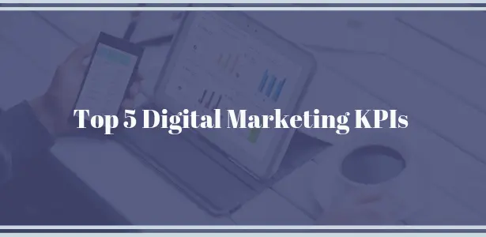
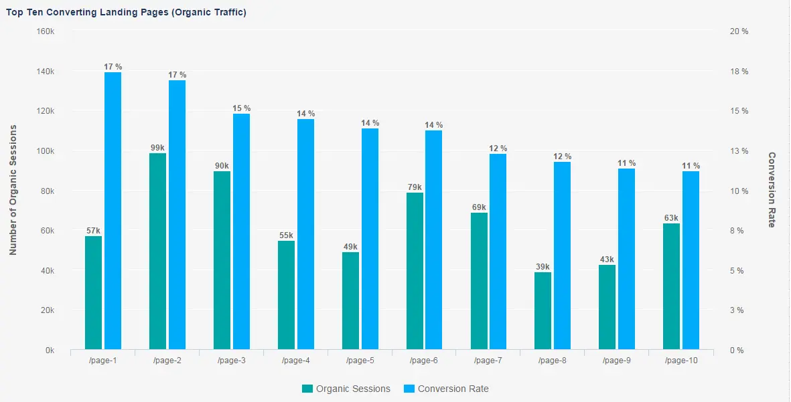
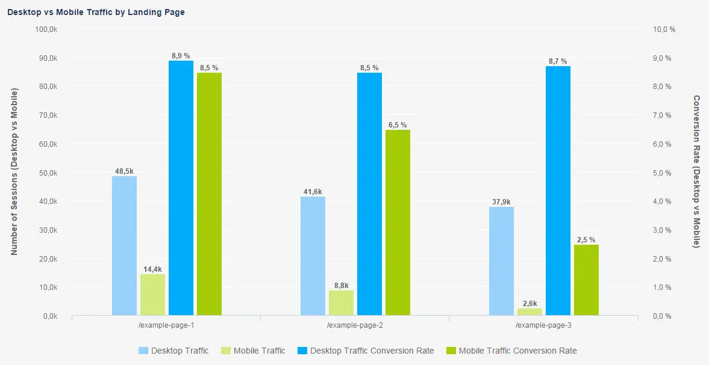
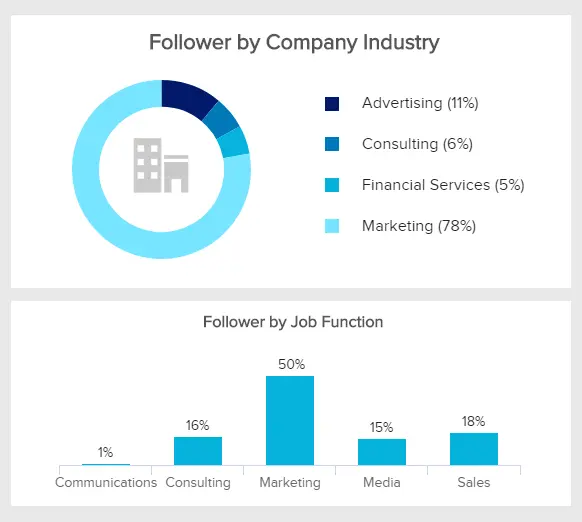

在商业中，关键绩效指标 （KPI） 可帮助您看到大局并评估您的战略以更好地调整它们。您可以使用许多不同的[KPI 示例](https://www.datafocus.ai/infos/kpi-examples-and-templates-)来跟踪和评估公司的成功。衡量数字营销KPI是营销部门的关键职能之一。为什么？

因为数字营销比任何其他形式的营销都更依赖于正确使用 KPI。通过数字营销，几乎所有事情都是可以量化的。您可以看到您的营销策略在每一步的成本，并了解您获得了多少投资回报。然而，随着这种量化能力的出现，挑战和问题也随之而来。其中一些挑战包括：

- 数字营销的关键绩效指标是什么？
- 这些在线营销KPI能否准确反映您在现实世界中的“胜负”？
- 您如何以积极的方式“移动”这些 KPI？

虽然这些挑战很困难，但解决起来非常重要。让我们从简单的定义开始。

## 什么是数字营销中的 KPI？

数字营销的关键绩效指标代表了可衡量的值，这些价值表明了营销团队在每个数字营销渠道（无论是展示广告、社交媒体还是搜索引擎优化）中开展的活动绩效。

通过为您的业务建立正确的 KPI，您可以增加成功的机会，并确保积极的投资回报率。

## 数字化的挑战与机遇

世界正朝着数字化的方向越来越远。一个很好的例子是最近智能手机的爆炸式增长。不久前，手机还是你用来给别人打电话或发短信的东西。在此之前不久，手机和对讲机一样大，而且非常昂贵。

现在，您可能有一个专门针对智能手机用户的Facebook广告系列，因为移动设备上的广告池比桌面广告池大。看看皮尤研究中心的这些数据，显示了在给定时间点拥有智能手机或手机的美国成年人的百分比：

智能手机直到2011年才成为“一种东西”。然而，在不到10年的时间里，超过77%的美国成年人现在拥有智能手机。这种快节奏的变化正在成为我们现代数字经济的常态。

每个营销活动都可以衡量。数字领域使各种规模的企业受益，特别是通过利用具有成本效益的预算。与电视或平面广告等传统媒体不同，在数字媒体中，您可以更具体地设定目标并细分受众的不同兴趣，制定真正个性化的营销策略。您可以找到新市场并利用潜在的全球影响力，围绕您的社交媒体建立客户忠诚度和社区，或创建即时广告系列，而无需等待特定的媒体机构确认您的媒体计划。

然而，许多营销部门很难跟上这些极快的发展和变化。数字营销目标是一个特定的品种。不断变化的营销行业使营销人员知道如何评估他们的结果并获得积极的投资回报率，他们就会处于领先地位。

但是你怎么知道从哪里开始呢？

## 从您的基础知识开始

首先，从您的标准数字营销 KPI 开始，其中包括页面浏览[量、跳出率](https://www.datafocus.ai/infos/kpi-examples-and-templates-marketing#bounce-rate)、[转化率](https://www.datafocus.ai/infos/kpi-examples-and-templates-marketing#goal-conversion-rates)、[投资回报](https://www.datafocus.ai/infos/kpi-examples-and-templates-marketing#return-on-investment)率 （ROI） 等。借助您的 GA 帐户中可用的[Google Analytics（分析）](https://www.datafocus.ai/infos/kpi-examples-and-templates-google-analytics)KPI 和指标，您可以跟踪所有这些内容。

话虽如此，设置数字营销 KPI 的一个常见错误是跟踪太多。有很多虚荣指标看起来很重要，但不会直接影响你的底线。虚荣指标可以包括以下内容：

- Facebook，Twitter，Pinterest追随者
- 您的内容获得的喜欢/分享数量
- 您的网站获得了多少页面浏览量

这些虚荣指标的共同点是它们都是表面水平。它们与“真实”业务指标（如收入）没有直接联系。我们在数字营销方面的理念是“每个人都必须为底线服务”。这是一种植根于直接营销的心态，而不是无法显示投资回报率的“创意”或“品牌建设”营销。

因此，如果您希望您的营销具有可观的投资回报率，您需要专注于在线营销 KPI，以查明影响最大的领域。在寻找切实的结果时要考虑的一些因素是：

- 你把营销资金花在哪里？
- 从长远来看，社交媒体会得到回报吗？
- 有多少合格的潜在客户首先来自移动设备？
- 着陆页是否实现了既定目标？
- 是否正确设置了正确的[数据仪表板](https://www.datafocus.ai/infos/data-dashboards-definition-examples-templates)？

到目前为止，我们已经对这个主题进行了广泛的概述。现在，让我们看一下一些数字营销指标。

您的机会：[想要测试KPI跟踪软件吗？](https://www.datafocus.ai/console)探索我们的 14 天免费试用版，获取您的营销工作的 360 度视图！

## 前 5 名数字营销关键绩效指标

### 1\. 获客成本

\*\* 点击放大 \*\*

我们将从客户获取成本开始数字营销中的 KPI 列表——将潜在客户转化为客户所需的总支出。CAC包括产品成本加上所有其他成本（例如研究和营销）用于吸引客户。

古老的商业格言“你不能管理你无法衡量的东西”在衡量你的购置成本时是正确的。主要针对初创企业的与CAC相关的两个常见故障是客户获取预算不足以及未正确衡量数据。根据社交媒体战略专业演讲者和教练Lon Safko的说法，“每个企业都应该每年至少两次，并在每次活动之后查看其客户获取成本”。每季度一次是一个更强大、更可用的指标。

要更深入、更准确地了解获取成本，请按季度将其拆分为不同的渠道或广告系列，如上例所示。

a） 自然流量

您花了多少钱来增加自然流量？您在此渠道中获取客户的真实成本是多少？

应该注意的是，这种数字营销KPI很难跟踪，因为通常涉及多个参与者和工作。您可能不会立即注意到您网站的流量增加，但追求这一点很重要，因为结果非常有价值。当您的网站在自然搜索中排名靠前时，该值开始显示。这为您的内容提供了可信度。您被视为专家，这会与您的访问者建立信任。虽然客户信任往往要花钱，但买不到。它必须被建造。

增加信任所涉及的成本不是购买，而是投资。投资通常是巨大的，主要是通过构建和维护您的网站以对搜索引擎友好来预先支付的。这得到了丰厚的回报，并且很容易建立到您的长期数字投资回报率中，并分摊到折旧期内，而每月的维护费用很容易计入客户获取成本。

b） 付费流量

此数字营销KPI的第二个维度是付费流量。付费流量可能需要大量的每月预算，具体取决于您要出价的关键字或您投放的展示广告。成本（以及您从中获得的结果）在很大程度上取决于您的执行。您的执行取决于许多因素，例如：

- 您对客户和利基市场的了解程度
- 您对消费心理的理解
- 您的文案技巧
- 您对广告平台的舒适度以及广告的相关程度

数字营销人员对他们的利基市场和客户了如指掌。他们知道如何以与广告平台相关的方式定位强大的价值和报价，广告平台几乎可以为他们的业务“印钱”。一个营销人员只是因为听说其他人都在做的事情而向Facebook投入资金，他们将很难证明他们努力的成本是合理的。

但是，必须说，任何广告平台都有一个货币“学习曲线”，可以被视为长期成功的必要前期成本。PPC（按点击付费）活动可以满足特定的独立需求，例如引入新产品或服务。使用PPC，如果您跟踪正确的数字营销指标，则可以轻松查看每个广告系列的回报，例如：

- 我们在特定广告系列上花费了多少？
- 从特定付费广告系列转化了多少潜在客户？
- 这些潜在客户中有多少变成了付费客户？
- 这些客户的平均生命周期价值是多少？
- 这些指标与通过其他渠道获得的客户相比如何？

最后，即使是资深的专业广告商也会承认，在任何广告平台上，最终都会达到“收益递减”的点，即您的额外资金开始以低于标准的方式表现。此外，必须持续监控付费流量活动，以确保它们表现良好。

这就是为什么利用其他流量来源也如此重要的原因——这样您的公司就不会依赖任何一个新业务来源。

c） 社交流量

在衡量和进行数字营销KPI监控时，社交流量起着重要作用。您想每月在社交上投资多少？互动可能是社交流量的目标，但转化是您业务的目标。社交渠道是否实现了转化？您是否制作了足够多的令人愉快的内容，并且是否在正确的平台上发布？

例如，如果您尝试吸引高管受众，即使 Facebook 拥有更多的受众，LinkedIn也可能是更好的平台。如果您有兴趣在Facebook广告方面做得更好，您可以阅读我们关于您应该跟踪的Facebook广告[KPI](https://www.datafocus.ai/infos/facebook-kpis)的指南，或者阅读有关如何在Facebook上投放广告的Youtube频道。

d） 电子邮件营销活动

跟踪打开率和点击率是建立长期滴灌活动的基本数字营销 KPI。客户是否使用您发送的内容？你有可靠的内容策略吗？您的电子邮件是否与目标受众建立了关系，或者由于收件箱混乱而疏远了他们？跟踪所有这些数字营销指标将有助于在每次发送时优化您的广告系列。

特别要注意“列表倦怠”，当您向客户发送不相关信息的次数过多时，就会发生这种情况。这可以在您的数字营销 KPI 中看到，即电子邮件的平均打开率逐渐下降。为避免这种情况，明智的做法是使用分段。在这里，您可以根据客户的兴趣将客户分组到不同的“列表”中。

一种简单的方法是拥有一个所有新潜在客户都会收到的主电子邮件序列，并具有更广泛的关注点。在该电子邮件系列中，您可以链接到本质上更“利基化”的文章或其他有用资源。然后，使用您的电子邮件营销提供商，您可以“标记”点击这些链接的潜在客户。

例如，如果您是一家数字营销机构，则可以拥有Facebook广告，Google Adwords，内容营销和内容策略等利基市场，然后每个细分市场都有不同的列表。

然后，如果您撰写了一篇关于Facebook广告如何成为B2B企业的强大工具的新文章，则只需发送一封电子邮件，其中包含该文章指向“Facebook广告”细分市场的链接。通过这样做，您可以确保所有电子邮件的高打开率，并避免发送潜在客户不感兴趣的电子邮件。

e） 电视/广播/非数字广告

我们将继续使用更传统的媒体进行数字营销的KPI列表。尽管很难跟踪因广播或电视广告而找到您网站的访问者，但了解非数字营销工作的影响很有用。

跟踪此内容涉及将流量与媒体航班（运行日期）进行比较。竞选期间是否有任何高峰？如果不是，当数字可能就足够时，媒体战略是否是一项值得的投资？如果流量有相关变化，可能值得进行线下努力。

由于企业已经能够跟踪 KPI，因此客户获取成本一直是最重要的。如果你不明白你的哪些费用只是这样，哪些是投资，你只是在赌博。精心设计的CAC可以突出您在哪里进行明智的投资，以及您只是在扔钱的地方。

### 2\. 登陆页面转化率

\*\* 点击放大 \*\*

我们的第二个数字营销KPI是登录页面，这是一个很好的营销工具。尽管有许多不同的网站指标需要衡量，但我们在这里专注于独立页面，与主[网站](https://www.datafocus.ai/infos/website-metrics-and-web-traffic-analytics)不同，并围绕一个单一的、有针对性的目标进行设计。为了有效，着陆页必须使有价值的转化变得容易。您希望用户执行的操作必须明显，并且您的信息清晰。

在着陆页环境中，您可以限制访问者的选项并引导他们实现预期目标。跟踪变得简单明了，更改更易于评估。着陆页的转化率（即成功完成网页的预期目标）可能取决于不同的因素。当然，主要考虑因素是转换是什么。

- 是注册时事通讯还是下载白皮书？如果像请求更多信息一样简单，您可以期望更高的转化率，有时高达 20%。
- 您是否要求用户注册免费试用版，但会要求他们包含其信用卡信息？您应该期望低得多的转化率。

对着陆页转化率的期望应与您期望用户的承诺一致。另一个关键因素是渠道。用户如何到达您的目标网页起着重要作用。用户是有机地找到了着陆页，还是从他们已经信任的网站引导到那里？虽然可能需要更长的时间才能看到结果，但这些选项的转化率通常高于付费搜索流量。

a） 自然流量

如果您的着陆页是围绕重点关键字和明确的主题设计的，那么自然搜索将增加流量。在您的Google Analytics帐户中，Google会准备一个自定义报告，您可以在其中衡量自然搜索流量的质量。可以而且应该为每个着陆页执行此操作。在这里，您可以跟踪目标转化率、收入和每次会话价值，以展示自然流量的价值。

此外，您可以创建的最有价值的[业务仪表板](https://www.datafocus.ai/infos/dashboard-examples-and-templates)之一是分析您的顶级转换目标网页。这将帮助您了解哪些内容对您的受众最有吸引力。反过来，这有助于为未来的内容创作产生想法。MOZ在周五的一篇传奇白板帖子中详细解释了这个概念。使用datafocus的[Google Analytics连接器](https://www.datafocus.ai/infos/google-analytics-connector)，您可以发现顶部转换的目标网页，并制作如下所示的图表。这将使您清楚地了解哪些页面在转换访问者方面最有效。

b） 付费搜索流量

转化是付费搜索策略的主要要素。如果您没有以合理的速度将浏览者转化为买家，那么您的目标是什么？

同样，转换是什么 - 始终是一个重点，但A / B测试也很重要。根据测试开发您的消息传递、号召性用语等将有助于通过向您展示哪些有效，哪些无效，或者向您展示哪个效果更好，从而帮助您提高转化率。着陆页细化介于艺术和科学之间。这是一个实验。在开始测试之前，请确保清楚地确定目标，否则它只是猜测。

一旦你概述了你的假设，就逐步改变，以确保你能理解是什么造成了差异。无论您是从消息传递、号召性用语还是可用性开始，请确保并跟踪所有内容！

### 3\. 移动流量转化率

\*\* 点击放大 \*\*

我们的第三个数字营销KPI涉及最终发生的预测转变;用户现在从移动设备访问的网站比从台式机访问的网站多。根据comScore发布的一项研究，美国用户现在将大部分时间花在移动应用程序中的数字媒体上。

智能手机和平板电脑所占的网络浏览流量比以往任何时候都多。如果您的网站未针对移动设备进行优化，那么您就缺少一个关键受众特征。不仅在移动设备上找到您的访问者数量具有相关性，而且您的移动形象的有效性也很重要。

Google的移动友好更新将控制跳出率，但您还应该跟踪移动流量（以及针对移动设备优化的着陆页）的转化率。最初，代理商是唯一以移动为先进行设计的人，这是优化的重要开端。现在，所有数字营销人员都必须迎头赶上，更广泛地思考移动优先对营销意味着什么。不仅网站应该针对移动设备进行优化，而且营销策略也应该如此。

Google的通用分析为您提供了跟踪移动流量转化率所需的所有选项。在任何设备上搜索您的网站的用户是同一个人，即使他们切换设备也是如此。通用分析用户 ID 将多个会话与单个用户相关联，从而更准确地了解访问者及其行为。

了解移动流量转化可能需要一些时间，您可能会发现需要定期调整广告系列才能取得成效。例如，在上图中，您会看到在第一个广告系列中，桌面设备和移动设备的转化效果大致相同;成功！

在第二个广告系列中，有一点空间可以优化移动工作。第三次竞选显然存在问题。低移动转化率显示了移动营销工作的缺陷。也许谷歌已将此页面标记为对移动设备不友好。这需要立即关注，并可能采取新的策略。

您的机会：[想要测试KPI跟踪软件吗？](https://www.datafocus.ai/console)探索我们的 14 天免费试用版，获取您的营销工作的 360 度视图！

### 4\. 客户终身价值 （LTV）

\*\* 点击放大 \*\*

我们继续通过客户终身价值 （LTV） 阐述数字营销的衡量标准，LTV 是用于预测您从与客户的关系中产生的利润的指标。了解它如何与客户获取成本相关联非常重要。在我们之前关于[每个公司应跟踪的 5 大 SaaS KPI](https://www.datafocus.ai/infos/top-5-saas-kpis-every-company-needs-track) 的博客文章中，我们详细解释了 LTV、客户获取成本和每用户平均收入 （ARPU） 之间的关系。

LTV的计算相当简单，但经常被忽视。它使您可以确定受众的购买历史记录。此信息很有价值，因为它有助于确定您是否需要在客户获取或客户保留方面投入更多资金。

从理论上讲，客户生命周期价值越小，需要的新客户就越多。反过来，客户生命周期价值越高，需要的新客户就越少。这个简单的等式向您展示了如何花费营销资金，并向您展示了如何定位您的努力。

有了良好的入站营销自动化，应该为您收集大部分信息。您如何翻译这些信息将决定您的策略的成功。基本上，LTV 是客户在其生命周期内将产生的预计收入。

如果计算得当，我们可以确定客户花费多少，他们多久消费一次，以及哪些忠诚度计划激励他们继续消费。这些是“满意的客户”指标。通过让客户满意来投资留住人才不应该被低估，可能没有必要在吸引力上花那么多钱。

访客忠诚度

与LTV类似的是访客忠诚度。非电子商务网站的此KPI非常有用。如果您的网站不要求通过转化进行销售，则此指标可以衡量忠诚度和最近的访问量。但是，在报告访问者频率时要小心，因为大多数网络分析工具会自动将新访问者放入这些计数中。确保过滤掉它们以更好地了解忠诚度组件。

凭借丰富的可用信息，在选择最适合跟踪的数字营销 KPI 时可能会让人不知所措。通过使用这五大数字营销指标，您可以开始确定需要注意的领域，因为衡量的任何内容（或错误的东西）都意味着没有任何收获。

但是现在，让我们采取一些行动。首先，彻底了解您当前的客户获取渠道。与 LTV 相比，哪些能为您带来最佳的投资回报率？接下来，确定是否有任何频道由于缺乏结果而应主动停止使用。最后，设计一个新的数字营销策略，记住过去对您有效的方法。

### 5\. 社交媒体表现

社交媒体的出现对营销人员来说可能是一个兔子洞，这已经不是什么秘密了。它似乎是无形的和转瞬即逝的。每条推文只持续片刻，状态更新只是一闪而过的想法。

不过，数字营销需要跟踪一些重要的 KPI。一个非常适合您的社交媒体覆盖面的指标可以让您向高管展示其社交媒体存在的有效性。此数字营销 KPI 可以衡量诸如喜欢、转发、分享等数量等内容。这些指标仅相对于其他与收入相关的指标很重要。

您还可以衡量更复杂的数据，例如每个社交媒体平台产生的潜在客户数量以及来自每个平台的流量百分比。为了了解您需要从社交指标中得到什么，需要考虑的一些问题是：

- 有多少人通过社交媒体访问您的网站？
- 这些人是谁，他们中的大多数人来自哪个SM平台？
- 投资令人愉快的内容很重要，但哪些内容有效？
- 哪些社交媒体渠道最具成本效益？
- 哪些网站正在转换？

创建有价值的数据报告以可视化您的社交媒体[数据](https://www.datafocus.ai/infos/data-report-examples)将帮助您一目了然地了解广告系列的状态。

\*\* 点击放大 \*\*

在上面的图表中，您会注意到社交媒体渠道的转化率。LinkedIn在转换访问者方面最强，转化率为 9.9%。Twitter紧随其后，这是制定社交策略时的宝贵信息。但是，当您查看对数字营销人员来说最重要的每次转化成本时，Google+ 是最有效和最具成本效益的。在这种情况下，即使您的转化率不如LinkedIn有效，您的钱也会获得更多转化。是的，Google+正在关闭，但我们显然使用示例来描述一些场景。您选择的真正策略和社交媒体渠道取决于您的特定业务和目标。

由于当今的社交媒体领域是公司正在投资的最重要的营销渠道之一，尽管最近通过GDPR（通用数据保护条例）和CCPA（加州消费者隐私法案）进行了规定，但我们将重点关注来自Facebook，Twitter，LinkedIn和YouTube等流行渠道的数字营销KPI示例。我们还将建议一些工具来衡量数字营销绩效，这将使任何社交媒体或营销经理的生活更加轻松。

让我们从历史上最常用的社交媒体渠道开始——Facebook。

a） 脸书

Facebook有许多数字KPI，社交媒体专业人士可以跟踪和分析。从[粉丝数量](https://www.datafocus.ai/infos/kpi-examples-and-templates-facebook#number-of-fans)到[页面浏览量](https://www.datafocus.ai/infos/kpi-examples-and-templates-facebook#page-views-by-sources)，或[每次转化费用](https://www.datafocus.ai/infos/kpi-examples-and-templates-facebook#cost-per-conversion)——根据预算和投入的时间，不同的[Facebook KPI](https://www.datafocus.ai/infos/kpi-examples-and-templates-facebook)会带来不同的结果。

转化率是[社交媒体 KPI](https://www.datafocus.ai/infos/social-media-kpis-and-metrics) 的阿尔法和欧米茄。如果您的营销工作没有发生转化，您将无法期望获得积极的投资回报率。这意味着即使您有数百万关注者，但他们不执行特定操作，也不参与您的策略，您的所有努力都可能受到损害，结果也会受到严重影响。使用正确的工具来衡量数字营销绩效，包括 Facebook 等社交媒体渠道，您可以通过利用正确的[KPI 软件](https://www.datafocus.ai/infos/kpi-dashboard-software)来设置健康的做法，从而降低您的运营成本。让我们通过一个例子来了解这一点。

在上面的示例中，每次转化费用与点击率（CTR）和每次点击费用（CPC）密切相关。衡量和评估这些数字 KPI 的相关性非常重要，这样您就可以了解成本的来源。这些关键指标在在线营销中的展示位置会极大地影响广告的效果。右列的每次点击费用较低，但每次转化费用较高，这种情况可能会发生。因此，建立一个可以帮助您更详细地收集和分析数据的[KPI 报告](https://www.datafocus.ai/infos/what-are-kpi-reports-examples)是有意义的。

b） 推特

Twitter是另一个社交媒体瑰宝，可以增加在线广告指标和分析的整体价值。要进行自己的[分析报告](https://www.datafocus.ai/infos/analytical-report-example-and-template)，设置正确的[Twitter KPI](https://www.datafocus.ai/infos/kpi-examples-and-templates-twitter)应该是营销的首要任务之一。您可以发布精美的内容，但如果您不知道如何跟踪或分析它，您的营销工作将无法提供预期的结果。让我们通过其他数字营销 KPI 示例来了解这一点。

在上面的此示例中，系统会根据您确定的目标跟踪特定广告系列的结果。在这种情况下，我们的数字 KPI 是过去 30 天内执行的点击率。这个数字营销的KPI还阐述了平均百分比，可以告诉您您的策略是否按计划执行。此外，此[营销报告中](https://www.datafocus.ai/infos/daily-weekly-monthly-marketing-report-examples)的某些峰值还可以深入了解您最成功的发布日期、时间和受众对广告的兴趣。

c） LinkedIn

如果您想充分利用您的[KPI 管理](https://www.datafocus.ai/infos/kpi-management-and-best-practices)流程，使用LinkedIn作为推广您的业务、产品或服务的手段也应该纳入您的战略。特别是如果策略集中在B2B上。LinkedIn是一个商业平台，旨在连接商业专业人士和公司。如果您知道如何定位受众，您可以利用[LinkedIn KPI](https://www.datafocus.ai/infos/kpi-examples-and-templates-linkedin)。

由于定位是设计营销策略时的主要关注点之一，因此我们将重点关注人口统计，这是数字营销中要考虑的主要 KPI 之一，当您想要实现目标时要考虑。为什么？这很简单。如果青少年的主要社交媒体是YouTube，您就不能在LinkedIn上定位他们。这就是为什么研究很重要。

尽管数字营销中的此 KPI 与投资回报率没有直接关系，但它在社交媒体发布和策略的各个方面都很重要，因为您的受众资料是您营销工作的核心。如果您是一家针对 40 岁以下男性的企业，美国的营销主管，您必须相应地调整您的策略。在上面的例子中，我们可以直接看到按行业和工作职能划分的关注者百分比。这可以直接设置您可以共享的内容类型，并定义您是否要针对其他行业和工作职能——这就是为什么我们将人口统计数据作为在线营销的关键指标之一。

如果您的商家与受众位于不同的时区，那么在晚上发布您的内容也没有意义。这可能会直接影响您的结果，最终会降低您的投资回报率。

通过设置[分析报告](https://www.datafocus.ai/infos/analytical-report-example-and-template)，数字营销KPI监控过程可以迅速变得更加方便-它们对于健康的商业环境至关重要，社交媒体也不例外。

d） 优酷

让我们面对现实吧——如今，视频是王道。Facebook在全球拥有超过19亿用户，唯一拥有更多用户的平台是Facebook。话虽如此，在您的营销策略中使用YouTube的潜力是巨大的。观看视频超过 30 秒的观看者访问、订阅或分享品牌频道的可能性要高出 23 倍。

因此，不应忽视或未充分利用[YouTube指标](https://www.datafocus.ai/infos/kpi-examples-and-templates-youtube)。但是，让我们看看我们如何在数字营销的实际KPI中看到这一点。

作为在线广告指标和分析的一部分，流量来源可以定义将营销资源分配到何处。由于观看者更有可能执行特定操作（如前所述，如果他们观看您的视频超过 30 秒），因此您应该能够定义哪个流量来源是您的主要兴趣点。

另一个需要注意的因素是，某些流量来源的点击率较高，例如 YouTube 搜索，因为搜索观看者的观看意向更高。

社交是专属用户的免费舞台的概念不仅已经过时，而且这个用户舞台向我们表明，除非我们制作高质量的内容，否则他们甚至不会听。无论您希望通过社交实现什么，如果您不创建有趣、有用且理想的漂亮内容，您甚至不会获得访问，更不用说转换了。制定社交媒体参与度是一项严肃的工作。具有明确定义的数字营销 KPI 的强大内容策略将向您展示哪些有效，哪些无效。

## 数字营销的宝贵衡量标准 - 关键绩效指标

我们已经定义了什么是数字营销中的KPI，选择了要衡量的顶级指标，并提供了可以使任何严肃的营销策略受益的[营销KPI示例](https://www.datafocus.ai/infos/kpi-examples-and-templates-marketing)。创建自己的特定计划很重要。广告系列的优化和评估应该是您的下一个重点。突出显示哪些有效，哪些无效。为改进留出空间。确定失败的领域以及如何改进它们的具体行动。您不需要广泛的 KPI 列表并跟踪所有 KPI，但在设置和开展活动之前，考虑哪些是最重要的以及它们如何帮助您实现营销目标应该是重中之重。这就是KPI中字母K的含义 - 关键，有影响力，关键。

作为结束语，来自 KPI 的数据在可视化格式中比在电子表格中更容易理解。[报告工具](https://www.datafocus.ai/infos/online-reporting)可以理解近年来收集的VAS数据量，可以在正确的时间直接为利益相关者提供正确的信息。

您可以通过[免费试用](https://www.datafocus.ai/console)datafocus[的数据可视化软件](https://www.datafocus.ai/infos/data-visualization-tools)来自己找到答案。它很直观，您只需单击几下即可开始构建引人注目[的业务仪表板](https://www.datafocus.ai/infos/dashboard-examples-and-templates)，从而获得可操作的见解，帮助您的公司提高盈利能力。

您的机会：[想要测试KPI跟踪软件吗？](https://www.datafocus.ai/console)探索我们的 14 天免费试用版，获取您的营销工作的 360 度视图！

总结一下我们的文章，以下是顶级数字营销 KPI：

- 客户获取成本
- 着陆页转化率
- 移动流量转化率
- 客户终身价值
- 社交媒体表现
