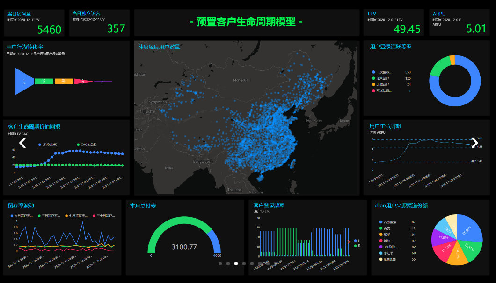

贵州，地处中国西南内陆地区腹地，是中国西南地区的交通枢纽。在这次抗击新型冠状病毒肺炎疫情中，贵州虽然不是“重灾区”，但也受到了相当大的影响。截止2020年2月5日，贵州省已共计确诊69人，其中危重症病例高达13例。

今天，小编带大家来分析下贵州省的抗疫形势。

1. **总体形势：防控初见成效**

根据贵州省卫健委报道，贵州省于1月22日出现首例病例；患者为51岁，男性，现居贵阳，发病前一周有武汉居住史。

在图1中，小编对贵州省的确诊人数日趋势作了分析。如图，自1月22日的首发病例后，贵州省确诊病例数量缓速上升，于1月31日迎来第一个增长率高值（详见图2），进入2月以后又有放缓的趋势。

图1：确诊人数趋势图

从下图2中我们可以看到更为详细的“日增长率”趋势图；正如我们前面所述，贵州在2月3日以后的日增长率是逐渐下降的，这传递出一个乐观的信号：该省在防控方面已经初见成效。

图2：确诊人数日增长率

1. **各地形势：疫情集中度高**

从下图3中我们可以看出，疫情主要集中在贵阳市、毕节地区、遵义市和六盘水市。其中，以贵阳市疫情最为严重（截止2020年2月5日，已确诊15人）。

贵阳是贵州的省会城市，相对于该省其它的地级市来说，经济发达、贸易频繁、人员往来频率高，因此也更易为病毒的传播“推波助澜”。同时，贵州省的第一例输入性病例就起源于贵阳，因此贵阳也是该省的“疫情中心”，自然确诊人数较多。

毕节地区紧邻贵阳市，成为了第二个“重灾区”。而遵义市和六盘水市分别位于贵阳市和毕节地区的北面和南面，因此受影响的程度也较高。

图3：贵州各市疫情情况图

我们再来看看疫情较严重的四个市的日增长量情况。由图4中可以看出，这四个市每天的情况波动较大；其中六盘水和遵义（红线和黄线）在近日的日增量有下降的趋势，然而贵阳和毕节（深蓝线和浅蓝线）仍有攀升之势，需要格外注意。尤其请大家注意下贵阳市（深蓝线），爬升的趋势还是比较明显的，这证明该市的防控工作仍需严格地坚持下去。

图4：贵州各市日增长量情况图

1. **小结**

总体来看，贵州市疫情集中度高，尤其市贵阳和毕节地区，集中了全省25%的确诊病例。小编也在这里提醒各位贵州的小伙伴，尤其是贵阳和毕节的朋友，一定要提高重视、注意防护。齐心协力！共抗疫情！
