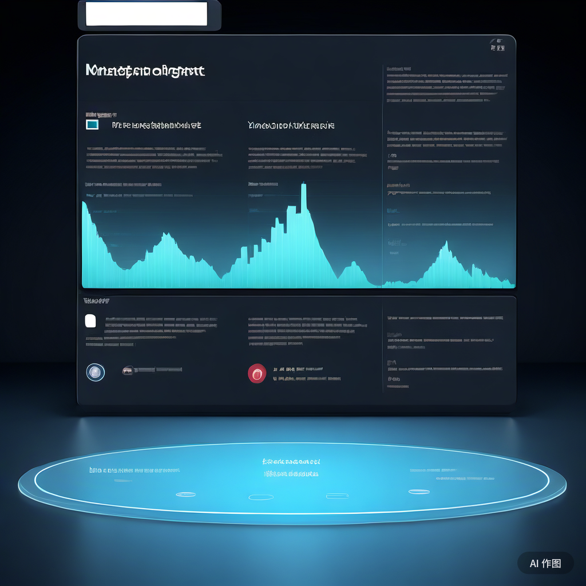
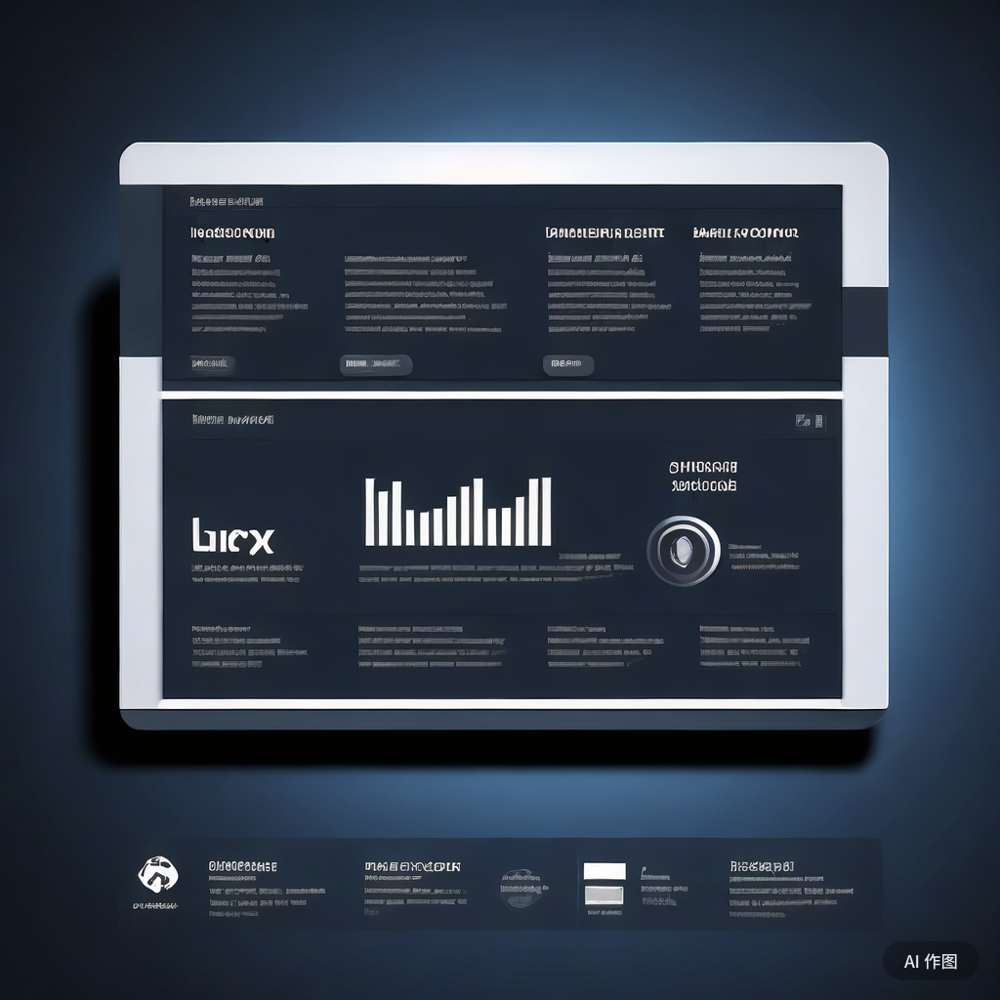

在商业世界中，一份高效、精准的CEO报告不仅是对企业运营状况的全面展示，更是CEO决策和战略规划的重要依据。然而，如何打造一份既全面又精炼的报告，让CEO能够快速把握企业运营状况，从而做出明智的决策呢？今天，我们就来探讨一下创建有效CEO报告的11大关键技巧，助你决胜商业战场！

### 一、明确报告目标，着眼大局

首先，要明确报告的目标。CEO关注的是企业的整体战略和运营状况，而非琐碎的细节。因此，在撰写报告时，我们应着眼于大局，提炼出关键绩效指标（KPI），为CEO描绘出一幅清晰的企业运营全貌。这样，CEO才能迅速了解企业的发展方向，以及可能需要进行调整的领域。

### 

### 二、设定绩效目标，量化成果

为了确保整个组织的效率和增长，设定明确的绩效目标是至关重要的。通过设定可实现且现实的目标，我们可以更好地评估不同活动和策略的成功与否，同时衡量员工和部门的绩效。在报告中展示这些目标及其达成情况，有助于CEO全面了解企业的运营状况，从而做出更加明智的决策。

### 三、深入了解受众，量身定制报告

CEO报告的受众可能包括C级高管、投资者等。不同的受众对于报告的需求和关注点各不相同。因此，在撰写报告前，我们需要深入了解受众的需求，根据他们的关注点量身定制报告内容。这样，报告才能更具针对性和吸引力，让受众一目了然地了解企业运营状况。

### 四、合理安排报告时间间隔，保持信息新鲜度

CEO并不需要频繁的日报来了解企业运营状况。相反，周报、月报或季报等适当的时间间隔更能保证信息的新鲜度和有效性。当然，具体的时间间隔应根据企业的实际情况和CEO的需求进行调整。合理的报告频率有助于让CEO保持对企业运营的持续关注，同时避免信息过载。

### 

### 五、展望未来，制定合理预测

一份高效的CEO报告不仅要关注过去的表现，还要展望未来，为CEO提供有价值的预测。通过设定切合实际的目标，并结合企业资源和市场环境进行合理预测，我们可以帮助CEO更好地规划企业的发展路径。这样，CEO才能在激烈的市场竞争中抢占先机，引领企业走向成功。

### 六、整合业务核心领域，呈现全景视图

企业在运营过程中涉及多个核心领域，如销售、营销、客户支持、人力资源等。在撰写CEO报告时，我们需要整合这些领域的关键数据和信息，为CEO呈现一个全景式的企业运营视图。通过清晰的结构和有效的视觉呈现手段，我们可以帮助CEO更好地把握企业运营的脉搏，从而做出更加精准的决策。

### 七、利用数据驱动决策，提升决策质量

在数字化时代，数据已经成为企业决策的重要依据。通过利用现代交互式仪表板等工具，我们可以让CEO更加深入地了解中央KPI、洞察和可能性。这样，CEO在决策过程中就能更加客观、理性地分析数据，从而提升决策的质量和准确性。

### 

### 八、讲好数据故事，增强报告吸引力

人类天生对引人入胜的故事情节产生共鸣。因此，在撰写CEO报告时，我们可以尝试将数据以故事的形式呈现出来。通过讲述各个指标背后的故事，我们可以让CEO更加直观地理解数据的意义和价值，从而增强报告的吸引力和说服力。

### 九、注重形式与功能并重，提升报告可读性

虽然美学在报告中占据一定地位，但形式和功能同样重要。为了确保报告内容易于理解和交互，我们需要关注设计的一致性和逻辑性。同时，为用户提供特性和功能，帮助他们轻松深入到重要的信息口袋中。这样，CEO在阅读报告时就能更加高效地获取信息，从而提升决策效率。

### 十、从结果中学习，持续改进

无论是好结果还是坏结果，背后都隐藏着宝贵的见解和经验教训。作为CEO，我们需要学会从结果中学习，深入挖掘背后的原因和规律。通过全面了解企业的优点和不足，我们可以找到改进的机会和方向，从而推动企业持续发展和进步。

### 

### 十一、不断发展和更新报告模板

最后但同样重要的是，我们需要不断发展和更新CEO报告模板。在这个快节奏且竞争激烈的数字时代，商业环境和企业需求都在不断变化。为了确保报告始终能够提供最大的价值，我们需要定期调整和发展报告模板，以适应新的市场趋势和企业需求。这样，我们的报告才能始终保持领先地位，为CEO提供最有力的决策支持。

总之，创建有效的CEO报告需要我们掌握一定的技巧和方法。通过明确报告目标、设定绩效目标、深入了解受众、合理安排时间间隔、展望未来、整合业务核心领域、利用数据驱动决策、讲好数据故事、注重形式与功能并重、从结果中学习以及不断发展和更新报告模板等关键技巧，我们可以打造出高效、精准的CEO报告，助力企业在商业战场上取得更大的成功！
