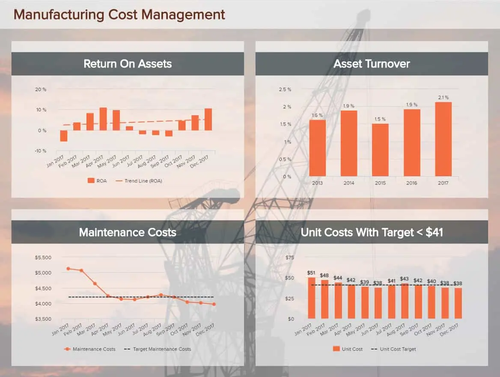
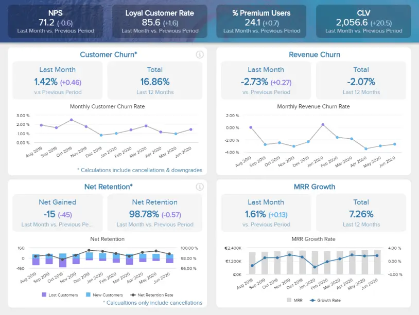

近年来，分析报告已发展成为世界上最重要的商业智能组成部分之一，激励各行各业的公司采用更具战略性的思维方式。

虽然许多公司都在努力利用有效的商业智能策略，但分析信息的重要性造成了知识的波动，不能简单地收集到单个电子表格中。创建和使用单个报表并在单个公司的部门、利益相关者和重要方之间传达各种重要见解变得越来越困难。这就是为什么企业需要适当的分析报告来帮助过滤重要数据并改进完整[管理报告的](https://www.datafocus.ai/infos/management-reporting-best-practices-and-examples)创建，从而成功开展业务运营。

 

这并不意味着创建此类报表应该只适用于能够更快地阅读和解释复杂信息的专业分析师，但借助扩展公司所有员工知识的[自助式 BI](https://www.datafocus.ai/infos/self-service-bi-tools)工具，分析报告可以成为推动进步、直接影响运营成本和使用每个人都理解的现代界面的最宝贵的工具之一。

也就是说，我们将深入研究分析报告及其在实际业务内容中的价值。我们还将研究如何在专业的[在线报告软件](https://www.datafocus.ai/infos/online-reporting)的帮助下创建它们。

让我们开始吧。

您的机会：[想要完全免费地构建自己的分析报告吗？](https://www.datafocus.ai/console/)试用我们的专业报告软件14天，完全免费！

## 什么是分析报告？

分析报告是一种业务报告，它使用定性和定量的公司数据来分析和评估业务战略或流程，同时使员工能够根据证据和分析做出数据驱动的决策。

虽然分析报告基于统计数据、历史数据，并且可以提供特定问题的预测预测，但它的用途也广泛用于分析各行各业的当前数据。例如，一家医院在其分析中看到，通过采取特定行动可以减少平均等待时间。在团队看到最多的流量来自不同的投资预算来源后，营销机构可以决定以不同的方式分配其预算。这类报告的应用是不同的，因此，写作风格和产生有价值的见解在每个行业中都是独一无二的。

## 为什么分析报告很重要？

现在，让我们考虑一下利用强大的洞察力进行运营所带来的业务促进效益。

分析报表是通向商业智能 （BI） 的门户。当您的组织变得更加智能时，您将推动自己在竞争中领先。与他们合作将使您能够做出明智、准确的决策，同时使您能够精确地解决问题或响应变化。

为了正确看待它们的重要性，以下是有效报告分析的主要好处的概述：

- 沟通与协作：通过投资有效的[BI报告工具和](https://www.datafocus.ai/infos/bi-reporting)流程，您可以让企业中的每个人都从一个中心位置访问有价值的视觉见解。这将赋予他们所需的知识，以更好地履行自己的职责，同时防止由于信息不佳或不准确而导致的任何部门间摩擦。有了强大的分析报告指标，公司中的每个人都将在同一页面上，在此过程中创造一种开放式协作和沟通的文化。
- 生产力：除了更好的沟通之外，分析还可以让您全面了解内部流程。通过获得这种级别的共享见解，您可以全面简化低效的流程，同时激励您的团队专注于更具战略性的活动来发展业务。结果呢？一个更投入、更高效的业务，不仅适应性更强，而且利润更高。
- 创新：现代业务工具在一个地方提供了大量有价值的关键绩效指标 （KPI）。在[仪表板创建者](https://www.datafocus.ai/infos/dashboard-creator)的帮助下，您还可以获得动态数据可视化，旨在深入了解您企业最重要的功能或流程。借助报告分析，您将能够识别弱点，利用趋势，发现您从未知道存在的见解或模式，并生成准确的预测。从可访问的仪表板中，您可以创建逻辑叙述并共享详细信息，从而使您的销售、营销、客户服务、财务、人力资源和履行活动更具创新性。当您这样做时，您将在您的利基市场中脱颖而出，并最终发展业务。
- 进化：数字世界处于不断运动的状态。今天有效的方法明天可能已经过时，因此跟上变化不仅对于生存而且对于蓬勃发展至关重要。由于[报告自动化](https://www.datafocus.ai/infos/automated-reporting-system-and-tools)和预测功能，报告提供对历史信息和实时数据的 24/7 访问，这些功能使您能够响应持续的变化，根据周围的情况完善您的业务模型或流程，同时降低运营成本并保持员工敬业度。由于每个值得注意的报告都是交互式和可定制的，因此您可以轻松地进行持续的调整或调整，并在您和您的行业发展中保持领先地位。

这里的收获是：使用正确的分析报告模板，您将提高业务各个关键方面的视野、效率和沟通，这将提高您的底线，同时吸引更多客户或客户加入您的业务。

## 如何创建分析报告？

现在我们已经了解了定义和一些关键优势，我们将考虑如何创建分析风格的报表，以在现代和专业工具的帮助下全面增强商业智能。

### 1\. 使用数字仪表板

第一步应该始终是考虑可用性和呈现方面的最佳媒介。可以使用电子表格、白皮书或简单的 Word 文档或文件创建综合报告。但这些更传统的方法通常笨拙且耗时。可以在各种电子表格中构建数据，但最终结果可能比生产力更令人困惑。

通过使用[在线仪表板](https://www.datafocus.ai/infos/online-dashboard)，您将能够以易于理解、可操作和准确的方式访问动态 KPI 和见解。不再需要筛选成群结队的电子表格，不再需要拼凑的数据分析和静态演示。通过数字分析报告，您将看到眼前展开的见解。

### 2\. 保持活力

传统报表具有不便于编辑的标准结构。传统类型的分析报告通常由标题页、目录、导言、方法、正文部分、结论、建议和参考书目组成。但是，使用动态的交互式[仪表板报告软件](https://www.datafocus.ai/infos/dashboard-reporting)，您的结构将更加简单和全面。因此，您可以保留所需的所有常规信息，但动态将提供您可以实时使用和深入挖掘的事实，同时通过滑动屏幕或单击按钮向下钻取知识口袋。

### 3\. 选择正确的图表类型

也许最重要的步骤之一是选择正确的图表类型。一旦您有意识地承诺使用动态分析报告，操作的下一阶段就会以选择正确的图表类型的形式出现。现代[数据报告](https://www.datafocus.ai/infos/data-report-examples)提供了大量交互式图表和可视化效果，您可以利用这些图表和可视化效果。

如果您选择正确的类型 - 那些代表您希望通过数据分析报告传达的信息的类型 - 您将增强沟通和生产力。常见的图表类型包括交互式条形图、折线图、气泡图、面积图和地图。为了帮助您选择合适的数据可视化，以下是为您的企业选择最佳[数据可视化](https://www.datafocus.ai/infos/how-to-choose-the-right-data-visualization-types)类型的指南。

### 4\. 遵循设计最佳实践

当您考虑准备这些报告时，演示文稿就是一切。无论您的[仪表板软件](https://www.datafocus.ai/infos/best-dashboard-software-features)多么强大，如果不遵循最佳实践，您都会稀释最重要的组织信息，使其效率大大降低。在设计方面，清晰简洁的布局和平衡的视觉效果组合是前进的方向。对于强大的分析报告，您必须确保您的布局为与业务绩效的关键方面相关的问题提供明确的答案。您应该避免将过多的图表和小部件打包到任何分析报告中，因为这只会减损您最有价值的信息。此外，为了获得最大的数据驱动成功，请专注于遵循逻辑格式，使您和您的用户能够一目了然地提取可操作的见解。在页面底部添加表格将使您能够实现逻辑格式，因为它们通常比图表、图形或类似指标提供更多的价值。

### 5\. 使用正确的 KPI

除了数字时代存在的许多不同类型的分析报告外，您还可以使用许多类型的动态关键绩效指标。这些 KPI 的视觉丰富性和交互性意味着您可以访问大量宝贵的事实，包括过去、预测和实时的事实。为了使信息风格的报告格式以最佳容量工作，选择正确的[KPI 模板](https://www.datafocus.ai/infos/kpi-examples-and-templates)来建立您的绩效和业务目标至关重要。在创建或开发业务分析报告时，您应该考虑要发现或基准测试的趋势，并相应地选择您的 KPI。

专注于您的主要业务目标将帮助您在选择动态 KPI 时得出合适的结论 - 这样做将确保您能够通过为组织开发的计划使您的业务更具适应性、响应速度更快、更具创新性。通过正确选择关键指标，您可以发现优势和劣势，同时使内部和外部的其他利益相关者更容易访问您的信息。这是确保分析报告结构恰到好处的重要组成部分。

### 6\. 使您的报告易于访问

扩展我们之前的观点，您的业务分析报告必须始终可访问。除了开发可直观访问的逻辑设计和格式外，您的相关信息应始终可供组织中的适当人员随时随地使用。通过使用预定义的模板，您将能够提供对公司最重要的[KPI 仪表板的 24](https://www.datafocus.ai/infos/best-kpi-dashboard-examples)/7 全天候访问，因为员工将能够登录并从多种设备（包括智能手机和平板电脑）中提取见解。分析报告的主要目的是改善内部商业智能，同时为每个人提供他们所需的知识，以更好地执行 - 这种无限级别的可访问性将做到这一点。

### 7\. 讲一个故事

您可能已经注意到，我们已经提到了“讲故事或故事”的重要性 - 并且有充分的理由。人类大脑喜欢强大的叙述或可以遵循的情节，因此，如果您的分析报告格式在开发时考虑到讲故事，您将使您的业务报告工作更加强大。

要了解有关如何改进工作的更多信息，您可以阅读我们关于[数据分析](https://www.datafocus.ai/infos/data-analysis-methods-and-techniques)方法和技术的综合指南。

### 8\. 使用交互功能

微调分析报表时，请务必考虑使数据更具交互性的特性和功能。

使用某些功能将使您最有价值的见解栩栩如生，同时帮助您的用户在其角色中表现得更好。这些动态功能包括：

- 可点击的图表或图形过滤器
- 详细的数据可视化钻取和[向下钻取](https://www.datafocus.ai/infos/drill-down-drill-through-reports)
- 图表放大功能
- 动态文本框和图像
- 实用信息工具包

通过启用正确的功能并帮助企业中的每个人了解如何使用它们，您将确保您的分析报告提供最大价值，并在此过程中提供始终如一的健康投资回报 （ROI）。如果您想更详细地查看此[交互式仪表板](https://www.datafocus.ai/infos/interactive-dashboard-features)功能，请查看我们关于该主题的完整指南！

### 9\. 收集利益相关者的内部反馈

一旦您的分析报告工具启动并运行，收集每个相关利益相关者的反馈对于确保持续成功至关重要。

使用此类工具时，确保初始设计和格式正确至关重要，但关注持续维护同样重要。

通过将焦点小组和研讨会（或请求在线反馈）分为两个主要部分 - 您的内部用户和您向其展示您的发现的外部利益相关者 - 您将识别分析报告格式（或格式）中的任何差距（功能和信息）。

无论您的部门或行业如何，采用这种思维方式都至关重要，因为它将确保您的数据保持可访问性，并且仪表板的每个方面都可以帮助您的用户发挥最大能力。

### 10\. 不断前进、改进和发展

扩展我们之前的观点：一旦您启动并运行了业务分析报告并且每个人都参与其中，那么与周围的环境一起移动至关重要。

经常检查您的分析报告格式、设计和 KPI。考虑您使用的可视化和基准是否仍代表您周围的行业以及您当前所处的旅程阶段。

例如，如果您发现自己突然扩大了业务规模，您可能会发现您需要重新调整核心组织，并可能更深入地了解您的招聘、人才保留和履行数据。

这里的重点是，如果你想通过商业智能继续获胜，致力于改变和发展你的努力是最好的前进方式。

您的机会：[想要完全免费地构建自己的分析报告吗？](https://www.datafocus.ai/console/)试用我们的专业报告软件14天，完全免费！

## 受益于这 18 个分析报告示例

许多行业发现，分析报告对于健康和一致的业务发展至关重要。这18个截然不同但同样强大的分析报告示例证明了这一点。

让我们一一看一下。

1\. 医疗保健：如何减少患者在我们医院的等待时间？

主要关键绩效指标：

- 治疗费用
- 急诊室等待时间
- 患者等待时间

接下来，我们看一下健康和福祉领域的分析报告样本。上面的医疗保健[仪表板](https://www.datafocus.ai/infos/dashboard-examples-and-templates-healthcare)强调结合历史信息和统计数据并深入研究趋势分析的[医疗保健指标](https://www.datafocus.ai/infos/kpi-examples-and-templates-healthcare)，因此，它可以作为生成未来决策的基本部分，这些决策对于运行和修改成功的医院战略非常重要。尽管[医疗保健中的大数据](https://www.datafocus.ai/infos/big-data-examples-in-healthcare)正变得越来越广泛，并且可以提供的信息种类越来越多，但它也使用仪表板形式的报告（如上面的报告），以便生成的每条信息都有自己的衡量标准和证据质量。如果使用得当，各部门的平均轮候时间可以明显提高不同医院部门的效率。此外，患者数量可以解释为什么某些部门有更长的等待时间，因此，提出减少等待时间的解决方案，并降低直接影响部门的成本。

该指标对财务部门很重要，但在此安排中创建和呈现的所有信息范围的整体视图将有助于管理层做出更好的决策。上图还可以用作分析报告模板，然后可以将其用作成功医院战略的路线图。

2\. 销售：明年如何超额完成目标？

下一个分析报告示例来自销售行业。

主要关键绩效指标：

- 销售增长
- 销售目标
- 阿普
- 购置成本
- 中新社

此[销售仪表板](https://www.datafocus.ai/infos/dashboard-examples-and-templates-sales)结合了许多重要的 KPI，例如平均每周收入、客户获取成本以及收入和利润的年度概述。您甚至可以在每天、每周、每月或每季度的时间范围内更进一步并以交互方式探索这些单元。重要性在于对仅编译成一个中心枢纽的大数据的解释，以及对[销售报告](https://www.datafocus.ai/infos/sales-report-kpi-examples-for-daily-reports)应具有的关键因素的快速总结。

销售目标超出 115%，这意味着经理可以快速得出结论，他们的目标已步入正轨，向团队提供反馈，并就如何进行战略的下一步提出更多想法。将这种报告纳入业务实践可以为公司带来价值，因为智能 KPI 以清晰有效的方式呈现。结合这些提供直接证据和整体战略概述的指标，管理人员可以降低运营成本，并就如何降低客户获取成本设定额外的目标，这是销售战略的主要目标之一。

我们可以在每月的层面上更深入。

这份月度报告结合了销售代表的数据、他们的整个渠道、销售阶段的平均长度和平均周期长度。您可以查看特定经理或代表的单一效率和转化率，并收集有关每个人的机会、提案、谈判和关闭时间的信息。这一系列清晰的销售[图表](https://www.datafocus.ai/infos/sales-graphs-and-charts-for-managers)和分析可以投射有效销售周期的证据，这意味着团队的每个成员都可以直观地看到他们在战略中的部分，并根据所提供的数据做出决策。由于这些类型的报告可以由不同的团队和利益相关者使用，因此清晰分析和数字的重要价值可以在分析当前数据时定义未来的行动。

3\. 营销：我们应该在哪里分配预算？

我们的第三个分析报告示例来自市场营销。自从数字媒体的使用进入营销场景以来，[数字营销KPI](https://www.datafocus.ai/infos/best-digital-marketing-kpis-and-metrics)已经扩大，报告变得更加广泛和详细。尽管您可以将跟踪 KPI 合并到一个电子表格中，但清楚地了解特定广告系列、投资回报率、每次点击成本或着陆页转化率通常更有用。

主要关键绩效指标：

- 流量来源
- 转化率
- 跳出率

此数据分析报告模板显示了 Web 分析指标的完美概述。它可以快速显示访问总量、平均会话持续时间、跳出率、页面浏览量和总目标转化率。根据这些信息，营销部门可以快速掌握他们的分析，并得出结论是改变他们的策略还是为特定活动做出额外的决定。监控流量来源可以轻松定义在哪里投资或多或少，并且顶级广告系列、渠道和转化的系统化可以轻松提供基于去年表现的历史数据证据，或每周趋势摘要。这种[营销仪表板](https://www.datafocus.ai/infos/dashboard-examples-and-templates-marketing)可以将消耗的写作和导出文档带入过去的痛苦，因为数字报告的动态已经进入数字时代的未来。

4、财务：降低经营费用率。怎么办？

在我们的分析报告中，第四个来自金融部门。

主要关键绩效指标：

- 资产回报率
- 股本回报率
- 营运资金

此财务仪表板简单表示如何在一份分析报告中实现所有[财务](https://www.datafocus.ai/infos/dashboard-examples-and-templates-finance)目标，因为它结合了：毛利率、运营费用比率、运营利润率和净利润率。所有这些指标都为一个中心访问点提供了有价值和简洁的见解，然后可以通过提供数据进行更详细的分析，从而为做出未来的决策奠定基础。在看到这种最重要的关键绩效指标的可视化表示后，利益相关者、经理或员工可以从见解中受益，并决定是降低运营费用还是采取行动制定新战略以增加收入和利润。

5\. 快速消费品：我们如何提高供应链效率？

我们的下一个示例以[快速消费品仪表板](https://www.datafocus.ai/infos/dashboard-examples-and-templates-fmcg)的形式出现。该报告样本是一份专注于快速消费品 （FMCG） 的业务分析报告，非常适合定期周转大量库存的企业。

主要关键绩效指标：

- 缺货率 （OOF）
- 按时和全额交付 （OTIF）
- 平均销售时间
- 新鲜度数据中售出产品的百分比

该分析报告样本拥有统一的供应链指标组合，旨在帮助企业主制定有效的策略来简化其库存处理和履行活动，提供了基于平均销售时间和缺货率的概览和长期战略绩效[指标](https://www.datafocus.ai/infos/supply-chain-metrics-and-kpis)，以及其他宝贵的信息块。

这是一份功能强大的报告，从长远来看，它将节省您的时间和金钱，同时显着改善您的供应商和消费者关系。

6\. 市场研究：我们如何提高品牌知名度？

此分析报告模板基于改进企业的市场研究策略，以使用更高效、更有效和价值驱动的方法收集关键见解。

主要关键绩效指标：

- 独立品牌知名度
- 辅助品牌知名度
- 品牌形象
- 名人分析

分析报告格式提供了双重解决方案——此[实时仪表板](https://www.datafocus.ai/infos/live-dashboards)中的 KPI 组合可以帮助各行各业的企业提高品牌知名度并利用影响者关系，同时收集市场见解，这将有助于制定更智能、更以结果为导向的营销和沟通计划。

这是一个可视化工具，可帮助您创建与目标受众产生共鸣的品牌形象，同时利用从电子邮件到社交媒体等各种媒体的业务促进机会。

7\. 制造成本管理：我的流程效率如何？

主要关键绩效指标：

- 资产周转
- 单位成本
- 资产回报率
- 维护成本

这份平衡分析报告提供了与设定时间段内成本相关的所有核心[制造指标](https://www.datafocus.ai/infos/kpi-examples-and-templates-manufacturing)的概览。

在当今快节奏、高度互联的世界中，制造公司或部门面临着巨大的压力，既要满足严格的质量控制法规，又要确保将成本保持在最低水平。

该分析报告配备了显示可访问的财务趋势的图表，旨在为制造决策者提供快速自信地评估单位成本和资产回报率等 KPI 的工具。通过使用这个关键数据报告模板，您将在质量、一致性和财务效率之间取得完美平衡，这是运营的最佳平衡点。

8\. 支持团队绩效：我们是否满足客户的需求？

主要关键绩效指标：

- 顶级代理商
- 首次联系解决率
- 利用率
- 净推荐值

在一个客户服务和体验被认为比价格或产品更重要的时代，你不能对你的支持工作感到自满。这就是此数据报告模板的用武之地。

这个以支持为中心的[Zendesk 仪表板](https://www.datafocus.ai/infos/dashboard-examples-and-templates-zendesk)将帮助您优化支持团队以实现持续成功。分析报告示例概述了一般客户支持 KPI，例如净推荐值 （NPS）、首次联系解决率以及 30 天内未结和未分配的支持票证数量。其中，它显示一个交互式图表，展示您的支持代理的个人绩效，像这样，您可以奖励员工人数较多，并帮助或激励人数较少的员工。通过跟踪和衡量您的支持成功，您将能够做出战略决策，使您的服务部门非常高效。

9\. 采购成本：我可以提高投资回报率（ROI）吗？

主要关键绩效指标：

- 采购订单成本
- 降低采购成本
- 采购成本规避
- 采购投资回报率

这个基于采购的分析平台专注于成本和采购。该设计展示了交互式图表，跟踪诸如采购订单成本、成本降低、成本节约、成本避免和采购投资回报率等指标，所有这些都显示实际数量和 5 年趋势。此外，您还可以看到与供应商相关的成本降低、成本节约和避免的详细明细。

通过深入了解这种有凝聚力的采购 KPI 组合，可以省略[采购](https://www.datafocus.ai/infos/kpi-examples-and-templates-procurement)流程中的任何不必要成本，同时了解库存中特定项目的投资回报率。定期跟踪这些指标将使您能够优化采购链的每个元素，确保您的努力不仅是价值驱动的，而且不会以最小的收益耗尽您的预算。这是各行各业企业的基本数据分析报告示例。

10\. 员工绩效：我的团队表现如何？

人力资源是您企业跳动的心脏之一。保持员工的敬业度和积极性将显着提高您的生产力水平。这个以人力资源为中心的数据分析模板将帮助您做到这一点。

主要关键绩效指标：

- 缺勤率
- 加班时间
- 培训费用
- 员工生产力

这个详细的工具旨在跟踪劳动效率和缺勤以及员工生产力、加班率和劳动力成本，将确保您的人才在尽其所能的同时保持敬业。经常跟踪这些[人力资源 KPI](https://www.datafocus.ai/infos/kpi-examples-and-templates-human-resources)将帮助您在需要时提供支持、资源或培训，同时通过高效、有价值的解决方案正面解决任何效率低下或与员工相关的问题。这是一个工具，将在每个部门创造持续的成功和凝聚力。

您的机会：[想要完全免费地构建自己的分析报告吗？](https://www.datafocus.ai/console/)试用我们的专业报告软件14天，完全免费！

11\. 供应链：我的供应链是否从端到端进行了优化？

从历史上看，各行各业的企业都因供应链不佳、效率低下和运营瓶颈而大量流失资金。但是，通过对基于供应链的活动采用数据驱动的方法，您可以减少效率低下或运营障碍。

主要关键绩效指标：

- 库存准确性
- 库存周转率
- 库存与销售比率

此[物流仪表板](https://www.datafocus.ai/infos/dashboard-examples-and-templates-logistics)是一份业务分析报告，可帮助您精确地跟踪营业额、缺货商品以及库存与销售比率。通过这样做，您可以减少冗余的供应链成本，同时保持整个流程从头到尾的流动。这是一个旨在实现可持续供应链成功的分析报告示例。

12\. 能源：我的业务的可持续性和能效如何？

许多公司忽视了他们的能源消耗 - 但它很重要。如果您有多个办公室、仓库或商业场所需要管理，如果没有熟练的能源管理解决方案或策略，您将遭受损失

主要关键绩效指标：

- 停电和平均持续时间
- 按行业划分的消费量

该数据分析模板允许您将能耗与其他行业进行比较，同时获得有关停电持续时间、排放、总体消耗和成本的重要信息。有了能源使用数据的大熔炉，您可以使用此工具提高财务效率、更环保、更可持续——这在日益进步和竞争激烈的数字环境中至关重要。通过实施数据驱动的能源管理战略，您将使您的业务更具可持续性，同时降低年度成本。

13\. YouTube 视频效果：哪些内容适合我的目标？

随着客户越来越多地选择视频而不是常规内容，品牌有机会以更具吸引力和互动性的方式提供重要信息。例如，通过使用解释器视频，您可以向观众介绍新产品、服务甚至您的品牌，而无需让他们经历阅读长文本以找到所需信息的痛苦。使用这种类型的内容，您还可以通过为您的公司增加额外价值来[完成更多交易](https://breadnbeyond.com/explainer-video/expert-roundup-close-more-deals)并增加转化率。

主要关键绩效指标：

- 承诺
- 受众留存
- 视图
- 观看时间

我们的[YouTube仪表板](https://www.datafocus.ai/infos/dashboard-examples-and-templates-youtube)是衡量视频内容性能的宝贵工具。它包含详细的图表，展示了参与指标的形式，例如喜欢、评论、分享和观看次数，以及两个图表，以秒为单位显示平均观众留存率和特定视频的平均观看时间。

通过跟踪这些指标，您可以查看特定视频的整体效果，并将其与其他视频进行比较，以了解目标受众最喜欢哪种内容。此外，通过查看平均观看时间，您可以了解您的视频应该有多长才能让观众娱乐。这将为您的受众优化资源和更好的内容。

14\. Facebook：我的社交媒体内容和策略的效果如何？

Facebook仍然是地球上参与度最高的社交媒体平台之一。如果您是一家现代企业，希望扩大受众并与成群结队的新潜在客户建立联系，那么使用这个最有价值的网络将创造奇迹。

主要关键绩效指标：

- 风扇数量
- 关注者人口统计
- 按来源划分的页面浏览量
- 页面上的操作

我们的[Facebook 仪表板](https://www.datafocus.ai/infos/dashboard-examples-and-templates-facebook)拥有无价的社交媒体 KPI，将帮助您对粉丝数量进行基准测试，深入了解您的关注者人口统计数据，按来源收集有关页面浏览量的情报，并跟踪各种页面操作。

通过使用这些强大的指标，您将获得所需的洞察力，以提供满足 Facebook 受众确切需求的内容，同时在正确的时间以正确的信息与正确的用户建立联系。

15\. IT 首席技术官：您以技术为中心的高级决策是否有效？

首席技术官的角色是高压和无所不包的。公司内部技术的执行、推出和开发对其持续成功有直接影响。也就是说，作为首席技术官，您的决策必须迅速、敏锐，并且是为持续增长而构建的。

我们流畅的 CTO[IT 仪表板](https://www.datafocus.ai/infos/dashboard-examples-and-templates-it)旨在让高级技术决策者能够快速访问高质量的高级指标。

主要关键绩效指标：

- 严重错误数
- 重新打开的门票
- 估算的准确性
- 新开发的功能
- 团队流失率

凭借平衡的设计和丰富的视觉信息，包括关键[IT KPI](https://www.datafocus.ai/infos/kpi-examples-and-templates-it)，如用户趋势、关键错误量化、团队流失率、新开发的功能等，在这里，您可以随时采取行动，同时在许多关键技术领域制定业务促进战略。

16\. 首席营销官：如何提高营销活动的效率？

我们的下一个动态分析报告示例是针对公司的 CMO。营销和传播是通过多种渠道向特定受众群体传递一致的品牌信息的关键。这是一项艰巨的任务，如果做得好，它可以为任何企业带来指数级的价值。

主要关键绩效指标：

- 销售目标和增长
- 网站流量与潜在客户比率
- 每条线索的成本
- 潜在客户与 MQL 比率
- MQL 与 SQL 比率

这个信息丰富的分析报告模板旨在为忙碌的 CMO 或高级营销人员提供洞察力，以精确地衡量营销活动的成功，同时管理预算并确保每个促销活动的最佳营销投资回报 （ROMI）。

此模板提供的信息还提供了一定程度的洞察力，最终将改善销售和营销部门之间的协作。

17\. 客户保留：如何激发客户忠诚度？

在我们这个高度互联的数字时代，消费者真正地坐在驾驶座上。因此，采取措施提高客户保留率和忠诚度对于业务的持续增长至关重要。

主要关键绩效指标：

- 客户流失
- 净留存率
- 收入流失
- MRR增长率

不仅现有客户的维护更具成本效益，而且忠诚的消费者还将充当品牌拥护者，这反过来又将以最小的努力进一步扩大您的品牌影响力。此[保留仪表板](https://www.datafocus.ai/infos/customer-retention-dashboard-metrics)将让您清楚地了解流失、保留和增长水平，从而轻松定位影响忠诚度的任何潜在问题。

有了这些宝贵的信息，您就可以着手制定策略，以减少每个相关渠道和接触点的客户流失。

18\. 内容质量控制：我可以提高我的沟通的影响吗？

在商业数字时代，内容就是一切。如果不提供一致的高质量内容流来启发、帮助或激励您的受众，您最终将陷入停滞。

主要关键绩效指标：

- 肉体阅读轻松
- 每篇文章的平均评论数
- 故事周转时间

我们的全景分析报告样本根据您业务内容的可访问性、效率和参与度提供专业报告。

使用这些关键见解，您将确保您的内容自然阅读，同时发现减少周转时间的新方法，并清楚地了解最能引起受众共鸣的文章、媒介或想法的类型，从而在此过程中取得更好的结果。

## 应避免的分析报告错误

我们查看了官方分析报告的定义，并探索了各种类型的分析工具，甚至还浏览了完整的示例列表。现在让我们看看生成它们时应该避免的基本错误。

- 不知道你的目标和目的

基于分析的报告构建的第一个主要罪过是没有花费足够的时间来完成您的核心业务目标或在协作环境中的目标。如果不查看您现有的职能并设定可操作的目标或结果，您将选择错误的指标，并基本上分析对您的业务增长几乎没有价值的信息。底线？不要跳过手术的这个关键阶段。留出充足的时间设定目标，并确保让相关人员或利益相关者参与进来。

- 不考虑您的用户或受众

下一个错误归结为没有考虑您的最终用户和需要阅读您的报告的人。考虑一下不同部门的不同用户在 KPI、可视化和访问权限方面需要什么，以便在他们的角色中更好地履行职责，同时确保您的模板是为外部利益相关者设置的，以便他们了解他们面前的信息，您将确保您的努力全面交付最大的结果，同时建立协作纽带。

- 选择风格而不是实质

在设计仪表板时，您永远不应该选择样式而不是实质内容。让你的设计在视觉上吸引人是件好事，但你永远不应该优先考虑美学而不是实用性。详细浏览您的报告，并确保每个相关的信息链清晰、可访问且完全交互，以确保最佳（和信息量最大）的用户体验。请参阅报告构建部分中的设计提示以获取灵感。

- 不提供培训

开发出色的数据模板固然很好，但是如果不培训企业内的每个人，您的努力将提供什么价值。也就是说，您必须就新数据工具举办研讨会，并确保企业中的每个人都了解他们为什么要使用它们以及如何尽其所能使用它们。没有例外，没有妥协。

通过避免这些关键错误，您将确保您编写的每个以分析为中心的报告都将提高整个企业的商业智能。在这样做的过程中，你会茁壮成长。

您的机会：[想要完全免费地构建自己的分析报告吗？](https://www.datafocus.ai/console/)试用我们的专业报告软件14天，完全免费！

## 分析报告要点

[数字时](https://stfc.ukri.org/files/digital-revolution-infographic)代改变了我们与周围世界互动的方式。现在，各行各业的企业有能力收集、整理和解释数据，从而提高智能并加速成功。在这个大胆的新世界中，BI 工具已成为在竞争激烈的数字环境中获得并保持领先地位的必备工具。

在提出“什么是分析报告”这个问题并探索官方定义，查看真实世界样本的组合并深入研究如何制作分析报告之后，很明显，这些动态、交互式和高度可视化的显示提供了无穷无尽的业务提升价值。

通过我们的帖子，很容易看到这些类型的报告如何跨行业使用，提供涵盖许多部门、活动和内部职能的可操作见解。使用[BI 仪表板工具](https://www.datafocus.ai/infos/bi-dashboard-tools)将确保您在当今市场上保持领先地位，同时降低运营成本并通过强大的数据驱动计划推动自己在竞争中领先。

[在线数据可视化](https://www.datafocus.ai/infos/data-visualization-tools)工具，加上正确的分析报告示例，可以帮助跟踪公司的具体和整体绩效，并改善您的决策。欢迎来到未来。

如果您想立即开始摇摆您的报告，请尝试[DataFocus 进行 14 天试用](https://www.datafocus.ai/console/)，开始从您的数据中提取见解和价值！
