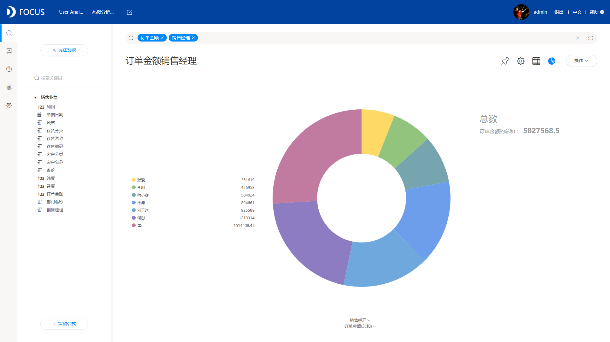
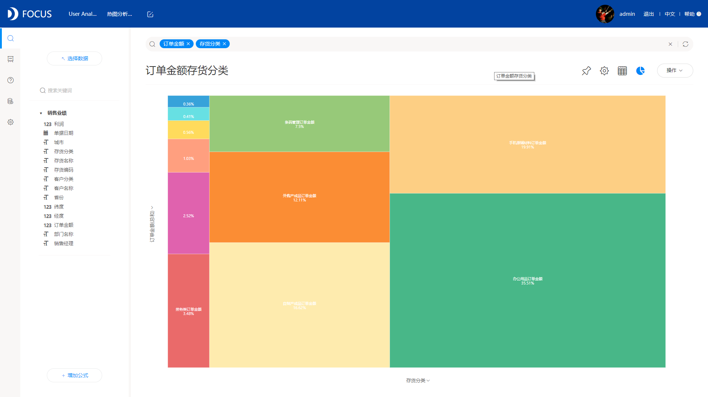
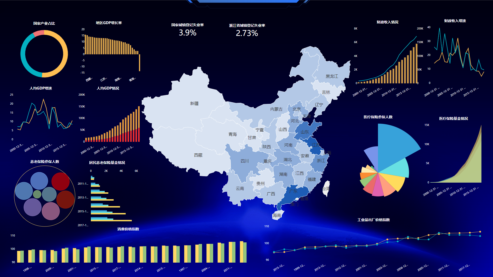
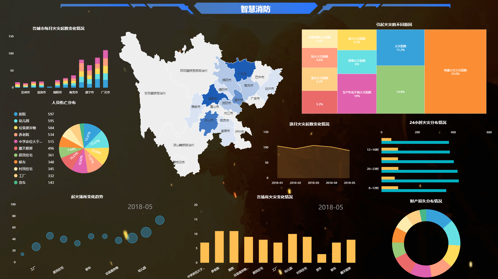

文不如表，表不如图，我们的大脑对于图形信息可以更有效地合成以及保留，也可以更容易理解。所以在日常工作中，我们经常会借助一些图形来展示各种信息，也就是将数据可视化。

那么怎样才可以做出高大上的数据可视化效果呢？事实上，可视化要做的高大上并不难，只要有一款合适的工具，而DataFocus就可以帮助你，即使是数据小白，也能够在数分钟内制作出高逼格的数据可视化图表，但是操作起来又不复杂。

DataFocus是一款性价比超高的可视化工具，同时也是一款超强悍的BI数据分析工具，因此其不仅拥有强大的数据分析功能，也具备超全的可视化展示功能。在DataFocus中，图表显示支持个性化配置，坐标轴配置，数值标尺配置，主题自定义配置，背景颜色、文字字体及颜色配置等，系统也会智能适配图表，图表类型丰富，有基础图形柱状图、折线图、环图、饼图、帕累托图等，也支持高级图形词云图、桑基图、打包图、平行图、旭日图、时序图等等，基本满足市场上所有需求。

功能强大，操作简单是DataFocus的一大优点。其独有的自然语言搜索大大降低了分析以及可视化的难度，不需要你配置，只需要在搜索框输入内容，系统智能地进行搜索分析并实时返回最适配图表。

下面就是用DataFocus制作的一些图表以及可视化大屏：

环图：

柱状图：

树形图：

打包图：

酷炫大屏：

