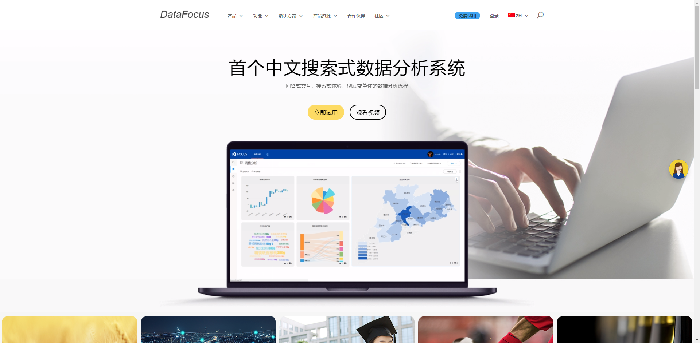

DataFocus在创立之初，有朋友一起与我们探讨：生活就像是一个产品，需要不断地迭代更新，以数据为参考进行优化。我们生活在这个大数据时代，其实时时刻刻都在被数据驱动着，每天接收大量的信息、数据，有人会依靠数据改进自己的短板，有人会依靠数据看到更大的世界。以前常说年轻人善于思考，其实在这个时代，善于思考的往往是年长一些的，有经验一些长者。青年们常常因为年轻所以无惧，无畏，年长的决策者每一天都在担心自己可能被时代淘汰。

所以其实每一个人都需要做的，是拥抱被数据驱动的自己，而不是拒绝数据或屏蔽数据。它能丰富对个体的认知，尤其是对企业员工来说。比如销售要依靠线索数据，寻找相关数据，而不是抱着碰运气状态，将生杀权交给客户，数据能帮我们做出更好的判断。

有个非常简单的例子。FaceBook的创始人扎克伯格曾经分享过一则自己的故事，大学时代几个人经常相约一起打德州扑克，小扎基本每次都是输的，甚至到了后来如果小扎不参与他们就不组织。小扎决定着手分析问题，这里将其他人代号为ABC，通过后面十几场的较量，他发现A一直在赢，但都是小赢，A只要发现不对会随时弃牌，输一个筹码，而赢的时候会赢5个筹码左右。B赢的多但输的也多，B就是不要怂就是干的典型，经常吓得A弃牌或是别人不敢跟，属于心理优势。C不温不火。通过分析这些数据，小扎从此会在A弃牌的时候选择不跟，在B突进的时候硬跟，后来他们就不怎么玩了，至于原因你们懂的。

这个世界会不断的被人工智能等新技术冲击，人或企业所处的市场环境也在变化。有些人像小扎一样通过数据优化路径，有些人则像A一样安分守己。我们要做的，是不断突破自我认知，就像DataFocus为什么要做搜索分析的原因之一就是，希望数据人能够不断的尝试新的分析关键词，找到新的思路，好好利用搜索的自由性。不断把“我以为”变成“我发现”，拥抱被数据驱动的自己。
