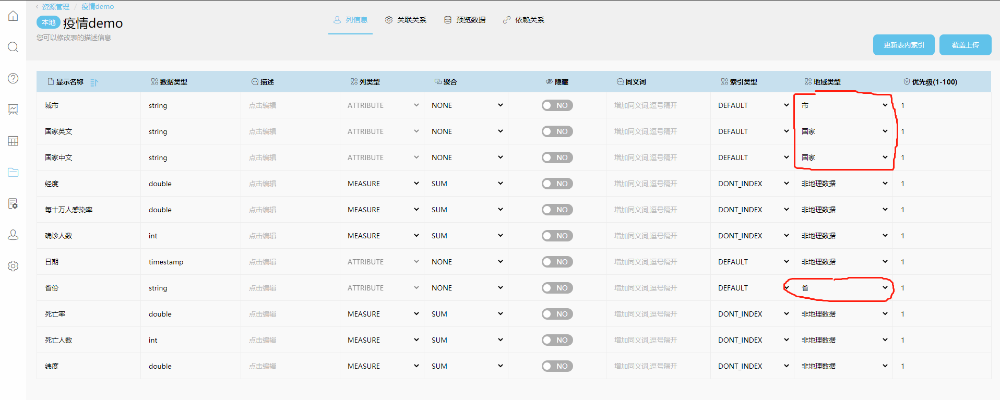

掌控疫情，从掌控数据开始 | 如何用datafocus实现对数据实时分析

11月23日，上海市卫健部门发布消息，22日晚 ，浦东机场对17719名相关人员开展核酸检测，1人结果阳性，其余为阴性。男子章某系位于浦东机场西区货运站联邦快递工作人员，经疾控中心新冠病毒核酸检测结果为阳性。经市级专家会诊，被诊断为新冠肺炎确诊病例。

网友不禁替上海捏了把汗，同时也开始担忧：疫情会影响过年吗？

小编提醒你以及身边的朋友这段时间还是戴好口罩，做好防护措施，希望大家都能安心回家过年。

我们可以通过记录疫情数据做成实时数据看板以便时刻掌控最新疫情，了解到的信息越多而且越及时，其实是越有利于我们去调整决策方向的。然而现实数据瞬息万变，你有没有想过实时监控数据是如何做到的？做起来是不是需要很复杂繁琐的步骤？是不是还很费时间？

疫情实时数据

完全不用！而且简单又高效！不需要你具备多么强的软件操作技能，简单几步靠datafocus就可以高效快速地搭建实时数据可视化大屏。

如何用datafocus实现对数据的实时分析？

简单来说，实现的原理就是连接到datafocus的外部数据源在不断更新源内数据表，那么datafocus里的数据也在更新，再通过ｄａｔａｆｏｃｕｓ内部公式实现可视化大屏上数据的实时变动。

1. 导入数据表

让数据呈现我们得先有数据源头，所以首先我们先把数据表导入。

导入数据表

要做到实时更新，我们一般是通过外部数据源导入给ｄａｔａｆｏｃｕｓ数据表以方便批量导入。

点击数据管理界面新建一个数据源，我们可以导入数据，当然也可以直连数据。

导入数据，即使没有数据源，只要一旦导入就保存在了datafocus里。

而直连数据需要有数据源的连接才能使用源内数据表，同时这也免去了导入步骤。

视个人情况而定。

这里的数据源还有自动按时更新的功能，也就是说只要你连接并且设置好按时更新的时间间隔，那么只要你连接好数据源就可以帮你自动更新，就省掉再次导入或者再次连接的麻烦。

导入后别忘了将数据中的地域类型更改一下，这是后续形成地域图必须要做的操作。

更改地域类型

2.使用源内数据表

点击搜索界面，选择“疫情demo”，我们这里以疫情demo表为例。

你可以下载这张表实操一下，点击下载。当然如果你还没有拥有这款软件，你可以点击文章下方的“阅读原文”试用。

如果你使用的是这张demo表，你可以通过资源管理，创建资源，从本地导入表。搜索界面的数据表中也会出现这张表。

那现在比如我想知道到2020年5月10日为止中国已有的确诊人数总和，你可以在搜索框搜索，国家中文是“中国”，确诊人数，日期＝“2020/5/10”。你也可以双击左边的列，对弹出的表格进行筛选。跳出结果后你可以把表转化为“KPI图”。

KPI图

如果这张数据表最新的数据是截止今天的日期，并且是在实时更新的，而且表的地区范围就是中国，你可以直接搜索“今天确诊人数”，datafocus会告诉你最直接的结果。

搜索完的结果保存到“历史问答”。

其它信息比如“累计确诊人数”、“累计死亡人数”、“累计治愈人数”或者今日的其它信息，你可以自己举一反三探索一下。

1. 可视化

得出以上结果最后将其可视化。点击左侧“数据看板”，“创建数据看板”

数据可视化

这里ｄａｔａｆｏｃｕｓ已经准备好了疫情大屏模板，方便分析。

用已经保存好的历史问答，替换模板上的版块。

只要数据表是在每日更新，那么可视化大屏上的数据就直接自动更新了。

总结

从数据源导入数据表、根据分析目的搭建可视化大屏，只需更新数据源内的数据表即可完成实时更新。
