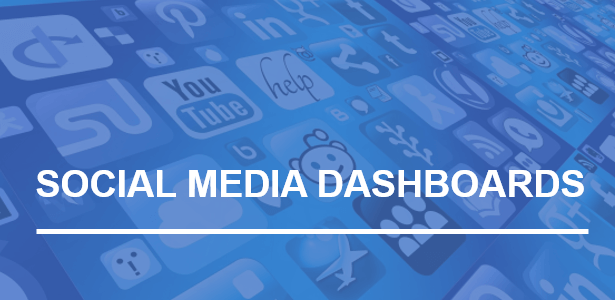
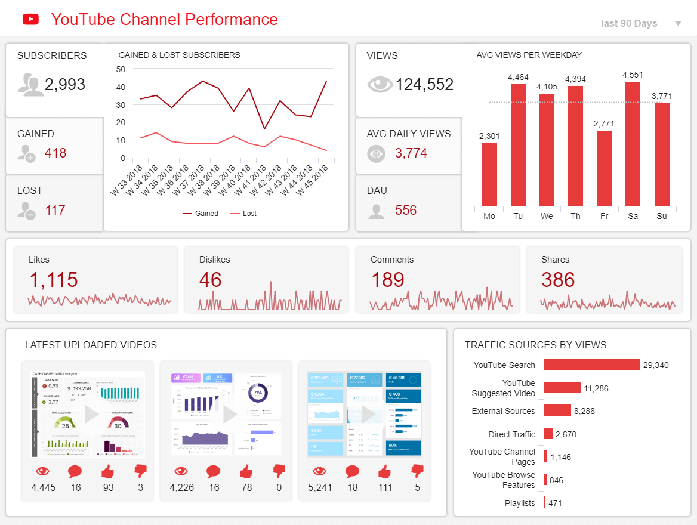

从一个或多个平台收集数据和信息创建一个全面的社交媒体仪表板，与创建社交内容本身同样重要。社交媒体已成为与潜在受众互动的最重要渠道之一，考虑到创建内容来吸引人们、瞄准您需要的准确受众并为您的利润创造价值的力量和潜力，这不足为奇。点赞、评论、分享、覆盖面、点击率和转化率——为了我们在竞争激烈的数字环境中成长，所有这些都变得及其重要，需要定期优化和管理。

您需要了解观众的反应，是否需要进一步调整，以及如何收集准确的实时数据。在这里，我们将介绍社交媒体仪表板的定义、一个如何创建的指南，并在文章结尾使用社交媒体仪表板模板作为示例。

## 什么是社交媒体仪表板？

社交媒体仪表板是一种宝贵的管理工具，专业人士、经理和公司使用它来收集、优化和可视化来自 Facebook、Twitter、LinkedIn、Instagram、YouTube 等社交平台的重要指标和数据。

此类仪表板通常由[仪表板制造商](https://www.datafocus.ai/infos/dashboard-creator)创建，这使事情变得更加简单和有效，因为您不必手动更新数据或创建无数令人困惑的电子表格。为了更好的评价仪表板在社交媒体分析中的价值，我们现在来看看这些工具是如何彻底改变企业处理社交数据的方式。

## 仪表板在高效社交媒体分析过程中的作用

简而言之，SM 仪表板是一种管理系统，它为企业提供了掌握数据的所有必要工具。它们是实时监控您的提及、标签、点击、评论和任何其他互动的最佳方式，而无需每隔几分钟查看您的帐户。这种方法可以让企业节省时间，专注于制定有针对性的策略，以保持其受众的参与和互动。以下是这些工具可以彻底改变您处理 SM 分析过程的一些其他作用。

- **直观地了解性能：**如果您使用多个社交平台与您的社区进行交流和互动，那么您很可能已经面临处理大量信息所带来的难题。也就是说，当在交互式视觉效果的帮助下正确组织信息时，分析体验变得更加有价值和平易近人。现代[业务仪表板](https://www.datafocus.ai/infos/dashboard-examples-and-templates)工具通过提供描述您的实时性能的交互式可视化组合来帮助您做到这一点。不仅如此，这些工具的交互性还允许您[深入](https://www.datafocus.ai/infos/drill-down-drill-through-reports)探索不同的图表和图形，以便从分析中获得更深入的结论。
- **同时监控各种活动：**在您的组织中实施社交媒体仪表板系统带来的另一个巨大好处是这些工具附带的集中式方法。您无需生成无限数量的仪表板来跟踪您的广告活动的效果。仪表板提供了一个集中位置，以可视化您的策略在跨各个平台上的发展情况。通过能够在一个地方交互和可视化所有重要信息，您不仅可以确保做出明智的决定，还可以避免每天不同时段多次检查多个帐户的繁琐过程。您甚至可以安排要发布的内容并实时监控响应，以便在问题出现时立即进行优化。
- **协作式分析方法：**您是一个与多个客户打交道的机构，或者是为大型企业工作的内部 SM 团队，协作是管理多个社交平台和策略的关键。仪表板的在线特性允许其用户在几秒钟内轻松地与利益相关者共享相关信息。这使团队能够有效地划分职责并管理即将到来的策略和职位。它还允许代理机构让他们的客户随时了解任何最新的发展，而不需要没完没了地开会。
- **节省时间和金钱**：正如本文中所提到的，仪表板为企业提供了一种交互式和自动化的方式来处理他们的社交媒体报告。传统报告通常是使用 PowerPoint 或 Excel 等工具生成的，虽然这些工具被证明可以用于此目的，但它们只能生成静态报告，这与当今业务环境所需的快节奏性质不相符。当报告在一份漂亮的 PPT 上完成时，上面的信息可能已经过时了，从而延误了决策过程。这就是为什么社交媒体仪表板分析被证明如此有用的原因。这些工具的实时性再加上您可以轻松实现自动化，使您能够掌握任何新的发展，同时节省创建静态报告的时间和金钱。

现在我们将进一步研究如何创建社交媒体KPI仪表板以及您应该记住哪些重要事项。

## 如何创建社交媒体仪表板？

为了最大限度地利用您的社交媒体仪表板，您需要在生成报告和利用[在线数据可视化](https://www.datafocus.ai/infos/data-visualization-tools)之前建立一个流程。在这方面，你需要考虑某些有助于优化分析的要点，并创建一个无缝整合数据和产生可操作见解的过程。让我们更详细地看一下这个过程。

### 1\. 设定你的社交媒体目标

要创建一个全面的社交网络仪表板，您需要确定您的目标和目的。使用 SMART 方法来保持其具体、可衡量、可实现、现实和及时是有意义的。您需要确定您想要实现什么样的目标，以及如何利用您拥有的资源实现目标。您的目标是获得更多关注者、网站访问量还是增加参与度？如果您深入了解细节，您就会知道需要什么样的指标来配合您的分析。

### 2\. 把所有东西都集中在一个地方

首先，将数据集成到单一访问点以创建令人惊叹的视觉效果应该是您的首要任务，因为您可能需要整合来自多个平台的信息，并创建一个无缝的[在线数据分析](https://www.datafocus.ai/infos/data-analysis-tools)流程。这将使您能够快速访问高级分析，并快速生成一个社交媒体分析仪表板，而无需使用电子表格或演示文稿等传统静态报告方式。

通过现代仪表板工具连接您的社交媒体帐户时，您需要考虑数据集成和连接过程。尽管静态电子表格可以为您的分析带来一些价值，但它们无法让您同时连接多个平台并实时可视化洞察。借助现代工具，您有机会在一个地方连接所有社交媒体资源，而无需设置复杂的 ETL 流程或执行繁琐的准备工作。尤其是在 SaaS 领域，您可以简单地连接到远程仓库，并在数据连接器和 API 的帮助下在一个地方合并、编辑或添加所有社交网络。这样，您可以不受限制地自定义您的分析，并在社会变化发生时立即做出反应。

### 3\. 选择正确的社交 KPI

如前所述，一旦您的目标和数据到位，您就需要开始考虑指标。尽管有许多[运营指标](https://www.datafocus.ai/infos/operational-metrics-and-kpi-examples)和战略指标，但您需要仔细考虑并明智地选择。你会选择什么样的[社交媒体 KPI](https://www.datafocus.ai/infos/social-media-kpis-and-metrics)，完全取决于你建立的目标。如果您想专注于社交媒体上的广告，那么 CPC 和 CTR 等指标应该包含在您的社交媒体仪表板中。另一方面，如果您专注于社区管理，那么点赞、评论、回复或分享等“社交货币”可能是一个很好的起点。

### 4.利用专业的社交媒体仪表板软件

正如我们前面提到的，专业软件只会帮助您节省无休止的分析，否则，您必须手动使用传统的电子表格。虽然市场上有很多选择，但只有一小部分会为您提供真正带来商业价值的高级功能。

通过使用专业的社交媒体仪表板软件，您将有机会自动化仪表板和报告，只需单击几下即可共享它们，并实时访问洞察力，这在社交网络等快节奏的环境中极为重要。

### 5.最后，开始创建

当您将所有目标和信息都放在正确的位置时，下一步就是创建本身。在这里，您可能需要考虑使用哪种图表，是否需要尊重您的品牌颜色，甚至针对移动设备进行优化。为了帮助您，可以阅读我们关于[如何创建仪表板](https://www.datafocus.ai/infos/how-to-make-a-dashboard-with-ease)的详尽指南。

为了了解我们在实践和实际业务场景中的观点，我们将在下一节专门介绍社交媒体分析仪表板模板，重点关注 4 个有价值的渠道：Facebook、LinkedIn、Twitter 和 YouTube。

## 社交媒体仪表板模板和示例

很明显，创建一个社交媒体管理仪表板需要一定的准备和研究。完成上述步骤后，就该生成仪表板了。也就是说，在这里我们将展示一些模板，您可以使用它们来获得自己的灵感和分析。

### 1\. 社交媒体 KPI 记分卡

正如我们提到的，将所有社交媒体数据置于单一访问点是多么重要，社交媒体[KPI 记分卡](https://www.datafocus.ai/infos/kpi-scorecard-examples-templates-to-track-performance)就是一个很好的例子，它展示了多个渠道和多个 KPI

在上面的示例中，我们可以看到 Facebook、Twitter、Instagram 和 YouTube 在设定目标方面的表现，但让我们更深入地挖掘视觉效果。关注者、印象、链接点击、粘性和点击率等指标将根据实际表现和目标进行分析。继续分析，我们可以看到渠道相对于设定目标方面的表现，将其与上一时期进行比较，并在最后一行中以百分比表示。在6 个月的时间里， CTR 的清晰概述提供了有关开发的更多详细信息，使我们能够立即发现是否有明显的峰值。

这样的仪表板使我们有机会将最重要的社交渠道整合到一个记分卡中，使我们能够立即注意到是否有信号告诉我们调整策略或一切都在控制之中。

### 2\. Facebook 的社交媒体广告仪表板

我们的第二个模板来自世界上最受欢迎的社交网络之一。该网络每月拥有超过27 亿用户，通常制定社交媒体策略的首选渠道之一，尤其是在广告方面。Facebook 广告商有一项艰巨的任务，就是持续优化活动，我们在此提供了一个社交媒体分析仪表板模板，可以帮助实现更好的 Facebook 效果。

[正如您在上面的Facebook 仪表板](https://www.datafocus.ai/infos/dashboard-examples-and-templates-facebook)中所见，展示次数、覆盖面、频率、每次点击费用和平均点击率的快速概览显示在此社交媒体营销仪表板的顶部。在这些指标下方，您可以看到每个指标更详细的可视化，这对于了解哪些有效以及哪些需要进一步调整至关重要。通过自定义时间范围和设置自定义警报，广告优化和性能不再是繁琐的。

### 3.LinkedIn KPI仪表板

我们的第三个社交媒体报告仪表板显示了在线网络的业务方面。LinkedIn 是发展业务联系的最著名的社交网络之一，它拥有超过7 亿的会员，它无疑是您应该关注的社交网络之一。

上面的这个[LinkedIn 仪表板](https://www.datafocus.ai/infos/dashboard-examples-and-templates-linkedin)示例显示了此社交网络整体概览的基本指标，包括相关指标，例如最新的帖子、参与率、个人资料浏览量和社交活动。在右侧，您还可以按行业、工作职能以及每周的社交活动发现关注者，这将帮助您优化和升级您的 LinkedIn 策略。如果您想更深入地处理这个面向业务的社交网络，并向您的受众提供最相关的内容以确保积极的社交媒体发展，那么这样的仪表板非常重要。

### 4\. Twitter 性能仪表板

继续我们的社交媒体仪表板示例， Twitter。尽管它已经存在了几十年并且已经落后于 TikTok、Instagram 甚至 Facebook 等其他平台，但该平台仍在全球范围内拥有3.965 亿忠实用户。事实上，Twitter的全球广告参与度同比增长 了35% ，使其成为品牌的一个有价值的平台。

考虑到所有这些，像上面这样一个有价值的[Twitter 仪表板](https://www.datafocus.ai/infos/dashboard-examples-and-templates-twitter)可以作为想要在这个平台上取得成功的品牌的完美工具。由于指标主要与交互和参与度有关，用户可以提取有价值的见解来优化他们的策略，并更深入地了解他们的用户。

### 5\. YouTube 频道性能

YouTube 是企业用于社交媒体工作的另一个绝佳平台。事实上，视频内容越来越受欢迎。研究表明，72% 的消费者表示他们更愿意通过视频了解产品。79% 的受访者承认他们曾通过观看产品相关视频而被说服购买产品或下载软件。考虑到所有这些因素，在现代[YouTube 仪表板](https://www.datafocus.ai/infos/dashboard-examples-and-templates-youtube)的帮助下优化您的视频内容是非常宝贵的。

稍微分解一下这个社交媒体参与度仪表板，它提供了有关您的 YouTube 频道表现的详细见解。借助有关订阅者、互动、最受欢迎的视频和流量来源的指标，企业可以轻松了解他们的受众最喜欢哪种类型的内容，并相应地优化他们的工作。

## 5大社交媒体仪表板工具功能

到目前为止，我们已经介绍了定义、一些好处、创建社交媒体指标仪表板时要遵循的步骤，以及不同渠道的一些示例。现在您可能想知道，我如何为我自己的企业或代理机构实现这一切？这实际上是最简单的部分，它是在现代社交媒体仪表板工具的帮助下完成的。为了充分了解这些解决方案的强大功能，我们将在此处列出您应该期望从中获得的5大功能。

1. **实时访问**：正如我们在本指南中多次提到的，使用现代仪表板进行 SM 分析工作可以获得的最大好处之一是访问实时数据。社交媒体渠道从不停歇，想要利用数据为自己谋利的企业如果想要击败竞争对手，就需要在出现任何新发展时立即采取行动。出于这个原因，实时分析是任何有价值的仪表板工具都应该包含的宝贵功能。这是可能的，因为这些解决方案提供了简单的集成，这意味着您可以在几秒钟内连接您需要的任何数据源，并且该工具将自动更新信息，无需任何手动干预。
2. **各种图表类型**：通过提供可访问且易于理解的数据方法，可视化使普通用户的分析过程更容易。也就是说，在使用可视化时，为您的分析目的选择适当的图表类型是很重要的。一个开发完善的仪表板软件将为您提供广泛的图表类型，以便您可以用正确的方式可视化最重要的 KPI。这是一个基本功能，因为您选择的图表和图形将直接影响最终产品（你的仪表板）的质量。一些软件还提供高级图表选项，例如添加辅助轴或将多种图表类型合并为一个的可能性。
3. **搜索功能**：在我们生活的这个数据驱动的时代，分析过程不再局限于 IT 专业人员或科学家。相反，随着现代仪表板解决方案的兴起，由于拖放、搜索界面等功能，分析的大门已经向更广泛的受众敞开。从本质上讲，搜索比拖放更智能，搜索功能允许用户轻松查询和可视化信息，而无需编写任何代码。您需要做的就是在搜索框中输入关键词或字段名，您将在几秒钟内获得令人惊叹的图表。
4. **共享能力**：正如我们在之前的观点中所说的，协作是社交媒体分析的关键。话虽如此，现代在线仪表板工具提供了多种共享功能来促进协作。其中一些选项包括：通过一个有密码保护的实时链接共享您的仪表板，发送可以定制的自动化电子邮件报告，以及通过移动应用程序或任何其他联网设备进行在线访问。一些工具还包括将仪表板导出为 PDF 或 PNG 格式，并打印出来作为与客户或团队成员会议的支持材料。
5. **白色标签和嵌入选项**：最后一项功能对于与多个客户合作并希望为他们提供出色报道体验的机构特别有价值。一方面，白色标签功能允许他们自定义其社交媒体管理仪标板中的颜色、公司logo和字体，以额外获得更个性化的外观。另一方面，嵌入技术允许机构将仪表板嵌入到他们自己的应用程序、内部网或网站中，以获得完整解决方案的所有功能和优势，而无需投资自己的解决方案。[在客户报告方面](https://www.datafocus.ai/infos/client-dashboard-report-examples)，这被证明是一种非常成功的做法，尤其是当您处理多个帐户并且没有时间不断更新所有帐户时。

这些只是专业社交媒体仪表板工具提供的各种功能中的一小部分。如果您想了解更多信息，请查看我们关于[仪表板软件](https://www.datafocus.ai/infos/best-dashboard-software-features)功能的完整指南！

## 总结

我们已经解释了什么是社交媒体仪表板，提供了有关如何创建仪表板的步骤和提示，并介绍了可以帮助您制定自己的社交媒体策略的示例。

现在是你大放异彩的时候了！试用DataFocus 进行30 [天试用](https://www.datafocus.ai/console/)，开始创建您自己的高级社交媒体仪表板！
